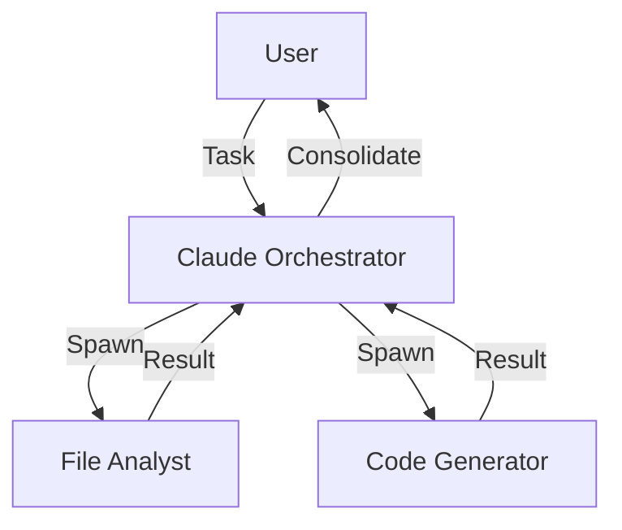
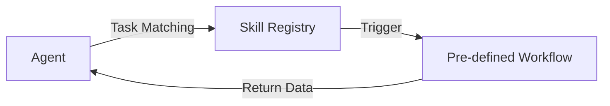
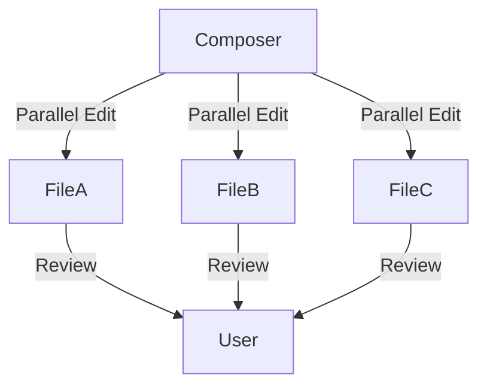

# AI Agent Research Report (2026)

This report details the research on leading AI coding agents, their structures, capabilities, and workflows.

## 1. Agentfile Structures by Agent

Each agent uses a distinct configuration format to define behavior, tools, and identity.

### Claude Code
Uses `CLAUDE.md` for project-level guidance and internal YAML-based configs for sub-agents.
```yaml
# Internal Specialist Config
name: "RefactorBot"
role: "Architectural Refactoring Specialist"
guidelines:
  - "Follow SOLID principles"
  - "Prefer composition over inheritance"
tools: [read_file, write_file, grep, ls]
```

### Codex (OpenAI)
Uses `config.toml` or standalone `.agent` files.
```toml
[agent]
name = "DevOps Specialist"
description = "Handles CI/CD and infrastructure."
developer_instructions = "You are a senior DevOps engineer..."
nickname_candidates = ["OpsBot", "DeployMaster"]

[skills]
config = "ai/skills/devops/config.json"
```

### Junie
Uses project-local guidance and `.junie` configuration files.
```json
{
  "name": "Junie Specialist",
  "mode": "CODE",
  "guidelines": "ai/CODE_STYLE.md",
  "validation": "./build.ps1 build"
}
```

### OpenCode
Supports multiple providers and uses a flexible JSON/YAML schema for "Sessions".
```yaml
provider: "anthropic"
model: "claude-3-5-sonnet"
system_prompt: "You are an OpenCode assistant..."
features:
  lsp: true
  git_integration: true
```

### Devin AI
Configured via Web/Slack interface or a `devin.json` in the root for project-specific playbooks.
```json
{
  "playbook": "ai/playbooks/standard_engineering.md",
  "compute_tier": "pro",
  "parallel_sessions": 5
}
```

---

## 2. Skill Handling Caveats

| Agent | Hot Reloading? | Restricted Paths? | Caveats |
| :--- | :--- | :--- | :--- |
| **Claude Code** | Yes | Any project path | Skills are loaded on-demand to save tokens; uses `/mcp` for external. |
| **Codex** | No (Requires Restart) | `~/.codex/skills/` or `$CODEX_HOME` | Metadata is read at start; body is lazy-loaded when triggered. |
| **Junie** | Yes | `.junie/`, `ai/skills/` | Strictly follows repository-local instructions; path restricted for security. |
| **Cursor** | Partial | `.cursorrules` | Rules are re-indexed on save, but complex tool updates may need a restart. |
| **OpenCode** | Yes | Any provider-specific path | Provider-agnostic; allows switching models mid-session without loss. |

---

## 3. Multi-Agentic Workflow Characteristics

### Claude Code: The Orchestrator Pattern
The main agent spawns isolated sub-agents for specific sub-tasks.


### Codex: The Skill-Trigger Pattern
Agents invoke specific workflows (Skills) based on task matching.


### Cursor: The Composer Pattern
Multiple parallel operations on the same context but different file sets.


---

## 4. Price & Context Size Comparison

| Tool | Price (Indiv/Team) | Context Window | Best Model |
| :--- | :--- | :--- | :--- |
| **Claude Code** | $20 - $200/mo | 200K - 500K | Claude 3.5 Sonnet / 4.0 |
| **Codex** | $20 - $500/mo | 128K - 1M | GPT-4o / GPT-5.3-Codex |
| **Cursor** | $20 - $40/mo | 50K - 200K | Claude 3.5 / GPT-4o |
| **Copilot CLI** | $10 - $39/mo | 32K - 128K | GPT-4o / GPT-5 mini |
| **Devin AI** | $20 - $500/mo | 128K - 2M+ | Devin v3 Custom |
| **Gemini CLI** | Free / Usage-based | 1M - 2M+ | Gemini 1.5 Pro / 2.0 |
| **OpenCode** | Free (Open Source) | Provider-based | User Choice (75+ models) |

---

## 5. Capability Estimation

*   **Claude Code**: Best-in-class reasoning and tool manipulation; ideal for hard bug fixes.
*   **Cursor**: Best "AI-first" IDE experience; seamless multi-file editing.
*   **Devin**: Highest autonomy; can handle "overnight" tasks like large migrations.
*   **Gemini CLI**: Best for "Repo-Wide" understanding due to massive context.
*   **Codex**: Most flexible for building custom team-specific automation "Skills".

---

## 6. Deep-Dive References

*   **[Claude Code: Context Engineering](https://code.claude.com/docs/en/costs)** - How memory hierarchies work.
*   **[Codex Sub-Agents Guide](https://developers.openai.com/codex/subagents)** - Deep dive into orchestration.
*   **[Cursor vs Copilot 2026 Comparison](https://www.nxcode.io/resources/news/github-copilot-vs-cursor-2026-which-to-pay-for)** - Detailed ROI analysis.
*   **[OpenCode GitHub](https://github.com/opencode-ai/opencode)** - Documentation for open-source agentic coding.
*   **[Devin AI Case Studies](https://devin.ai/blog)** - Real-world ETL and migration benchmarks.
