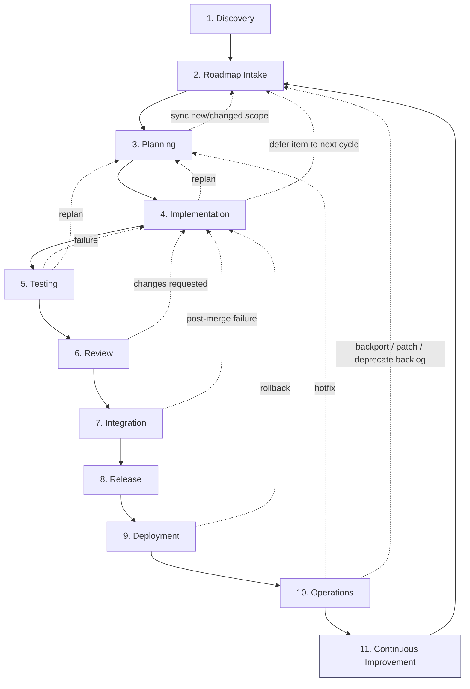
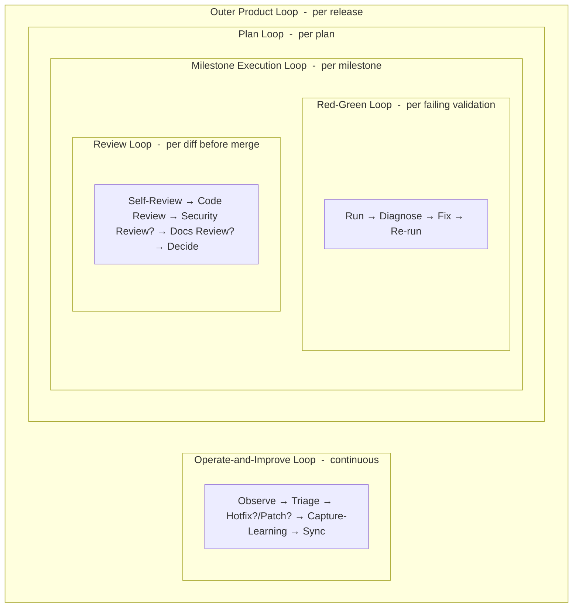
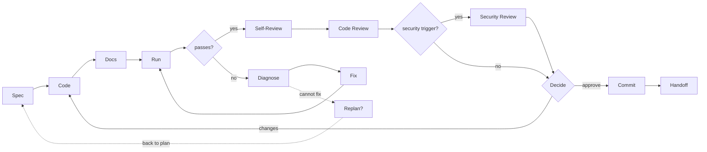
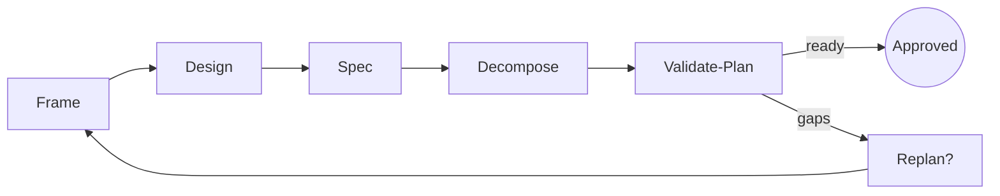
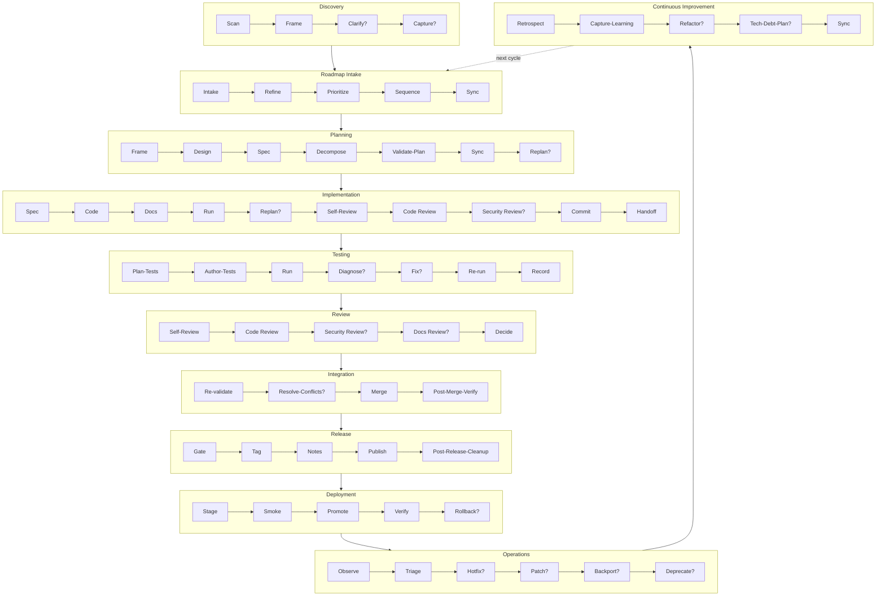
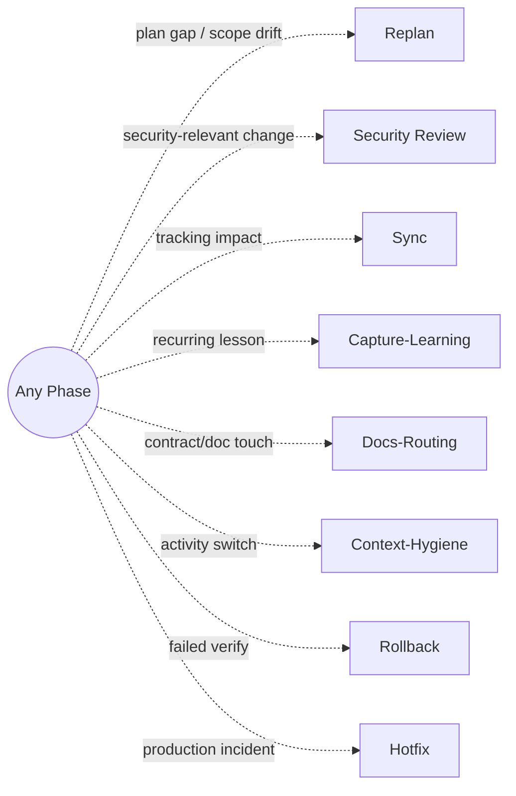
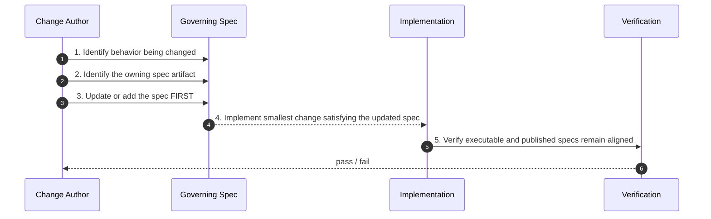
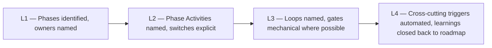

# Application Development Lifecycle Diagrams

This document accompanies `docs/specs/application-lifecycle-spec.md` and visualizes its three layered models (Phases, Phase Activities, Loops) plus cross-cutting triggers.

All diagrams use [Mermaid](https://mermaid.js.org/) syntax so they render natively on GitHub, IntelliJ Markdown preview, and most static-site renderers. The diagrams are descriptive, not normative; the spec text remains authoritative when text and diagrams disagree.

## How To Read These Diagrams

- **Solid arrows** mark the planned forward path between phases or phase activities.
- **Dashed arrows** mark *conditional* transitions: re-entry on failure, conditional phase activities (`?` in the spec), or trigger-driven switches.
- **Dotted arrows** mark cross-cutting triggers that may fire from any phase.
- A node label ending in `?` is a conditional activity or phase, matching the spec.
- Loop boundaries are shown as Mermaid `subgraph` boxes.

## 1. Phase Flow

The eleven phases and their normal forward transitions, with re-entry edges for failed gates and roadmap-feedback edges for scope changes discovered mid-cycle.

## 2. Loop Nesting

The six loops nest from outermost (per release) to innermost (per failing validation or per diff).

## 3. Implementation Milestone Execution Loop

The activity sequence inside a single milestone, with the inner Red-Green and Review loops drawn explicitly. This is the loop the spec's section 5.3 names as "Milestone Execution Loop".

## 4. Plan Loop

Activity sequence for producing a decision-complete plan, with `Replan?` re-entry.

## 5. Phase Activity Sequence

A compact view of the in-order primary activity sequence per phase. Each row mirrors section 4 of the spec.

## 6. Cross-Cutting Triggers

Triggers fire from any phase and force a switch. They are not a phase of their own.

## 7. Spec-Driven Development Sequence

The five-step rule from spec section 8, rendered as a sequence to highlight the spec-first ordering.

## 8. Conformance Levels

Section 11 of the spec defines four conformance levels. Visualized as a maturity ladder.

## Cross-References

- `docs/specs/application-lifecycle-spec.md` — the normative spec these diagrams accompany
- `docs/specs/lifecycle-phase-activities.md` — the repo-specific instantiation of the activity vocabulary
