# Lifecycle Action Document Loading Report

This report maps user-initiated lifecycle actions from `docs/specs/application-lifecycle-spec.md` and `docs/specs/lifecycle-phase-activities.md` to the repository files an AI agent loads when executing those actions.

The report is descriptive. It does not change loading policy. `AGENTS.md` and the focused owner guides remain authoritative.

## Scope And Notation

Every user-initiated action starts with:

- `M: AGENTS.md`

The table below lists additional files loaded for each action occurrence in lifecycle order.

Notation:

- `M:` mandatory load for that action, beyond the global `AGENTS.md`
- `O:` optional or conditional load
- `<governing spec>` means the task-specific executable or published spec that owns the behavior
- `<source files>` means the task-specific implementation files
- `<active plan>` means the concrete `.agents/plans/PLAN_*.md` file when the work is plan-bound
- `<worker log>` means `.agents/tmp/workflow/*.md` when delegated or coordinated workflow is active

Cross-references in owner guides are conditional pointers, not recursive load requirements. Loops reuse already loaded files unless a new condition fires.

## Graph File Alias Legend

The graph uses aliases so all actions can fit in one diagram.

| Alias | File or file family |
| --- | --- |
| F0 | `AGENTS.md` |
| F1 | `docs/ARCHITECTURE.md` |
| F2 | `.agents/references/planning.md` |
| F3 | `.agents/references/execution.md` |
| F4 | `.agents/references/LEARNINGS.md` |
| F5 | `ROADMAP.md` |
| F6 | `docs/DESIGN.md` |
| F7 | `.agents/references/documentation.md` |
| F8 | `.agents/references/references-rules.md` |
| F9 | `README.md` |
| F10 | `src/docs/asciidoc/` |
| F11 | `src/test/resources/openapi/approved-openapi.json` |
| F12 | `docs/FRONTEND_AI_CONTRACT.md` |
| F13 | `.agents/templates/plan-template.md` |
| F14 | `.agents/references/workflow.md` |
| F15 | `.agents/references/plan-authoring-guide.md` |
| F16 | `.agents/references/testing.md` |
| F17 | `.agents/references/plan-execution.md` |
| F18 | `.agents/references/code-style.md` |
| F19 | `.agents/references/environment-quick-ref.md` |
| F20 | `.agents/references/gradle-task-graph.md` |
| F21 | `.agents/references/troubleshooting.md` |
| F22 | `SETUP.md` |
| F23 | `.agents/references/reviews.md` |
| F24 | `.gitmessage` |
| F25 | `.agents/references/releases.md` |
| F26 | `.agents/references/release-checklist.md` |
| F27 | `CHANGELOG.md` |
| F28 | `.agents/archive/` |
| F29 | `.agents/references/release-artifact-verification.md` |
| F30 | `infra/` |
| F31 | `src/externalTest/` |
| F32 | `src/manualTests/http/suites/README.md` |
| F33 | `docs/specs/application-lifecycle-spec.md` |
| F34 | `docs/specs/lifecycle-phase-activities.md` |
| F35 | `docs/specs/application-lifecycle-diagrams.md` |
| F36 | concrete `.agents/plans/PLAN_*.md` |
| F37 | `.agents/tmp/workflow/*.md` |
| F38 | task-specific governing spec or published contract artifact |
| F39 | task-specific source files |
| F40 | task-specific test or executable-spec files |
| F41 | changed documentation or contract files |
| F42 | conflicting files being resolved |
| F43 | deployment-specific workflow, configuration, or check files |
| F44 | user-supplied monitoring, log, trace, or incident files |
| F45 | focused owner guide for a durable correction |
| F46 | referenced ticket, pull request, example, document, or web page |
| F47 | temporary `CHANGELOG_<topic>.md` files |
| F48 | security-sensitive source, workflow, config, or release files |
| F49 | published contract docs not otherwise named in this row |

## All-Action Load Graph

Every action inherits `M:F0`.
Node labels list action-specific mandatory (`M`) and optional (`O`) loads.
Dashed arrows are conditional branches or loops.

```mermaid
flowchart TB
    Start["M:F0<br/>AGENTS.md"]

    subgraph Discovery
        D1["Scan<br/>M:F1<br/>O:F4,F39"] --> D2["Frame<br/>M:F2<br/>O:F3,F5"]
        D2 --> D3["Clarify?<br/>M:F2"]
        D3 -. answer or fallback .-> D2
        D3 --> D4["Capture?<br/>M:F4<br/>O:F45,F8"]
        D4 -. return .-> D2
    end

    subgraph Roadmap_Intake["Roadmap Intake"]
        R1["Intake<br/>M:F5<br/>O:F2"] --> R2["Refine<br/>M:F5<br/>O:F6"]
        R2 --> R3["Prioritize<br/>M:F5<br/>O:F6"]
        R3 --> R4["Sequence<br/>M:F5<br/>O:F36"]
        R4 --> R5["Sync<br/>M:F5<br/>O:F36"]
    end

    subgraph Planning
        P1["Frame<br/>M:F2,F5<br/>O:F6,F38,F46,F33,F34"] --> P2["Design<br/>M:F2,F6 or F38<br/>O:F7,F9,F10"]
        P2 --> P3["Spec<br/>M:F2,F38<br/>O:F7,F11,F9,F10"]
        P3 --> P4["Decompose<br/>M:F2,F13<br/>O:F14,F15"]
        P4 --> P5["Validate-Plan<br/>M:F2,F36<br/>O:F16,F7,F14"]
        P5 --> P6["Sync<br/>M:F5,F36"]
        P6 --> P7["Replan?<br/>M:F2,F36<br/>O:F3,F17"]
        P7 -. gaps .-> P5
        P4 -. parallel workflow shape .-> W0["Parallel workflow branch<br/>M:F14<br/>O:F37,F16,F23,F7"]
    end

    subgraph Implementation
        I1["Spec<br/>M:F3,F38<br/>O:F7"] --> I2["Code<br/>M:F3,F18,F39<br/>O:F1,F6,F38"]
        I2 --> I3["Docs<br/>M:F7,F41<br/>O:F8,F9,F10,F12,F11"]
        I3 --> I4["Run<br/>M:F16,F19<br/>O:F20,F21"]
        I4 --> I5["Replan?<br/>M:F2,F36<br/>O:F17,F14"]
        I5 -. plan gap .-> P7
        I4 --> I6["Self-Review<br/>M:F23<br/>O:F16,F7"]
        I6 --> I7["Code Review<br/>M:F23<br/>O:F38,F39"]
        I7 --> I8["Security Review?<br/>M:F23<br/>O:F48,F16,F7"]
        I8 --> I9["Commit<br/>M:F3,F24<br/>O:F36,F37,F14"]
        I9 --> I10["Handoff<br/>M:F3<br/>O:F14,F36,F37"]
    end

    subgraph Testing
        T1["Plan-Tests<br/>M:F16<br/>O:F7,F20"] --> T2["Author-Tests<br/>M:F16,F40<br/>O:F18,F39"]
        T2 --> T3["Run<br/>M:F16,F19<br/>O:F20,F21"]
        T3 -. fail .-> T4["Diagnose?<br/>M:F21<br/>O:F16,F22,F4"]
        T4 --> T5["Fix?<br/>M:F3,F39/F40/F38<br/>O:F2"]
        T5 --> T6["Re-run<br/>M:F16,F19<br/>O:F20"]
        T6 -. still fails .-> T4
        T6 --> T7["Record<br/>M:F16,F36 or F37<br/>O:F14"]
    end

    subgraph Review
        V1["Self-Review<br/>M:F23<br/>O:F16,F7"] --> V2["Code Review<br/>M:F23,F41<br/>O:F38,F16"]
        V2 --> V3["Security Review?<br/>M:F23<br/>O:F48,F16,F7"]
        V3 --> V4["Docs Review?<br/>M:F23,F7<br/>O:F8,F49"]
        V4 --> V5["Decide<br/>M:F23<br/>O:F3,F16"]
        V5 -. changes requested .-> I2
        V5 -. validation needed .-> I4
    end

    subgraph Integration
        G1["Re-validate<br/>M:F16,F19<br/>O:F14,F20"] --> G2["Resolve-Conflicts?<br/>M:F14,F42<br/>O:F36,F23"]
        G2 --> G3["Merge<br/>M:F14<br/>O:F36,F37"]
        G3 --> G4["Post-Merge-Verify<br/>M:F16,F14<br/>O:F3,F17"]
        G4 -. failure .-> I2
    end

    subgraph Release
        L1["Gate<br/>M:F25,F16,F7<br/>O:F36,F5,F27"] --> L2["Tag<br/>M:F25,F26,F27,F5<br/>O:F4,F28"]
        L2 --> L3["Notes<br/>M:F25,F27<br/>O:F26,F47"]
        L3 --> L4["Publish<br/>M:F25<br/>O:F29"]
        L4 --> L5["Post-Release-Cleanup<br/>M:F25,F26,F5,F27,F28<br/>O:F4,F14"]
        L1 -. precondition fails .-> I10
        L4 -. verify publication .-> L4V["Publication verification<br/>M:F29"]
    end

    subgraph Deployment
        DP1["Stage<br/>M:none beyond F0<br/>O:F29,F30,F31"] --> DP2["Smoke<br/>M:none beyond F0<br/>O:F29,F32,F31"]
        DP2 --> DP3["Promote<br/>M:none beyond F0<br/>O:F43"]
        DP3 --> DP4["Verify<br/>M:none beyond F0<br/>O:F29,F43"]
        DP4 -. failed verify .-> DP5["Rollback?<br/>M:none beyond F0<br/>O:F14,F25,F43"]
    end

    subgraph Operations
        O1["Observe<br/>M:none beyond F0<br/>O:F44"] --> O2["Triage<br/>M:F5 when scheduling<br/>O:F2,F4,F44"]
        O2 --> O3["Hotfix?<br/>M:F3,F16,F23<br/>O:F14,F2"]
        O2 --> O4["Patch?<br/>M:F2 or F3<br/>O:F5,F16,F23"]
        O2 --> O5["Backport?<br/>M:none beyond F0<br/>O:F14,F27"]
        O2 --> O6["Deprecate?<br/>M:F5,F6<br/>O:F2,F49"]
    end

    subgraph Continuous_Improvement["Continuous Improvement"]
        C1["Retrospect<br/>M:F4<br/>O:F25,F36,F5"] --> C2["Capture-Learning<br/>M:F4<br/>O:F45,F8"]
        C2 --> C3["Refactor?<br/>M:F2,F5<br/>O:F1,F18,F16"]
        C3 --> C4["Tech-Debt-Plan?<br/>M:F2,F5<br/>O:F4,F1,F6"]
        C4 --> C5["Sync<br/>M:F5<br/>O:F27"]
    end

    Start --> D1
    D2 --> R1
    R5 --> P1
    P6 --> I1
    I4 -. validation failure .-> T4
    I10 --> T1
    T7 --> V1
    V5 -. approve .-> G1
    G4 --> L1
    L5 --> C1
    C5 -. next cycle .-> R1
    O3 -. normal fix path .-> I1
    O4 -. planned patch .-> P1
    O6 -. schedule removal .-> R1
```

## Chain Metrics And Deduplication

Counting rules:

- `Chain length` counts load events along the max-expanded action sequence for the scope. Repeated loads count again.
- `Total loaded` counts all load events in the same max-expanded scope. For these phase rows, the action sequence is linear, so it matches `Chain length`.
- `Deduplicated chain length` removes documents already loaded earlier in the same scope.
- `Distinct loaded` is the unique file-alias count for the same scope.
- Each user-initiated action includes `AGENTS.md`; therefore repeated `AGENTS.md` loads are counted in raw chain and total numbers.
- Optional branches listed in the action matrix are included once in max-expanded counts. Infinite loop repetition is not counted.

### Phase Metrics

| Scope | Chain length | Total loaded | Deduplicated chain length | Distinct loaded | Notes |
| --- | ---: | ---: | ---: | ---: | --- |
| All 63 action occurrences | 295 | 295 | 50 | 50 | Max-expanded count across every action in the lifecycle specs. |
| Discovery | 14 | 14 | 9 | 9 | Includes ambiguity and learning branches once. |
| Roadmap Intake | 15 | 15 | 5 | 5 | Mostly repeats `ROADMAP.md`. |
| Planning | 40 | 40 | 19 | 19 | Add 5 raw loads and 2 more distinct files when the optional parallel workflow branch is also expanded. |
| Implementation | 53 | 53 | 26 | 26 | Broadest normal phase because spec, code, docs, validation, review, commit, and handoff all participate. |
| Testing | 34 | 34 | 17 | 17 | Includes one red-green failure diagnosis and rerun path. |
| Review | 23 | 23 | 10 | 10 | Includes security and docs-review branches once. |
| Integration | 19 | 19 | 11 | 11 | Includes conflict and post-merge verification paths once. |
| Release | 30 | 30 | 13 | 13 | Includes local release preparation, publication branch, and cleanup once. |
| Deployment | 17 | 17 | 8 | 8 | Mostly optional because no complete AI owner guide exists for this phase. |
| Operations | 26 | 26 | 12 | 12 | Partial mapping through planning, execution, roadmap, workflow, and release-history files. |
| Continuous Improvement | 24 | 24 | 13 | 13 | Learning and roadmap files repeat heavily. |

### Common Loop Metrics

| Loop or path | Chain length | Total loaded | Deduplicated chain length | Distinct loaded | Notes |
| --- | ---: | ---: | ---: | ---: | --- |
| Plan Loop, one pass | 32 | 32 | 17 | 17 | `Frame -> Design -> Spec -> Decompose -> Validate-Plan`. |
| Plan Loop, one replan iteration | 43 | 43 | 19 | 19 | Adds `Replan? -> Validate-Plan` once. |
| Milestone Execution Loop | 53 | 53 | 26 | 26 | Same max-expanded count as the Implementation phase row. |
| Red-Green Loop after one failure | 20 | 20 | 12 | 12 | `Run -> Diagnose? -> Fix? -> Re-run`. |
| Review Loop with conditional reviews | 23 | 23 | 10 | 10 | `Self-Review -> Code Review -> Security Review? -> Docs Review? -> Decide`. |
| Delegated workflow branch | 8 | 8 | 7 | 7 | Workflow guide, delegated/coordinated detail, worker log, validation, review, and docs alignment. |
| Local release preparation | 27 | 27 | 12 | 12 | `Gate -> Tag -> Notes -> Post-Release-Cleanup`, excluding remote publication verification. |
| Release publication verification | 6 | 6 | 4 | 4 | `Publish` plus publication verification. |

### Single-Action Extremes

| Action | Chain length | Total loaded | Deduplicated chain length | Distinct loaded | Why |
| --- | ---: | ---: | ---: | ---: | --- |
| `Implementation / Docs` | 8 | 8 | 8 | 8 | Can touch documentation routing, changed docs, reference rules, README, REST Docs, frontend contract, and OpenAPI. |
| `Release / Post-Release-Cleanup` | 8 | 8 | 8 | 8 | Can touch release guides, roadmap, changelog, archives, learnings, and workflow cleanup. |
| `Release / Gate` | 7 | 7 | 7 | 7 | Checks release, validation, documentation, active plan, roadmap, and changelog context. |
| `Release / Tag` | 7 | 7 | 7 | 7 | Loads release guide, checklist, changelog, roadmap, learnings, and archive context. |
| Deployment or Operations gap actions with no explicit owner guide | 1 | 1 | 1 | 1 | Only `AGENTS.md` is mandatory until a task-specific owner is supplied. |

## Action Load Matrix

| Phase | Action | Mandatory loads beyond `AGENTS.md` | Optional or conditional loads | Parallel path and loop handling |
| --- | --- | --- | --- | --- |
| Discovery | `Scan` | `docs/ARCHITECTURE.md` when structural repo context is needed | `.agents/references/LEARNINGS.md` for known recurring lessons; task-specific docs or source files found by the scan | Branches into the owner guide for the discovered area only |
| Discovery | `Frame` | `.agents/references/planning.md` when the request may need planning | `.agents/references/execution.md` when the request is clearly bounded; `ROADMAP.md` when active-work state matters | Can exit to `Clarify?`, `Intake`, or bounded execution |
| Discovery | `Clarify?` | `.agents/references/planning.md` | none | Loops back to `Frame` after the user answers or a fallback is recorded |
| Discovery | `Capture?` | `.agents/references/LEARNINGS.md` | focused owner guide for the durable correction; `.agents/references/references-rules.md` if a reference guide changes | Conditional cross-cutting action; returns to the prior action after capture |
| Roadmap Intake | `Intake` | `ROADMAP.md` | `.agents/references/planning.md` if intake becomes plan creation | Starts active-work tracking or rejects the item as not ready |
| Roadmap Intake | `Refine` | `ROADMAP.md` | `docs/DESIGN.md` when product or contract intent is being shaped | Can loop to `Frame` if the request is still ambiguous |
| Roadmap Intake | `Prioritize` | `ROADMAP.md` | `docs/DESIGN.md` for product tradeoffs | May defer work without loading execution guides |
| Roadmap Intake | `Sequence` | `ROADMAP.md` | `<active plan>` files when dependencies are plan-specific | May identify parallel-safe or blocking work before planning |
| Roadmap Intake | `Sync` | `ROADMAP.md` | `<active plan>` when syncing a concrete plan path or lifecycle state | Cross-cutting; can fire after planning, execution, release, or learning |
| Planning | `Frame` | `.agents/references/planning.md`, `ROADMAP.md` | `docs/DESIGN.md`, `<governing spec>`, referenced tickets or examples | Starts the Plan Loop; may return to Discovery if intent is unclear |
| Planning | `Design` | `.agents/references/planning.md`, `docs/DESIGN.md` or `<governing spec>` | `.agents/references/documentation.md` for artifact routing; `README.md` or `src/docs/asciidoc/` if public contract is involved | Feeds `Spec`; does not load implementation guides by default |
| Planning | `Spec` | `.agents/references/planning.md`, `<governing spec>` | `.agents/references/documentation.md`; `src/test/resources/openapi/approved-openapi.json`; `README.md`; `src/docs/asciidoc/` | Establishes the spec target before implementation |
| Planning | `Decompose` | `.agents/references/planning.md`, `.agents/templates/plan-template.md` | `.agents/references/workflow.md` for split/worktree decisions; `.agents/references/plan-authoring-guide.md` when compact planning rules are not enough | May branch into delegated or coordinated workflow design |
| Planning | `Validate-Plan` | `.agents/references/planning.md`, `<active plan>` | `.agents/references/testing.md`; `.agents/references/documentation.md`; `.agents/references/workflow.md` | If gaps remain, loops through `Replan?` back to `Frame` or `Design` |
| Planning | `Sync` | `ROADMAP.md`, `<active plan>` | none | Keeps roadmap state aligned with plan readiness |
| Planning | `Replan?` | `.agents/references/planning.md`, `<active plan>` | `.agents/references/execution.md` or `.agents/references/plan-execution.md` when replan is triggered during execution | Loops back to `Validate-Plan` until the plan is decision-complete |
| Implementation | `Spec` | `.agents/references/execution.md`, `<governing spec>` | `.agents/references/documentation.md` when spec ownership is unclear | Starts the milestone execution path |
| Implementation | `Code` | `.agents/references/execution.md`, `.agents/references/code-style.md`, `<source files>` | `docs/ARCHITECTURE.md` for placement; `docs/DESIGN.md` for product behavior; `<governing spec>` | Re-enters after review changes or red-green fixes |
| Implementation | `Docs` | `.agents/references/documentation.md`, changed documentation or contract files | `.agents/references/references-rules.md` for `.agents/references/*.md`; `README.md`; `src/docs/asciidoc/`; `docs/FRONTEND_AI_CONTRACT.md`; `src/test/resources/openapi/approved-openapi.json` | Can run in parallel with code only when artifact ownership is disjoint |
| Implementation | `Run` | `.agents/references/testing.md`, `.agents/references/environment-quick-ref.md` | `.agents/references/gradle-task-graph.md`; `.agents/references/troubleshooting.md` on failure | Enters Red-Green Loop if validation fails |
| Implementation | `Replan?` | `.agents/references/planning.md`, `<active plan>` | `.agents/references/plan-execution.md` for whole-plan execution; `.agents/references/workflow.md` if ownership shape changes | Returns from milestone execution to Plan Loop |
| Implementation | `Self-Review` | `.agents/references/reviews.md` | `.agents/references/testing.md`; `.agents/references/documentation.md` | Starts Review Loop; may expose validation or doc drift |
| Implementation | `Code Review` | `.agents/references/reviews.md` | `<governing spec>`, `<source files>` | If changes are requested, returns to `Code` or `Run` |
| Implementation | `Security Review?` | `.agents/references/reviews.md` | `.agents/references/testing.md`; `.agents/references/documentation.md`; security-sensitive source or workflow files | Conditional branch inside Review Loop |
| Implementation | `Commit` | `.agents/references/execution.md`, `.gitmessage` | `<active plan>`; `<worker log>`; `.agents/references/workflow.md` for branch/delegated work | Commits close a bounded task or milestone, not a whole release |
| Implementation | `Handoff` | `.agents/references/execution.md` | `.agents/references/workflow.md`; `<active plan>`; `<worker log>` | Must report blocked, failed, skipped, or terminal worker states explicitly |
| Testing | `Plan-Tests` | `.agents/references/testing.md` | `.agents/references/documentation.md`; `.agents/references/gradle-task-graph.md` | Chooses validation before `Run`; may branch by change class |
| Testing | `Author-Tests` | `.agents/references/testing.md`, test or spec files under `src/test/` or related spec locations | `.agents/references/code-style.md`; `<source files>` | Often runs in parallel with implementation only when ownership is clear |
| Testing | `Run` | `.agents/references/testing.md`, `.agents/references/environment-quick-ref.md` | `.agents/references/gradle-task-graph.md`; `.agents/references/troubleshooting.md` on failure | Red-Green Loop begins on failure |
| Testing | `Diagnose?` | `.agents/references/troubleshooting.md` | `.agents/references/testing.md`; `SETUP.md` only for real environment/setup failures; `.agents/references/LEARNINGS.md` for durable recurring lessons | Loops to `Fix?` or `Replan?` |
| Testing | `Fix?` | `.agents/references/execution.md`, affected implementation/test/spec files | `.agents/references/planning.md` when the failure reveals a plan gap | Returns to `Re-run` after the smallest correction |
| Testing | `Re-run` | `.agents/references/testing.md`, `.agents/references/environment-quick-ref.md` | `.agents/references/gradle-task-graph.md` | Loops until the failing validation passes or exits through `Replan?` |
| Testing | `Record` | `.agents/references/testing.md`, `<active plan>` or `<worker log>` when present | `.agents/references/workflow.md` for delegated validation evidence | Ends a validation pass; evidence must match what actually ran |
| Review | `Self-Review` | `.agents/references/reviews.md` | `.agents/references/testing.md`; `.agents/references/documentation.md` | Can return to implementation before peer-style review |
| Review | `Code Review` | `.agents/references/reviews.md`, changed files under review | `<governing spec>`; `.agents/references/testing.md` | May return to `Code` or `Run` |
| Review | `Security Review?` | `.agents/references/reviews.md` | security-sensitive source, workflow, config, or release files; `.agents/references/testing.md`; `.agents/references/documentation.md` | Conditional branch; failures return to implementation |
| Review | `Docs Review?` | `.agents/references/reviews.md`, `.agents/references/documentation.md` | `.agents/references/references-rules.md` for reference docs; affected human-facing docs | Conditional branch for doc-heavy changes |
| Review | `Decide` | `.agents/references/reviews.md` | `.agents/references/execution.md` if changes are requested; `.agents/references/testing.md` if validation must be rerun | Approve exits Review Loop; changes loop back to Code or Run |
| Integration | `Re-validate` | `.agents/references/testing.md`, `.agents/references/environment-quick-ref.md` | `.agents/references/workflow.md`; `.agents/references/gradle-task-graph.md` | Confirms merge target after rebase or conflict resolution |
| Integration | `Resolve-Conflicts?` | `.agents/references/workflow.md`, conflicting files | `<active plan>`; `.agents/references/reviews.md` for conflict-risk review | Conditional branch before merge |
| Integration | `Merge` | `.agents/references/workflow.md` | `<active plan>`; `<worker log>` | Parallel workers converge here; coordinator owns integration order |
| Integration | `Post-Merge-Verify` | `.agents/references/testing.md`, `.agents/references/workflow.md` | `.agents/references/execution.md` or `.agents/references/plan-execution.md` for completion criteria | Failure returns to Implementation or Replan |
| Release | `Gate` | `.agents/references/releases.md`, `.agents/references/testing.md`, `.agents/references/documentation.md` | `<active plan>`; `ROADMAP.md`; `CHANGELOG.md` | If preconditions fail, returns to execution or integration |
| Release | `Tag` | `.agents/references/releases.md`, `.agents/references/release-checklist.md`, `CHANGELOG.md`, `ROADMAP.md` | `.agents/references/LEARNINGS.md`; `.agents/archive/` | Detailed release mechanics load only after gate passes |
| Release | `Notes` | `.agents/references/releases.md`, `CHANGELOG.md` | `.agents/references/release-checklist.md`; temporary `CHANGELOG_<topic>.md` files | Can merge accepted worker release text into canonical notes |
| Release | `Publish` | `.agents/references/releases.md` | `.agents/references/release-artifact-verification.md` when pushing or verifying publication | Remote publication branch; not part of local implementation |
| Release | `Post-Release-Cleanup` | `.agents/references/releases.md`, `.agents/references/release-checklist.md`, `ROADMAP.md`, `CHANGELOG.md`, `.agents/archive/` | `.agents/references/LEARNINGS.md`; `.agents/references/workflow.md` for cleanup of temporary branches/worktrees | Closes released plans and feeds Continuous Improvement |
| Deployment | `Stage` | none beyond `AGENTS.md`; no complete AI owner guide exists | `.agents/references/release-artifact-verification.md`; `infra/`; `src/externalTest/` when task-specific | Guidance gap; should not invent an owner chain |
| Deployment | `Smoke` | none beyond `AGENTS.md`; no complete AI owner guide exists | `.agents/references/release-artifact-verification.md`; `src/manualTests/http/suites/README.md`; `src/externalTest/` when task-specific | Usually tied to release verification or external checks |
| Deployment | `Promote` | none beyond `AGENTS.md`; no complete AI owner guide exists | deployment workflow/config files when explicitly named | Guidance gap |
| Deployment | `Verify` | none beyond `AGENTS.md`; no complete AI owner guide exists | `.agents/references/release-artifact-verification.md`; deployment-specific check files | Can trigger `Rollback?` if verification fails |
| Deployment | `Rollback?` | none beyond `AGENTS.md`; no complete AI owner guide exists | `.agents/references/workflow.md`; `.agents/references/releases.md`; deployment-specific files | Conditional gap; should route to planning or explicit user instruction |
| Operations | `Observe` | none beyond `AGENTS.md`; no complete AI owner guide exists | monitoring, log, or external signal artifacts supplied by the user | Guidance gap; observation can feed Triage |
| Operations | `Triage` | `ROADMAP.md` when scheduling follow-up | `.agents/references/planning.md`; `.agents/references/LEARNINGS.md`; user-supplied incident data | Can branch to Hotfix, Patch, Backport, Deprecate, or Sync |
| Operations | `Hotfix?` | `.agents/references/execution.md`, `.agents/references/testing.md`, `.agents/references/reviews.md` | `.agents/references/workflow.md`; `.agents/references/planning.md` if scope is not bounded | Conditional partial mapping; no dedicated operations guide |
| Operations | `Patch?` | `.agents/references/planning.md` or `.agents/references/execution.md`, depending on scope | `ROADMAP.md`; `.agents/references/testing.md`; `.agents/references/reviews.md` | Normal-flow corrective work enters Planning or Implementation |
| Operations | `Backport?` | none beyond `AGENTS.md`; no complete AI owner guide exists | `.agents/references/workflow.md`; `CHANGELOG.md`; release branch docs if created later | Guidance gap |
| Operations | `Deprecate?` | `ROADMAP.md`, `docs/DESIGN.md` | `.agents/references/planning.md`; published contract docs if behavior is documented | Usually becomes planned work |
| Continuous Improvement | `Retrospect` | `.agents/references/LEARNINGS.md` | `.agents/references/releases.md`; `<active plan>` or archived plan; `ROADMAP.md` | Runs after release or major plan; can feed Capture-Learning |
| Continuous Improvement | `Capture-Learning` | `.agents/references/LEARNINGS.md` | focused owner guide; `.agents/references/references-rules.md` for reference-doc guidance changes | Cross-cutting learning loop |
| Continuous Improvement | `Refactor?` | `.agents/references/planning.md`, `ROADMAP.md` | `docs/ARCHITECTURE.md`; `.agents/references/code-style.md`; `.agents/references/testing.md` | Converts improvement into planned work |
| Continuous Improvement | `Tech-Debt-Plan?` | `.agents/references/planning.md`, `ROADMAP.md` | `.agents/references/LEARNINGS.md`; `docs/ARCHITECTURE.md`; `docs/DESIGN.md` | Converts recurring pain into roadmap-tracked work |
| Continuous Improvement | `Sync` | `ROADMAP.md` | `CHANGELOG.md` when released-history text is involved | Feeds the next Roadmap Intake cycle |

## Loop And Parallel Path Effects

| Loop or path | Extra loads when the path fires | Reuse behavior |
| --- | --- | --- |
| Plan Loop | `.agents/references/planning.md`, `<active plan>`, `ROADMAP.md`, optional `.agents/templates/plan-template.md`, `.agents/references/plan-authoring-guide.md`, `.agents/references/documentation.md`, `.agents/references/testing.md`, `.agents/references/workflow.md` | Replan iterations reuse planning context; only newly discovered owner docs are added |
| Milestone Execution Loop | `.agents/references/execution.md`, `.agents/references/code-style.md`, current milestone context, optional documentation/testing/review/workflow guides | Each milestone should load only its named context; previous milestone files should be dropped |
| Red-Green Loop | `.agents/references/testing.md`, `.agents/references/environment-quick-ref.md`, optional `.agents/references/troubleshooting.md`, `.agents/references/gradle-task-graph.md`, `.agents/references/execution.md` | Passing runs stay shallow; failure adds troubleshooting once and loops until pass or replan |
| Review Loop | `.agents/references/reviews.md`, optional `.agents/references/testing.md`, `.agents/references/documentation.md`, `.agents/references/execution.md` | Approval exits; requested changes loop back to implementation or validation |
| Delegated one-plan work | `.agents/references/workflow.md`, `.agents/references/workflow-delegated-plan.md`, `<worker log>`, final validation/review/docs guides | Coordinator loads integration docs; workers load only assigned slice context |
| Coordinated multi-plan work | `.agents/references/workflow.md`, `.agents/references/workflow-coordinated-plans.md`, `<worker log>`, temporary `CHANGELOG_<topic>.md` files | Coordinator deduplicates final validation, changelog, roadmap, and integration context |
| Release path | `.agents/references/releases.md`, optional `.agents/references/release-checklist.md`, `.agents/references/release-artifact-verification.md`, `CHANGELOG.md`, `ROADMAP.md`, `.agents/archive/` | Release-checklist loads only after gate passes; artifact verification loads only for push/publish verification |
| Operate-and-Improve Loop | `.agents/references/LEARNINGS.md`, `ROADMAP.md`, optional planning/execution guides | Current repo has partial ownership; deployment and operations-specific owner guides are gaps |

## Observations

1. Most actions require one additional owner file beyond `AGENTS.md`; deep chains appear when an action crosses lifecycle boundaries.
2. Planning, whole-plan execution, release, and delegated workflow are the deepest user-initiated paths.
3. `Run` is cheap when validation passes and expensive when it fails because `troubleshooting.md`, focused reruns, and implementation fixes enter the loop.
4. `Docs` and `Spec` are the most likely actions to branch into contract artifacts because they depend on change class.
5. The fastest paths in `AGENTS.md` reduce load for documentation-only and bounded implementation work by deferring `documentation.md`, `testing.md`, and `reviews.md` until their checkpoints.
6. Deployment and Operations actions are named by the lifecycle specs but do not have complete AI owner guides in this repository.

## Stats

- Phase-action occurrences in `application-lifecycle-spec.md`: 63.
- Unique action labels: 54.
- Repeated action labels: 8 (`Code Review`, `Frame`, `Replan?`, `Run`, `Security Review?`, `Self-Review`, `Spec`, `Sync`).
- Occurrences in phases with complete or mostly complete repo owner guidance: 47 (`Discovery` through `Release`).
- Occurrences with explicit no-complete-owner-guide gaps: 11 (`Deployment` and `Operations`).
- Continuous Improvement occurrences with partial ownership through learnings, roadmap, and planning: 5.
- Mandatory global load for every user-initiated action: 1 file, `AGENTS.md`.
- Max-expanded raw load events across all action occurrences: 295.
- Max-expanded distinct load aliases across all action occurrences: 50.
- Typical bounded implementation path before validation failure: `AGENTS.md`, `.agents/references/execution.md`, `.agents/references/code-style.md`, task-specific specs/source files.
- Typical red-green failure path adds at least `.agents/references/testing.md`, `.agents/references/environment-quick-ref.md`, and `.agents/references/troubleshooting.md`.
- Release publication is the broadest static path because it can touch release guides, validation guide, documentation guide, changelog, roadmap, archives, and remote-publication verification guidance.

## Uncommon Loads

These files are uncommon in ordinary user-initiated work because they are phase-gated, failure-gated, or tied to specialized maintenance:

| File or path | Why uncommon |
| --- | --- |
| `docs/specs/application-lifecycle-spec.md` | Loaded for lifecycle vocabulary, phase, activity, or conformance changes, not routine implementation |
| `docs/specs/lifecycle-phase-activities.md` | Loaded for activity vocabulary, owner mapping, or loop diagnosis |
| `docs/specs/application-lifecycle-diagrams.md` | Loaded when lifecycle diagrams are edited or reviewed |
| `.agents/templates/plan-template.md` | Loaded when creating a concrete plan skeleton |
| `.agents/references/plan-authoring-guide.md` | Loaded only when compact planning rules and the template are not enough |
| `.agents/references/gradle-task-graph.md` | Loaded only when Gradle task overlap or prerequisites affect command choice |
| `.agents/references/troubleshooting.md` | Loaded only after validation, workflow, benchmark, or release-gate failure |
| `.agents/references/workflow-delegated-plan.md` | Loaded only after approved one-plan delegation or worktree-backed split |
| `.agents/references/workflow-coordinated-plans.md` | Loaded only after approved parallel execution of separate active plans |
| `.agents/tmp/workflow/*.md` | Exists only for delegated or coordinated worker logs |
| `.agents/references/release-checklist.md` | Loaded only after release preconditions pass and a local release tag is being prepared |
| `.agents/references/release-artifact-verification.md` | Loaded only for push, publication monitoring, or published-artifact verification |
| `.agents/archive/` | Used during release cleanup or historical lookup, not active implementation |
| `.agents/references/references-rules.md` | Loaded for `.agents/references/*.md` edits or reference-document rule changes |
| `.gitmessage` | Loaded when creating an AI-authored commit |
| `SETUP.md` | Loaded for human setup or real environment troubleshooting, not normal validation selection |
| `src/manualTests/http/suites/README.md` | Loaded only for manual regression suite use |
| `.agents/skills/**` | Loaded only when a repo-local skill is invoked or maintained |
| `.agents/plugins/marketplace.json` | Loaded only for Codex plugin marketplace configuration |
