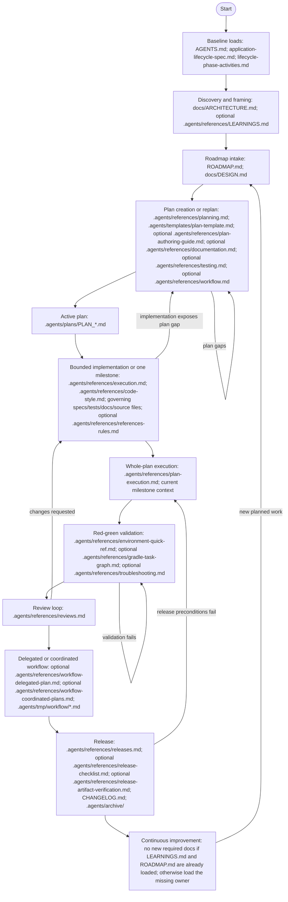

# Lifecycle Document Loading Report

This report analyzes the common lifecycle actions defined by `docs/specs/application-lifecycle-spec.md` and `docs/specs/lifecycle-phase-activities.md` that can lead to deep document-loading chains in this repository.

The report is descriptive. It does not change lifecycle policy. `AGENTS.md` and the focused owner guides remain authoritative for what must be loaded during a task.

## Sources And Reading Rules

Primary sources:

- `docs/specs/application-lifecycle-spec.md`
- `docs/specs/lifecycle-phase-activities.md`
- `AGENTS.md`
- owner guides named by the lifecycle activity catalogue

Assumptions:

- Cross-references in owner guides are conditional pointers, not recursive load requirements.
- The "full" diagram intentionally expands conditional branches so deep chains and loops are visible.
- The "filtered" diagram shows a continuous lifecycle-order traversal where a document already loaded by an earlier node is omitted from later nodes.
- If a task starts in the middle of the lifecycle, the filtered diagram does not apply globally; start from `AGENTS.md` and the owner guide for that task.

## Common Actions With Deep Loading Chains

| Common action | Lifecycle activities | Deep load trigger | Typical owner chain |
| --- | --- | --- | --- |
| Discovery and framing | `Scan`, `Frame`, `Clarify?`, `Capture?` | structural context, ambiguity, durable lesson | `AGENTS.md` -> `docs/ARCHITECTURE.md` or `.agents/references/planning.md` -> optional `.agents/references/LEARNINGS.md` |
| Roadmap intake | `Intake`, `Refine`, `Prioritize`, `Sequence`, `Sync` | active-work tracking plus product intent | `AGENTS.md` -> `ROADMAP.md` -> optional `docs/DESIGN.md` |
| Plan creation or replan | `Frame`, `Design`, `Spec`, `Decompose`, `Validate-Plan`, `Sync`, `Replan?` | decision-complete plan needs lifecycle vocabulary, artifact routing, validation, roadmap state, and sometimes detailed examples | `AGENTS.md` -> `.agents/references/planning.md` -> lifecycle specs -> `.agents/templates/plan-template.md` -> optional `.agents/references/plan-authoring-guide.md`, `.agents/references/documentation.md`, `.agents/references/testing.md`, `.agents/references/workflow.md`, `ROADMAP.md` |
| Bounded implementation or one milestone | `Spec`, `Code`, `Docs`, `Run`, `Self-Review`, `Commit`, `Handoff` | spec-driven edit crosses implementation, docs, validation, review, and commit rules | `AGENTS.md` -> `.agents/references/execution.md` -> governing spec/source files -> optional `.agents/references/code-style.md`, `.agents/references/documentation.md`, `.agents/references/testing.md`, `.agents/references/reviews.md`, `.agents/references/workflow.md` |
| Whole-plan execution | Milestone Execution Loop | plan execution repeats implementation, validation, review, and tracking per milestone | `AGENTS.md` -> `.agents/references/plan-execution.md` -> active plan -> current milestone context -> optional `.agents/references/documentation.md`, `.agents/references/testing.md`, `.agents/references/reviews.md`, `.agents/references/workflow.md`, `.agents/references/execution.md` for commit rules |
| Red-green validation | `Run`, `Diagnose?`, `Fix?`, `Re-run`, `Record` | validation failure switches from proof to diagnosis, then back to implementation and proof | `AGENTS.md` -> `.agents/references/testing.md` -> `.agents/references/environment-quick-ref.md` -> optional `.agents/references/gradle-task-graph.md`, `.agents/references/troubleshooting.md`, `.agents/references/execution.md` |
| Review loop | `Self-Review`, `Code Review`, `Security Review?`, `Docs Review?`, `Decide` | review may branch into security, documentation ownership, validation sufficiency, or implementation changes | `AGENTS.md` -> `.agents/references/reviews.md` -> optional `.agents/references/testing.md`, `.agents/references/documentation.md`, `.agents/references/execution.md` |
| Delegated or coordinated workflow | `Decompose`, `Handoff`, `Merge`, `Record` | worker ownership adds workflow shape, worker logs, integration order, and final validation | `AGENTS.md` -> `.agents/references/workflow.md` -> optional `.agents/references/workflow-delegated-plan.md` or `.agents/references/workflow-coordinated-plans.md` -> `.agents/references/testing.md`, `.agents/references/reviews.md`, `.agents/references/documentation.md` |
| Release | `Gate`, `Tag`, `Notes`, `Publish`, `Post-Release-Cleanup` | release preconditions add validation proof, release metadata, publication checks, roadmap cleanup, changelog, archive, and learning review | `AGENTS.md` -> `.agents/references/releases.md` -> optional `.agents/references/release-checklist.md`, `.agents/references/release-artifact-verification.md`, `.agents/references/testing.md`, `.agents/references/documentation.md`, `.agents/references/LEARNINGS.md`, `CHANGELOG.md`, `ROADMAP.md` |
| Continuous improvement and learning | `Retrospect`, `Capture-Learning`, `Refactor?`, `Tech-Debt-Plan?`, `Sync` | durable correction must route to the focused owner, a repo-wide lesson, or active-work tracking | `AGENTS.md` -> `.agents/references/LEARNINGS.md` -> optional focused owner guide or `.agents/references/documentation.md` -> optional `ROADMAP.md` |
| Deployment and operations | `Stage`, `Smoke`, `Promote`, `Verify`, `Rollback?`, `Observe`, `Triage`, `Hotfix?`, `Patch?`, `Backport?`, `Deprecate?` | these phases are listed by the lifecycle specs but have no complete AI owner guide in this repo | gap: current mapping is partial through `ROADMAP.md`, `CHANGELOG.md`, release docs, and future owner guides |

## Diagram 1: Full Parallel Paths And Loops

This diagram expands common conditional branches and repeats documents where they appear in multiple owner chains. It is a worst-case visualization, not a recommended initial read set.

```mermaid
flowchart TD
    Start([Task or lifecycle signal]) --> A["AGENTS.md"]
    A --> LS1["docs/specs/application-lifecycle-spec.md"]
    A --> LS2["docs/specs/lifecycle-phase-activities.md"]

    A --> D0[Discovery and framing]
    D0 --> ARCH["docs/ARCHITECTURE.md"]
    D0 --> PLAN0[".agents/references/planning.md"]
    D0 -. durable lesson .-> LEARN0[".agents/references/LEARNINGS.md"]
    D0 -. ambiguity .-> UserInput((User input))
    UserInput --> D0

    A --> R0[Roadmap intake]
    R0 --> ROAD0["ROADMAP.md"]
    R0 --> DESIGN0["docs/DESIGN.md"]
    R0 --> SYNC0[Sync active-work state]
    SYNC0 --> ROAD0

    A --> P0[Plan creation or replan]
    P0 --> PLAN1[".agents/references/planning.md"]
    PLAN1 --> LS1
    PLAN1 --> LS2
    PLAN1 --> TMPL[".agents/templates/plan-template.md"]
    PLAN1 -. examples needed .-> PAG[".agents/references/plan-authoring-guide.md"]
    PLAN1 --> ROAD1["ROADMAP.md"]
    PLAN1 -. product or contract behavior .-> DESIGN1["docs/DESIGN.md"]
    PLAN1 -. artifact routing .-> DOC1[".agents/references/documentation.md"]
    PLAN1 -. validation planning .-> TEST1[".agents/references/testing.md"]
    PLAN1 -. execution shape .-> WF1[".agents/references/workflow.md"]
    P0 --> ValidatePlan{Validate-Plan ready?}
    ValidatePlan -- gaps --> Replan["Replan?"]
    Replan --> P0
    ValidatePlan -- ready --> ActivePlan[".agents/plans/PLAN_*.md"]

    A --> BI[Bounded implementation or one milestone]
    BI --> EX1[".agents/references/execution.md"]
    EX1 --> SpecFiles["governing specs, tests, docs, source files"]
    EX1 --> CS1[".agents/references/code-style.md"]
    CS1 --> ARCH
    EX1 -. docs or contract touched .-> DOC2[".agents/references/documentation.md"]
    DOC2 -. reference doc touched .-> RR1[".agents/references/references-rules.md"]
    EX1 --> TEST2[".agents/references/testing.md"]
    TEST2 --> ENV2[".agents/references/environment-quick-ref.md"]
    TEST2 -. task overlap unclear .-> GTG2[".agents/references/gradle-task-graph.md"]
    TEST2 -. validation fails .-> TR2[".agents/references/troubleshooting.md"]
    TR2 -. durable failure lesson .-> LEARN1[".agents/references/LEARNINGS.md"]
    EX1 --> REV2[".agents/references/reviews.md"]
    REV2 -. validation sufficiency .-> TEST2
    REV2 -. doc alignment .-> DOC2
    EX1 -. delegation or integration .-> WF2[".agents/references/workflow.md"]
    EX1 -. task too large or unclear .-> PLAN0

    A --> WPE[Whole-plan execution]
    WPE --> PEX[".agents/references/plan-execution.md"]
    PEX --> ActivePlan
    PEX --> CurrentMilestone["current milestone context"]
    CurrentMilestone --> EX2[".agents/references/execution.md"]
    CurrentMilestone -. artifact routing .-> DOC3[".agents/references/documentation.md"]
    CurrentMilestone --> TEST3[".agents/references/testing.md"]
    CurrentMilestone --> REV3[".agents/references/reviews.md"]
    CurrentMilestone -. split work .-> WF3[".agents/references/workflow.md"]
    PEX --> MilestoneDone{milestone done?}
    MilestoneDone -- next milestone --> CurrentMilestone
    MilestoneDone -- plan gap --> Replan

    A --> RG[Red-green validation loop]
    RG --> TEST4[".agents/references/testing.md"]
    TEST4 --> ENV4[".agents/references/environment-quick-ref.md"]
    TEST4 -. overlapping Gradle tasks .-> GTG4[".agents/references/gradle-task-graph.md"]
    TEST4 --> RunCheck[Run validation]
    RunCheck -- fail --> TR4[".agents/references/troubleshooting.md"]
    TR4 --> EX4[".agents/references/execution.md"]
    EX4 --> RunCheck
    RunCheck -- pass --> Record4[Record validation evidence]

    A --> RV[Review loop]
    RV --> REV5[".agents/references/reviews.md"]
    REV5 -. weak validation .-> TEST5[".agents/references/testing.md"]
    REV5 -. doc ownership drift .-> DOC5[".agents/references/documentation.md"]
    REV5 --> Decide5{Approve?}
    Decide5 -- changes requested --> EX5[".agents/references/execution.md"]
    EX5 --> RG
    Decide5 -- approve --> IntegrationReady[Ready for integration]

    A --> WF[Delegated or coordinated workflow]
    WF --> WF6[".agents/references/workflow.md"]
    WF6 -. one plan split .-> WFD[".agents/references/workflow-delegated-plan.md"]
    WF6 -. multiple plans .-> WFC[".agents/references/workflow-coordinated-plans.md"]
    WFD --> WorkerLogs[".agents/tmp/workflow/*.md"]
    WFC --> WorkerLogs
    WFD --> TEST6[".agents/references/testing.md"]
    WFC --> TEST6
    WF6 --> REV6[".agents/references/reviews.md"]
    WF6 --> DOC6[".agents/references/documentation.md"]
    TEST6 --> IntegrationReady

    A --> REL[Release]
    REL --> RELG[".agents/references/releases.md"]
    RELG --> Gate{release preconditions met?}
    Gate -- no --> PEX
    Gate -- yes --> RCHK[".agents/references/release-checklist.md"]
    RCHK --> TEST7[".agents/references/testing.md"]
    RCHK --> DOC7[".agents/references/documentation.md"]
    RCHK --> CHANGE["CHANGELOG.md"]
    RCHK --> ROAD7["ROADMAP.md"]
    RCHK --> ARCHIVE[".agents/archive/"]
    RCHK -. durable release lesson .-> LEARN7[".agents/references/LEARNINGS.md"]
    RCHK --> TagReady[annotated tag ready]
    TagReady -. push or verify publication .-> RAV[".agents/references/release-artifact-verification.md"]
    RAV --> RemoteChecks[GitHub, GHCR, smoke, attestation checks]

    A --> CI[Continuous improvement and learning]
    CI --> LEARN8[".agents/references/LEARNINGS.md"]
    LEARN8 -. focused owner exists .-> FocusedGuide["focused owner guide"]
    FocusedGuide -. reference guide changed .-> RR8[".agents/references/references-rules.md"]
    LEARN8 -. planned follow-up .-> ROAD8["ROADMAP.md"]
    ROAD8 --> R0
```

## Diagram 2: Filtered Previous-Node Loads

This diagram walks the same lifecycle-order action groups but lists only documents not already loaded by an earlier node in the diagram. It shows how context shrinks when the agent treats prior loaded documents as still known and avoids reloading duplicate owner guides.

## Findings

1. The deepest ordinary path is whole-plan execution that reaches validation, review, documentation routing, workflow splitting, and commit rules. It can touch `AGENTS.md`, a plan, `plan-execution.md`, `execution.md`, `documentation.md`, `testing.md`, `reviews.md`, `workflow.md`, and the current milestone context before any source file is considered.
2. Planning is the deepest pre-implementation path because it naturally composes lifecycle vocabulary, roadmap state, product/design context, plan template shape, validation scope, and workflow shape.
3. Red-green validation is shallow when validation passes, but failure creates a loop through `testing.md`, `environment-quick-ref.md`, `troubleshooting.md`, and back to `execution.md`.
4. Release work is intentionally deep and phase-gated. The detailed release references should stay unloaded until release preconditions and task phase match.
5. Documentation-only reference edits are now comparatively shallow when ownership is clear: `AGENTS.md`, the target file, and `references-rules.md`; `documentation.md` is needed only when artifact routing or cross-file alignment is unclear.
6. Deployment and Operations remain gaps in this repo's AI owner-guide map. The lifecycle specs name the activities, but current repo guidance does not provide a complete owner chain.

## Practical Loading Guidance

- Do not use Diagram 1 as an initial read list. It is a risk map.
- Start from the fast paths in `AGENTS.md`.
- Treat lifecycle activity names as routing labels. Load the owner guide for the current activity, not every guide named by the full lifecycle.
- In plans, keep milestone `Context Required` fields exact so later execution can use Diagram 2-style deduplication instead of defensive broad reads.
- Load release, workflow-splitting, troubleshooting, and detailed planning references only after their explicit conditions fire.
