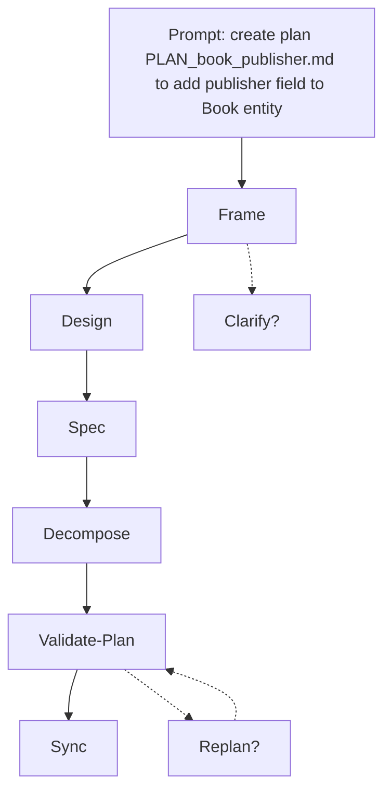
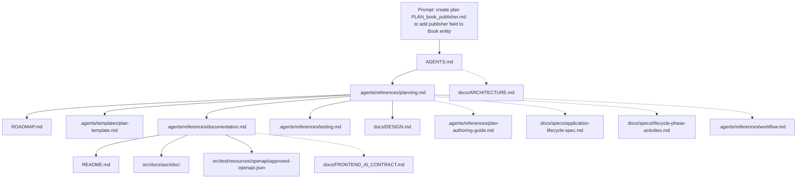
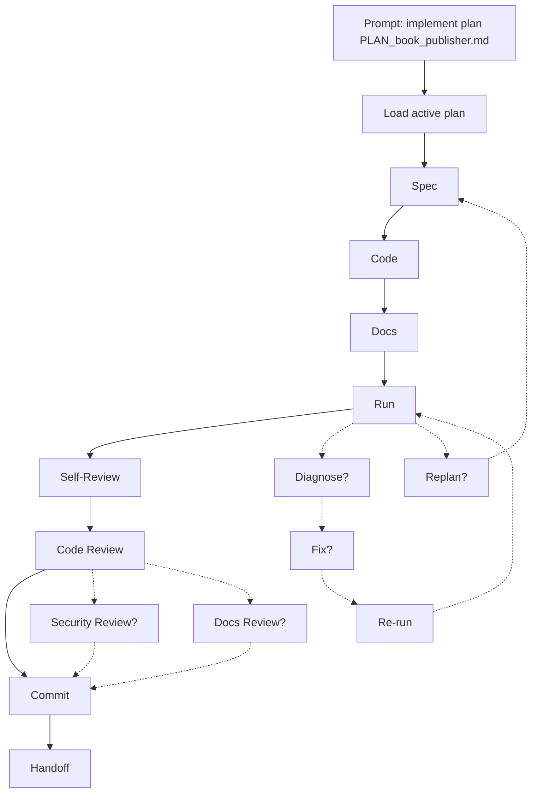
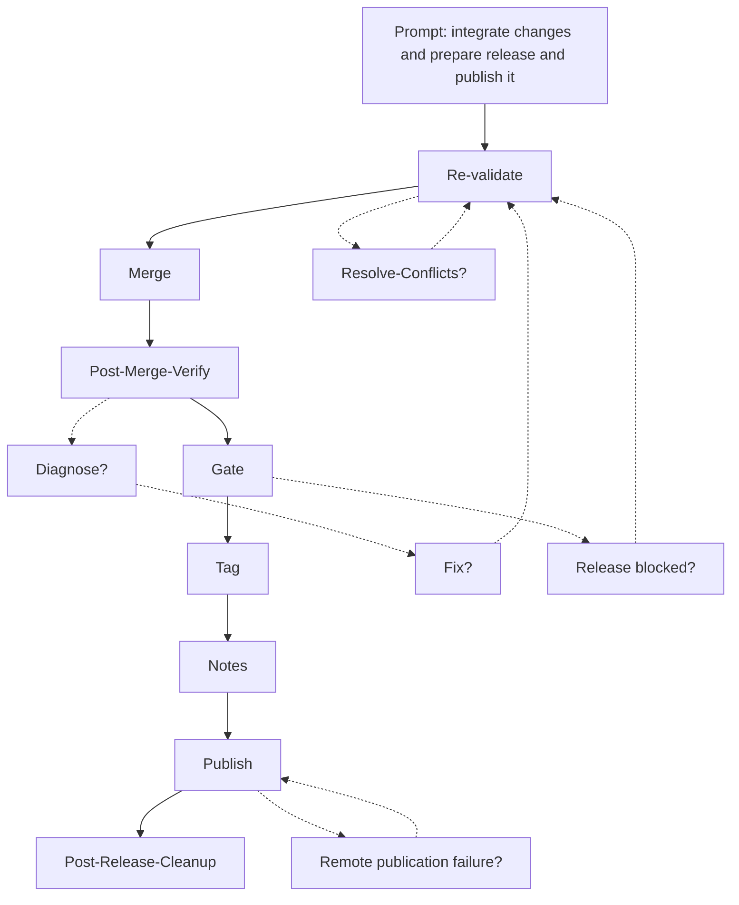

# Prompt Lifecycle Chain Load Report

This report describes likely action chains and document-load chains for three user prompts.
It is an archived analysis artifact, not source-of-truth workflow policy.

## Scope

Prompts modeled:

1. `create plan PLAN_book_publisher.md to add publisher field to Book entity`
2. `implement plan PLAN_book_publisher.md`
3. `integrate changes and prepare release and publish it`

The report models normal repository guidance for these prompts. It does not describe this documentation-only interactive session, where tests, builds, and normal verification are explicitly out of scope.

## Assumptions

- `AGENTS.md` is always the first repository guidance document loaded.
- Owner guides are terminal unless the current task matches another guide's explicit entry condition.
- Solid Mermaid edges are mandatory loads or action transitions. Dashed Mermaid edges are optional, conditional, or failure-path transitions.
- Document diagrams show distinct provenance paths. Statistics also list first-pass load slots; loops are shown but not unrolled indefinitely.
- Document depth counts document-to-document edges with `AGENTS.md` at depth 0. The user prompt node is not counted.
- Source files, code packages, and generated build output are outside the document-count totals. Contract artifacts such as `src/docs/asciidoc/` and `src/test/resources/openapi/approved-openapi.json` are counted because they are published or checked contract documents.
- `.agents/plans/PLAN_book_publisher.md` does not exist at report time. The implementation and release prompt estimates model it as a target plan document with an estimated 1,200 tokens, based on the current plan template size.
- Context estimates are approximate full-file upper bounds using current word count times 1.35. Targeted section reads can be much smaller.

## Summary Statistics

| Prompt | Primary action nodes | Conditional action nodes shown | Mandatory distinct documents | Distinct documents with all conditionals | Mandatory first-pass load slots | All-condition first-pass load slots | Mandatory max document depth | All-condition max document depth | Mandatory context estimate | All-condition context estimate |
| --- | ---: | ---: | ---: | ---: | ---: | ---: | ---: | ---: | ---: | ---: |
| Create plan | 6 | 2 | 10 | 16 | 10 | 16 | 3 | 3 | ~21,500 tokens | ~34,700 tokens |
| Implement plan | 8 per milestone | 6 per milestone | 15 | 23 | 15 per first milestone | 23 per first milestone | 3 | 3 | ~31,600 tokens | ~42,700 tokens |
| Integrate, release, publish | 8 | 5 | 17 | 23 | 17 | 23 | 3 | 3 | ~32,600 tokens | ~41,300 tokens |

## Context Estimate Inputs

| Document | Estimated tokens |
| --- | ---: |
| `AGENTS.md` | 1,382 |
| `.agents/references/planning.md` | 2,174 |
| `.agents/templates/plan-template.md` | 1,207 |
| `.agents/references/plan-authoring-guide.md` | 2,657 |
| `.agents/references/plan-execution.md` | 1,200 |
| `.agents/references/execution.md` | 1,251 |
| `.agents/references/code-style.md` | 684 |
| `.agents/references/documentation.md` | 1,823 |
| `.agents/references/testing.md` | 1,122 |
| `.agents/references/environment-quick-ref.md` | 396 |
| `.agents/references/gradle-task-graph.md` | 1,577 |
| `.agents/references/troubleshooting.md` | 1,604 |
| `.agents/references/reviews.md` | 516 |
| `.agents/references/workflow.md` | 1,192 |
| `.agents/references/releases.md` | 713 |
| `.agents/references/release-checklist.md` | 452 |
| `.agents/references/release-artifact-verification.md` | 540 |
| `.agents/references/LEARNINGS.md` | 1,311 |
| `.gitmessage` | 387 |
| `ROADMAP.md` | 791 |
| `CHANGELOG.md` | 9,100 |
| `README.md` | 738 |
| `docs/DESIGN.md` | 1,207 |
| `docs/ARCHITECTURE.md` | 1,165 |
| `docs/FRONTEND_AI_CONTRACT.md` | 865 |
| `docs/specs/application-lifecycle-spec.md` | 4,412 |
| `docs/specs/lifecycle-phase-activities.md` | 2,962 |
| `src/docs/asciidoc/` | 894 |
| `src/test/resources/openapi/approved-openapi.json` | 10,149 |
| `.agents/plans/PLAN_book_publisher.md` | ~1,200 assumed |
| `.github/workflows/release.yml` | 1,127 |

## Prompt 1: Create Plan

Prompt: `create plan PLAN_book_publisher.md to add publisher field to Book entity`

The plan file is created or updated by this prompt, but it is not counted as a loaded document because it is missing at report time.

### Chained Actions

Metrics: primary action nodes 6; conditional action nodes 2; loop edges 1; maximum primary action depth 6.

### Chained Documents

Metrics: mandatory distinct documents 10; optional distinct documents 6; first-pass load slots 10 mandatory and 16 with all conditionals; maximum mandatory chain depth 3; maximum all-condition chain depth 3; mandatory context estimate ~21,500 tokens; all-condition estimate ~34,700 tokens.

## Prompt 2: Implement Plan

Prompt: `implement plan PLAN_book_publisher.md`

The action chart is per milestone. Whole-plan execution repeats the milestone loop for each remaining milestone in the target plan.

### Chained Actions

Metrics: primary action nodes 8 per milestone; conditional action nodes 6 per milestone; loop edges 4; maximum primary action depth 8 per milestone; whole-plan depth scales by milestone count `M`.

### Chained Documents

Metrics: mandatory distinct documents 15; optional distinct documents 8; first-pass load slots 15 mandatory and 23 with all conditionals; maximum mandatory chain depth 3; maximum all-condition chain depth 3; mandatory context estimate ~31,600 tokens; all-condition estimate ~42,700 tokens.

```mermaid
flowchart TD
    prompt["Prompt: implement plan PLAN_book_publisher.md"]
    agents["AGENTS.md"]
    plan_execution[".agents/references/plan-execution.md"]
    target_plan[".agents/plans/PLAN_book_publisher.md (expected target plan; missing at report time)"]
    documentation[".agents/references/documentation.md"]
    testing[".agents/references/testing.md"]
    reviews[".agents/references/reviews.md"]
    execution[".agents/references/execution.md"]
    gitmessage[".gitmessage"]
    code_style[".agents/references/code-style.md"]
    environment[".agents/references/environment-quick-ref.md"]
    roadmap["ROADMAP.md"]
    changelog["CHANGELOG.md"]
    readme["README.md"]
    rest_docs["src/docs/asciidoc/"]
    openapi["src/test/resources/openapi/approved-openapi.json"]
    workflow[".agents/references/workflow.md"]
    gradle_graph[".agents/references/gradle-task-graph.md"]
    troubleshooting[".agents/references/troubleshooting.md"]
    architecture["docs/ARCHITECTURE.md"]
    frontend_contract["docs/FRONTEND_AI_CONTRACT.md"]
    design_doc["docs/DESIGN.md"]
    learnings[".agents/references/LEARNINGS.md"]
    planning[".agents/references/planning.md"]

    prompt --> agents
    agents --> plan_execution
    plan_execution --> target_plan
    plan_execution --> documentation
    plan_execution --> testing
    plan_execution --> reviews
    plan_execution --> execution
    execution --> gitmessage
    plan_execution --> code_style
    testing --> environment
    plan_execution --> roadmap
    plan_execution --> changelog
    documentation --> readme
    documentation --> rest_docs
    documentation --> openapi
    plan_execution -.-> workflow
    testing -.-> gradle_graph
    environment -.-> gradle_graph
    testing -.-> troubleshooting
    code_style -.-> architecture
    documentation -.-> frontend_contract
    plan_execution -.-> design_doc
    plan_execution -.-> learnings
    plan_execution -.-> planning
```

## Prompt 3: Integrate, Release, Publish

Prompt: `integrate changes and prepare release and publish it`

This prompt chains Integration and Release because it asks to land changes, prepare the release, and publish it.
The archived plan path is a release cleanup output, not a separate loaded document, so it is excluded from the document-load graph and metrics.

### Chained Actions

Metrics: primary action nodes 8; conditional action nodes 5; loop edges 3; maximum primary action depth 8.

### Chained Documents

Metrics: mandatory distinct documents 17; optional distinct documents 6; first-pass load slots 17 mandatory and 23 with all conditionals; maximum mandatory chain depth 3; maximum all-condition chain depth 3; mandatory context estimate ~32,600 tokens; all-condition estimate ~41,300 tokens.

```mermaid
flowchart TD
    prompt["Prompt: integrate changes and prepare release and publish it"]
    agents["AGENTS.md"]
    workflow[".agents/references/workflow.md"]
    testing[".agents/references/testing.md"]
    environment[".agents/references/environment-quick-ref.md"]
    reviews[".agents/references/reviews.md"]
    documentation[".agents/references/documentation.md"]
    releases[".agents/references/releases.md"]
    release_checklist[".agents/references/release-checklist.md"]
    release_verification[".agents/references/release-artifact-verification.md"]
    execution[".agents/references/execution.md"]
    gitmessage[".gitmessage"]
    changelog["CHANGELOG.md"]
    roadmap["ROADMAP.md"]
    target_plan[".agents/plans/PLAN_book_publisher.md (expected target plan; missing at report time)"]
    readme["README.md"]
    rest_docs["src/docs/asciidoc/"]
    openapi["src/test/resources/openapi/approved-openapi.json"]
    troubleshooting[".agents/references/troubleshooting.md"]
    gradle_graph[".agents/references/gradle-task-graph.md"]
    learnings[".agents/references/LEARNINGS.md"]
    release_workflow[".github/workflows/release.yml"]
    frontend_contract["docs/FRONTEND_AI_CONTRACT.md"]
    planning[".agents/references/planning.md"]

    prompt --> agents
    agents --> workflow
    workflow --> testing
    testing --> environment
    workflow --> reviews
    workflow --> documentation
    agents --> releases
    releases --> release_checklist
    releases --> release_verification
    release_checklist --> execution
    execution --> gitmessage
    releases --> changelog
    releases --> roadmap
    releases --> target_plan
    documentation --> readme
    documentation --> rest_docs
    documentation --> openapi
    testing -.-> troubleshooting
    testing -.-> gradle_graph
    environment -.-> gradle_graph
    release_checklist -.-> learnings
    release_verification -.-> release_workflow
    documentation -.-> frontend_contract
    releases -.-> planning
```

## Observations

- The deepest normal document chains for these prompts are depth 3. Examples are `AGENTS.md -> .agents/references/planning.md -> .agents/references/documentation.md -> src/test/resources/openapi/approved-openapi.json` and `AGENTS.md -> .agents/references/workflow.md -> .agents/references/testing.md -> .agents/references/gradle-task-graph.md`.
- The high context consumers are not the owner guides. They are `src/test/resources/openapi/approved-openapi.json` and `CHANGELOG.md`. Full-file reads of those two documents dominate implementation and release context estimates.
- `docs/specs/application-lifecycle-spec.md` and `docs/specs/lifecycle-phase-activities.md` are optional for the create-plan prompt unless lifecycle phase vocabulary, activity names, owner-guide mapping, or loop vocabulary needs arbitration. They should not be recursively loaded just because `.agents/references/planning.md` names them.
- `.gitmessage` is reached through `.agents/references/execution.md` when commit-message rules are needed. It is not modeled as a direct load from `AGENTS.md`.
- `docs/FRONTEND_AI_CONTRACT.md` is conditional in these diagrams. It becomes mandatory only when the publisher-field change affects the separate frontend AI contract.
- Release publication adds little guide text but broadens the required state check: `CHANGELOG.md`, `ROADMAP.md`, the active plan, release checklist, artifact verification reference, and contract artifacts all become relevant.
- If context pressure matters, the best reductions are targeted reads of `CHANGELOG.md`, targeted lookup or structured querying of the OpenAPI baseline, and relying on the active plan's milestone context instead of rereading broad descriptive docs.

## Files Uncommon To Load

These files appear only on conditional or specialized paths in the modeled prompts:

- `.agents/references/plan-authoring-guide.md`
- `docs/specs/application-lifecycle-spec.md`
- `docs/specs/lifecycle-phase-activities.md`
- `.agents/references/gradle-task-graph.md`
- `.agents/references/troubleshooting.md`
- `docs/ARCHITECTURE.md`
- `docs/DESIGN.md` during implementation, when the plan already carries locked decisions
- `.agents/references/LEARNINGS.md`
- `.github/workflows/release.yml`
- `docs/FRONTEND_AI_CONTRACT.md`
