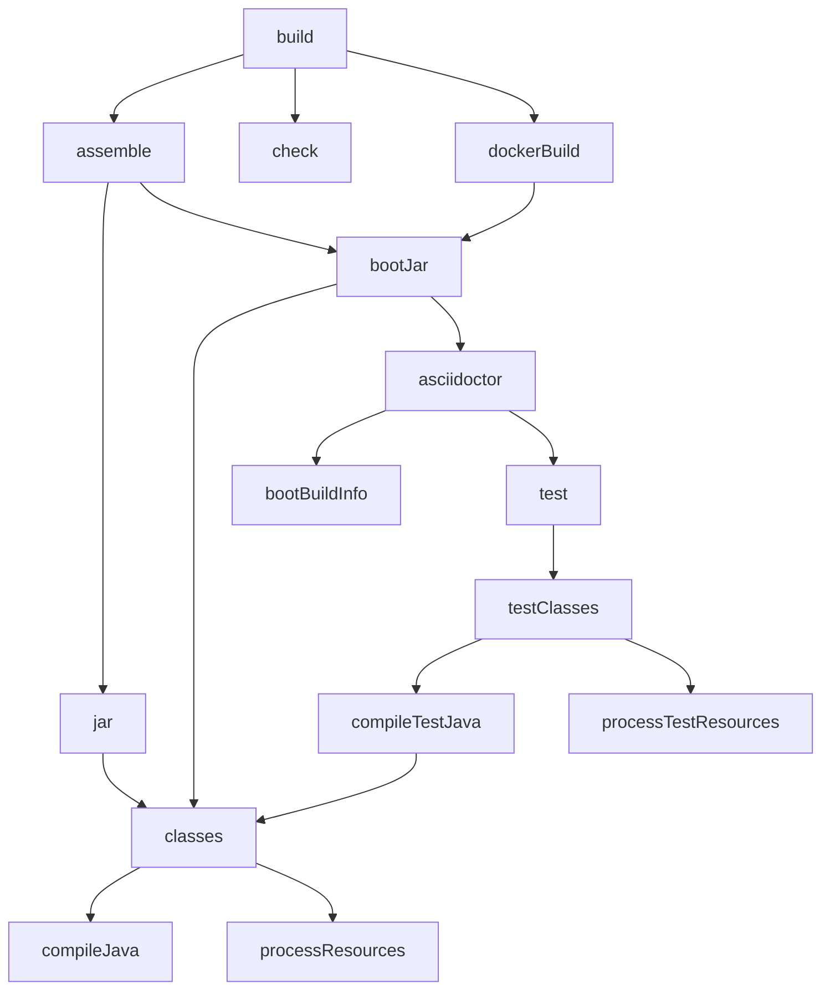
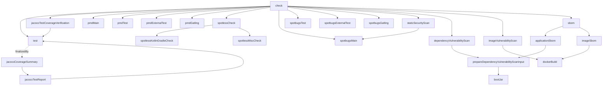
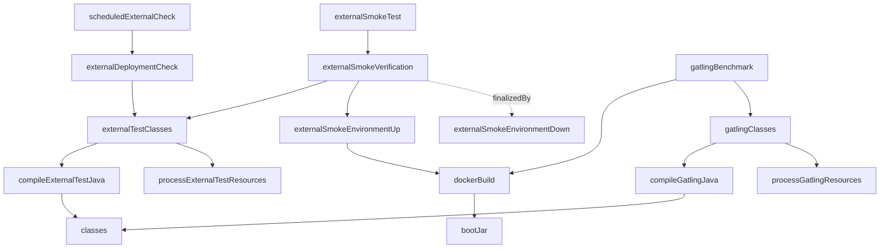

# Gradle Task Dependency Graph

Use this on-demand reference to choose the smallest useful `./build.ps1` command.

Sources:

- `build.gradle.kts`
- `buildSrc/src/main/kotlin/team/jit/technicalinterviewdemo/build/JacocoCoverageConventionsPlugin.kt`
- `buildSrc/src/main/kotlin/team/jit/technicalinterviewdemo/build/ExternalTestingConventionsPlugin.kt`
- `./build.ps1 tasks --all --no-daemon`

In the graphs below, `A --> B` means running `A` also schedules `B`.
For exact expansion after build changes, run:

```powershell
./build.ps1 <task-or-tasks> --dry-run --no-daemon
```

## Standard Build



Decision shortcuts:

- `./build.ps1 compileJava`: fastest Java production compile check.
- `./build.ps1 test --tests <pattern>`: focused executable spec check.
- `./build.ps1 build`: normal final verification; may skip Gradle for lightweight-only uncommitted changes.
- `./build.ps1 -FullBuild build`: force final full verification, including Docker image, checks, scans, and SBOM.
- Do not separately run `test`, `asciidoctor`, `dockerBuild`, PMD, SpotBugs, Spotless, vulnerability scans, or SBOM when `build` already provides the required proof.

## Check And Quality Gates



Notes:

- SpotBugs tasks for `test`, `externalTest`, and `gatling` are registered but disabled by the build script; `spotbugsMain` is the active static security scan target.
- `-SkipChecks` excludes formatting, PMD, SpotBugs, Error Prone, coverage verification, vulnerability scans, and SBOM checks for local loops only.
- `-SkipTests` is separate from `-SkipChecks`; use both only when intentionally doing a compile/package loop.

## External And Benchmark Gates



Decision shortcuts:

- `./build.ps1 externalSmokeTest`: Docker-backed deployed-shape smoke check; already builds the image.
- `./build.ps1 externalDeploymentCheck`: checks an already deployed target; it does not build or deploy an image.
- `./build.ps1 scheduledExternalCheck`: scheduled alias for `externalDeploymentCheck`.
- `./build.ps1 gatlingBenchmark`: Docker-backed benchmark; already builds the image and packaging/test/doc prerequisites needed for that image.
- If both `build` and `gatlingBenchmark`, `externalSmokeTest`, or `externalDeploymentCheck` are required, prefer one command such as `./build.ps1 build gatlingBenchmark --no-daemon`, or run them sequentially when the deployed target setup makes one invocation awkward.
- Do not run `build`, `gatlingBenchmark`, `externalSmokeTest`, `externalDeploymentCheck`, or `scheduledExternalCheck` in parallel with each other because they share Gradle outputs and Docker/test resources.

## Command Choice Table

| Change type | Fast loop | Final or extra proof |
| --- | --- | --- |
| Production Java compile change | `./build.ps1 compileJava` | `./build.ps1 build` |
| Test-only compile change | `./build.ps1 testClasses` | targeted `test --tests <pattern>` or `build` |
| Focused business or service rule | `./build.ps1 test --tests <pattern>` | `./build.ps1 build` |
| Public API behavior or REST Docs | targeted integration/docs tests | `./build.ps1 build`; refresh OpenAPI only after intentional contract review |
| Build wrapper or Gradle config | `./build.ps1 -SkipChecks compileJava` or `--dry-run` | `./build.ps1 -FullBuild build` |
| Docker image, runtime packaging, scans, SBOM | `./build.ps1 dockerBuild` when narrow | `./build.ps1 build` |
| External smoke environment | `./build.ps1 externalSmokeTest` | combine with `build` in one invocation when both are required |
| Already deployed environment | `./build.ps1 externalDeploymentCheck` | use only after target URL and credentials are configured |
| Benchmark-sensitive behavior | targeted tests first | `./build.ps1 gatlingBenchmark`; combine with `build` in one invocation when both are required |
| Documentation-only or lightweight support files | `./build.ps1 build` classifier path | manual consistency review when classifier skips heavy validation |
