# Lifecycle Action Load Graph Pairs Report

This report maps each user-initiated phase-action occurrence from `docs/specs/application-lifecycle-spec.md` and `docs/specs/lifecycle-phase-activities.md` to two document-load graphs:

- `Full`: all mandatory and optional load edges for the action.
- `Deduplicated`: the same action after removing edges whose target document was already loaded earlier in that action graph.

The report is descriptive. `AGENTS.md` and the focused owner guides remain authoritative.

The graphs use the file aliases defined in `docs/specs/lifecycle-action-loading-report.md`.
Every action includes `M:F0` (`AGENTS.md`).
Solid edges marked `M` are mandatory. Dashed edges marked `O` are optional or conditional.
Alternative nodes such as `F6 or F38` count as one selected load slot in the metrics because a single execution selects one of the alternatives.
Task-specific file-family aliases count as one abstract load slot even when a real task touches several concrete files.

Most isolated action graphs have identical full and deduplicated forms because duplicate loads mainly accumulate across phase and loop scopes. When an action has no duplicate target inside its own graph, the deduplicated graph is intentionally identical.

## Discovery

### Discovery / Scan

Metrics: chain length 4; total loaded 4; deduplicated chain length 4; distinct loaded 4.

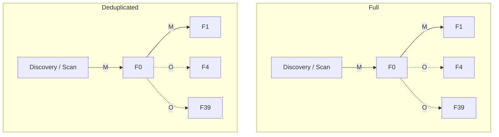

### Discovery / Frame

Metrics: chain length 4; total loaded 4; deduplicated chain length 4; distinct loaded 4.

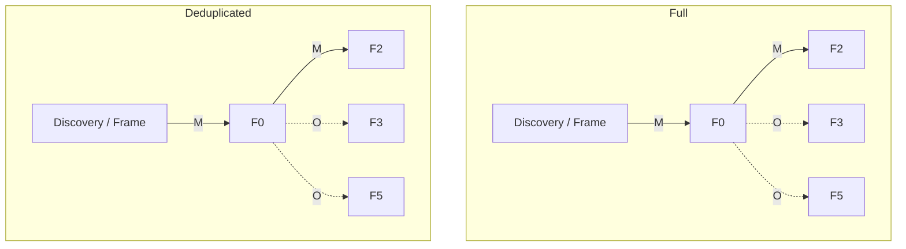

### Discovery / Clarify?

Metrics: chain length 2; total loaded 2; deduplicated chain length 2; distinct loaded 2.

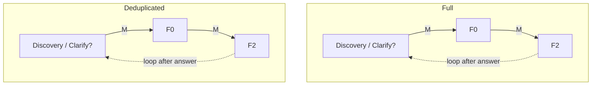

### Discovery / Capture?

Metrics: chain length 4; total loaded 4; deduplicated chain length 4; distinct loaded 4.

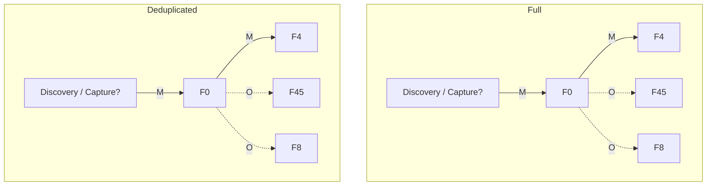

## Roadmap Intake

### Roadmap Intake / Intake

Metrics: chain length 3; total loaded 3; deduplicated chain length 3; distinct loaded 3.

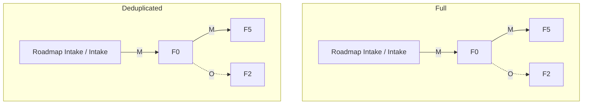

### Roadmap Intake / Refine

Metrics: chain length 3; total loaded 3; deduplicated chain length 3; distinct loaded 3.

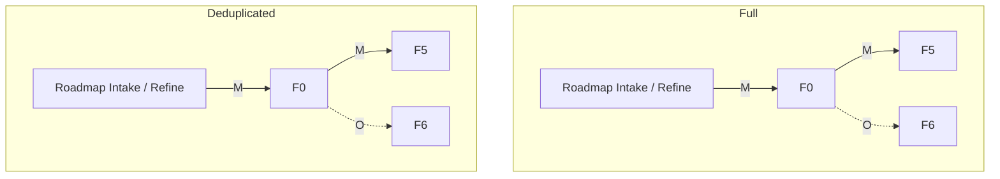

### Roadmap Intake / Prioritize

Metrics: chain length 3; total loaded 3; deduplicated chain length 3; distinct loaded 3.

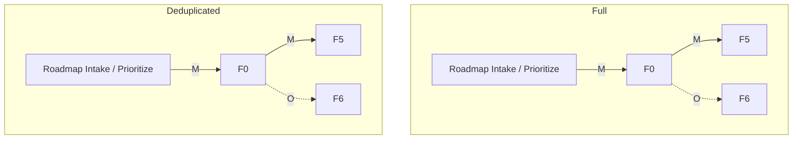

### Roadmap Intake / Sequence

Metrics: chain length 3; total loaded 3; deduplicated chain length 3; distinct loaded 3.

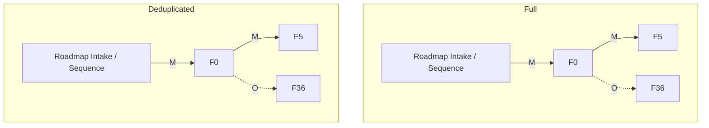

### Roadmap Intake / Sync

Metrics: chain length 3; total loaded 3; deduplicated chain length 3; distinct loaded 3.

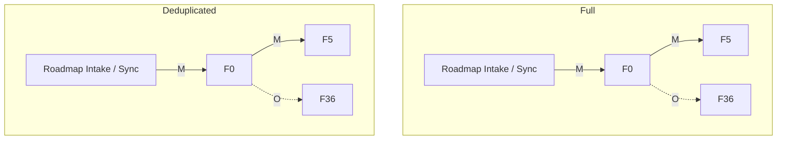

## Planning

### Planning / Frame

Metrics: chain length 8; total loaded 8; deduplicated chain length 8; distinct loaded 8.

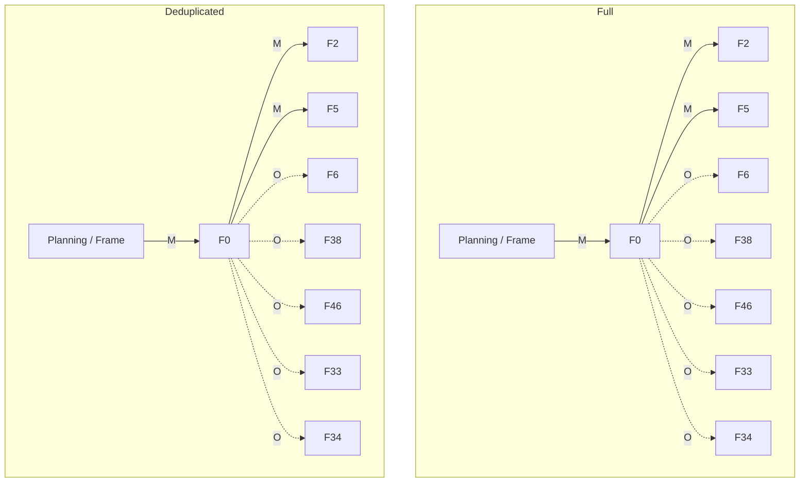

### Planning / Design

Metrics: chain length 6; total loaded 6; deduplicated chain length 6; distinct loaded 6.

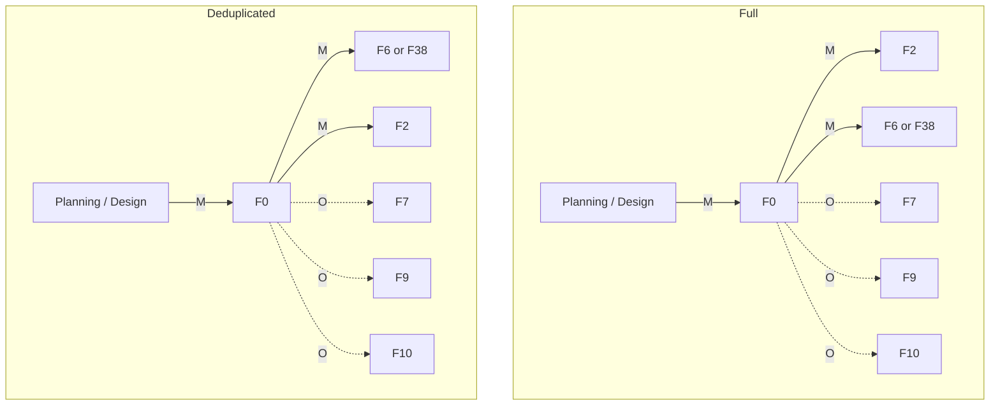

### Planning / Spec

Metrics: chain length 7; total loaded 7; deduplicated chain length 7; distinct loaded 7.

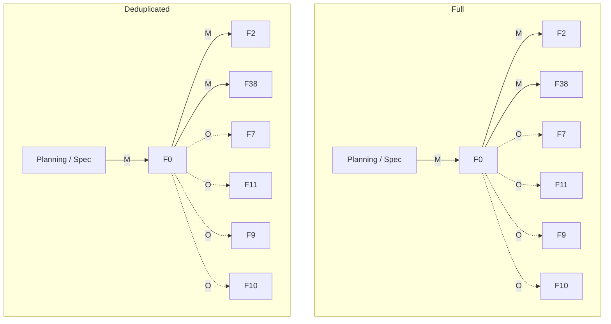

### Planning / Decompose

Metrics: chain length 5; total loaded 5; deduplicated chain length 5; distinct loaded 5.

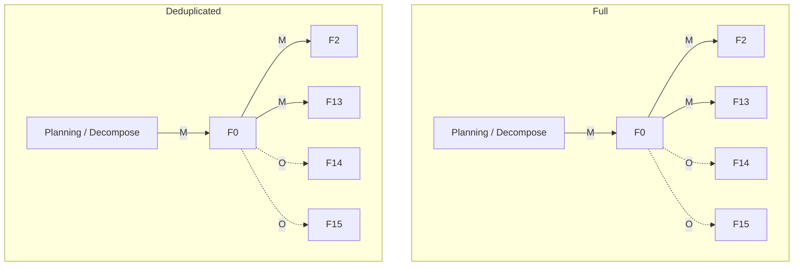

### Planning / Validate-Plan

Metrics: chain length 6; total loaded 6; deduplicated chain length 6; distinct loaded 6.

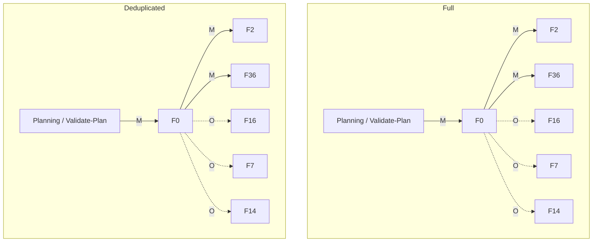

### Planning / Sync

Metrics: chain length 3; total loaded 3; deduplicated chain length 3; distinct loaded 3.

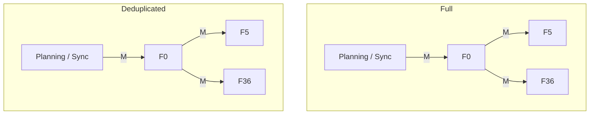

### Planning / Replan?

Metrics: chain length 5; total loaded 5; deduplicated chain length 5; distinct loaded 5.

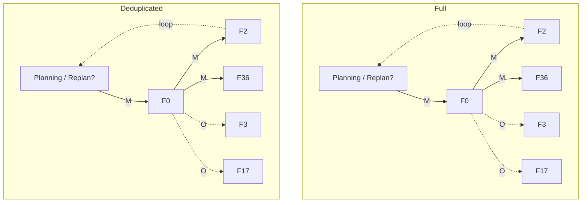

## Implementation

### Implementation / Spec

Metrics: chain length 4; total loaded 4; deduplicated chain length 4; distinct loaded 4.

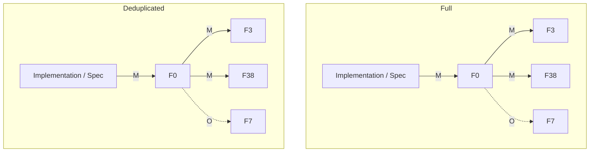

### Implementation / Code

Metrics: chain length 7; total loaded 7; deduplicated chain length 7; distinct loaded 7.

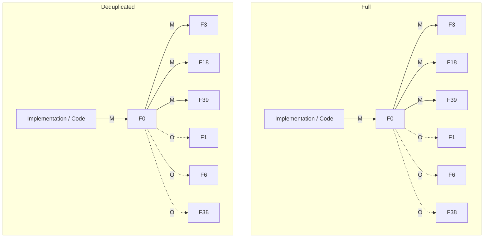

### Implementation / Docs

Metrics: chain length 8; total loaded 8; deduplicated chain length 8; distinct loaded 8.

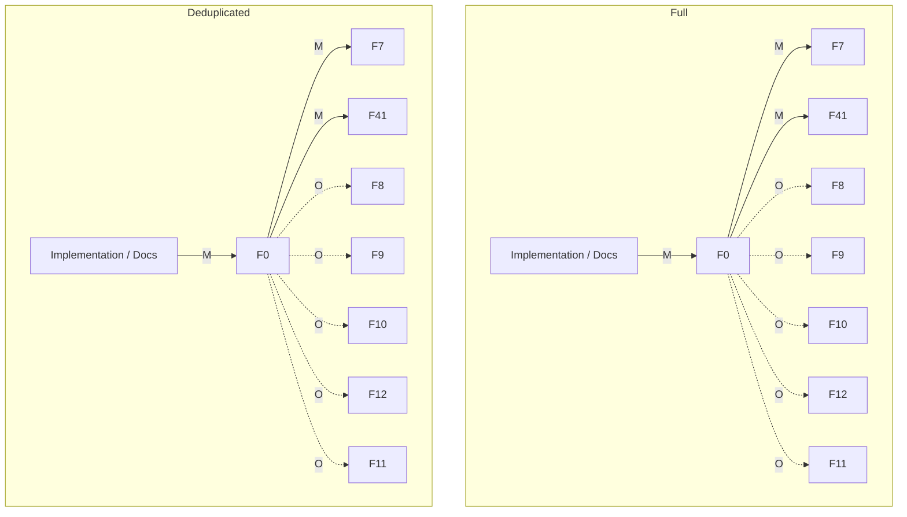

### Implementation / Run

Metrics: chain length 5; total loaded 5; deduplicated chain length 5; distinct loaded 5.

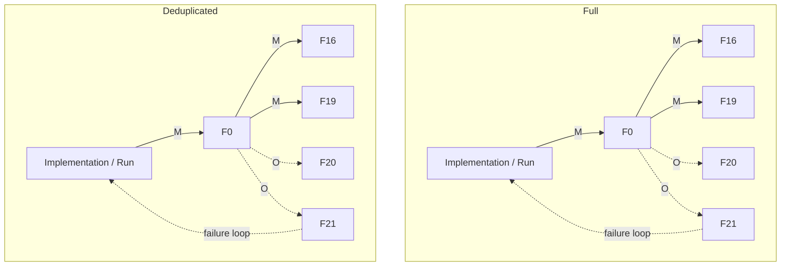

### Implementation / Replan?

Metrics: chain length 5; total loaded 5; deduplicated chain length 5; distinct loaded 5.

```mermaid
flowchart TD
    subgraph Full
        FA["Implementation / Replan?"] -->|M| F0a["F0"]
        F0a -->|M| F2a["F2"]
        F0a -->|M| F36a["F36"]
        F0a -. O .-> F17a["F17"]
        F0a -. O .-> F14a["F14"]
        F2a -. returns to plan loop .-> FA
    end
    subgraph Deduplicated
        DA["Implementation / Replan?"] -->|M| F0b["F0"]
        F0b -->|M| F2b["F2"]
        F0b -->|M| F36b["F36"]
        F0b -. O .-> F17b["F17"]
        F0b -. O .-> F14b["F14"]
        F2b -. returns to plan loop .-> DA
    end
```

### Implementation / Self-Review

Metrics: chain length 4; total loaded 4; deduplicated chain length 4; distinct loaded 4.

```mermaid
flowchart TD
    subgraph Full
        FA["Implementation / Self-Review"] -->|M| F0a["F0"]
        F0a -->|M| F23a["F23"]
        F0a -. O .-> F16a["F16"]
        F0a -. O .-> F7a["F7"]
    end
    subgraph Deduplicated
        DA["Implementation / Self-Review"] -->|M| F0b["F0"]
        F0b -->|M| F23b["F23"]
        F0b -. O .-> F16b["F16"]
        F0b -. O .-> F7b["F7"]
    end
```

### Implementation / Code Review

Metrics: chain length 4; total loaded 4; deduplicated chain length 4; distinct loaded 4.

```mermaid
flowchart TD
    subgraph Full
        FA["Implementation / Code Review"] -->|M| F0a["F0"]
        F0a -->|M| F23a["F23"]
        F0a -. O .-> F38a["F38"]
        F0a -. O .-> F39a["F39"]
    end
    subgraph Deduplicated
        DA["Implementation / Code Review"] -->|M| F0b["F0"]
        F0b -->|M| F23b["F23"]
        F0b -. O .-> F38b["F38"]
        F0b -. O .-> F39b["F39"]
    end
```

### Implementation / Security Review?

Metrics: chain length 5; total loaded 5; deduplicated chain length 5; distinct loaded 5.

```mermaid
flowchart TD
    subgraph Full
        FA["Implementation / Security Review?"] -->|M| F0a["F0"]
        F0a -->|M| F23a["F23"]
        F0a -. O .-> F48a["F48"]
        F0a -. O .-> F16a["F16"]
        F0a -. O .-> F7a["F7"]
    end
    subgraph Deduplicated
        DA["Implementation / Security Review?"] -->|M| F0b["F0"]
        F0b -->|M| F23b["F23"]
        F0b -. O .-> F48b["F48"]
        F0b -. O .-> F16b["F16"]
        F0b -. O .-> F7b["F7"]
    end
```

### Implementation / Commit

Metrics: chain length 6; total loaded 6; deduplicated chain length 6; distinct loaded 6.

```mermaid
flowchart TD
    subgraph Full
        FA["Implementation / Commit"] -->|M| F0a["F0"]
        F0a -->|M| F3a["F3"]
        F0a -->|M| F24a["F24"]
        F0a -. O .-> F36a["F36"]
        F0a -. O .-> F37a["F37"]
        F0a -. O .-> F14a["F14"]
    end
    subgraph Deduplicated
        DA["Implementation / Commit"] -->|M| F0b["F0"]
        F0b -->|M| F3b["F3"]
        F0b -->|M| F24b["F24"]
        F0b -. O .-> F36b["F36"]
        F0b -. O .-> F37b["F37"]
        F0b -. O .-> F14b["F14"]
    end
```

### Implementation / Handoff

Metrics: chain length 5; total loaded 5; deduplicated chain length 5; distinct loaded 5.

```mermaid
flowchart TD
    subgraph Full
        FA["Implementation / Handoff"] -->|M| F0a["F0"]
        F0a -->|M| F3a["F3"]
        F0a -. O .-> F14a["F14"]
        F0a -. O .-> F36a["F36"]
        F0a -. O .-> F37a["F37"]
    end
    subgraph Deduplicated
        DA["Implementation / Handoff"] -->|M| F0b["F0"]
        F0b -->|M| F3b["F3"]
        F0b -. O .-> F14b["F14"]
        F0b -. O .-> F36b["F36"]
        F0b -. O .-> F37b["F37"]
    end
```

## Testing

### Testing / Plan-Tests

Metrics: chain length 4; total loaded 4; deduplicated chain length 4; distinct loaded 4.

```mermaid
flowchart TD
    subgraph Full
        FA["Testing / Plan-Tests"] -->|M| F0a["F0"]
        F0a -->|M| F16a["F16"]
        F0a -. O .-> F7a["F7"]
        F0a -. O .-> F20a["F20"]
    end
    subgraph Deduplicated
        DA["Testing / Plan-Tests"] -->|M| F0b["F0"]
        F0b -->|M| F16b["F16"]
        F0b -. O .-> F7b["F7"]
        F0b -. O .-> F20b["F20"]
    end
```

### Testing / Author-Tests

Metrics: chain length 5; total loaded 5; deduplicated chain length 5; distinct loaded 5.

```mermaid
flowchart TD
    subgraph Full
        FA["Testing / Author-Tests"] -->|M| F0a["F0"]
        F0a -->|M| F16a["F16"]
        F0a -->|M| F40a["F40"]
        F0a -. O .-> F18a["F18"]
        F0a -. O .-> F39a["F39"]
    end
    subgraph Deduplicated
        DA["Testing / Author-Tests"] -->|M| F0b["F0"]
        F0b -->|M| F16b["F16"]
        F0b -->|M| F40b["F40"]
        F0b -. O .-> F18b["F18"]
        F0b -. O .-> F39b["F39"]
    end
```

### Testing / Run

Metrics: chain length 5; total loaded 5; deduplicated chain length 5; distinct loaded 5.

```mermaid
flowchart TD
    subgraph Full
        FA["Testing / Run"] -->|M| F0a["F0"]
        F0a -->|M| F16a["F16"]
        F0a -->|M| F19a["F19"]
        F0a -. O .-> F20a["F20"]
        F0a -. O .-> F21a["F21"]
        F21a -. failure .-> FA
    end
    subgraph Deduplicated
        DA["Testing / Run"] -->|M| F0b["F0"]
        F0b -->|M| F16b["F16"]
        F0b -->|M| F19b["F19"]
        F0b -. O .-> F20b["F20"]
        F0b -. O .-> F21b["F21"]
        F21b -. failure .-> DA
    end
```

### Testing / Diagnose?

Metrics: chain length 5; total loaded 5; deduplicated chain length 5; distinct loaded 5.

```mermaid
flowchart TD
    subgraph Full
        FA["Testing / Diagnose?"] -->|M| F0a["F0"]
        F0a -->|M| F21a["F21"]
        F0a -. O .-> F16a["F16"]
        F0a -. O .-> F22a["F22"]
        F0a -. O .-> F4a["F4"]
    end
    subgraph Deduplicated
        DA["Testing / Diagnose?"] -->|M| F0b["F0"]
        F0b -->|M| F21b["F21"]
        F0b -. O .-> F16b["F16"]
        F0b -. O .-> F22b["F22"]
        F0b -. O .-> F4b["F4"]
    end
```

### Testing / Fix?

Metrics: chain length 4; total loaded 4; deduplicated chain length 4; distinct loaded 4.

```mermaid
flowchart TD
    subgraph Full
        FA["Testing / Fix?"] -->|M| F0a["F0"]
        F0a -->|M| F3a["F3"]
        F0a -->|M| AffectedA["F39/F40/F38"]
        F0a -. O .-> F2a["F2"]
    end
    subgraph Deduplicated
        DA["Testing / Fix?"] -->|M| F0b["F0"]
        F0b -->|M| F3b["F3"]
        F0b -->|M| AffectedB["F39/F40/F38"]
        F0b -. O .-> F2b["F2"]
    end
```

### Testing / Re-run

Metrics: chain length 4; total loaded 4; deduplicated chain length 4; distinct loaded 4.

```mermaid
flowchart TD
    subgraph Full
        FA["Testing / Re-run"] -->|M| F0a["F0"]
        F0a -->|M| F16a["F16"]
        F0a -->|M| F19a["F19"]
        F0a -. O .-> F20a["F20"]
        F20a -. still fails .-> FA
    end
    subgraph Deduplicated
        DA["Testing / Re-run"] -->|M| F0b["F0"]
        F0b -->|M| F16b["F16"]
        F0b -->|M| F19b["F19"]
        F0b -. O .-> F20b["F20"]
        F20b -. still fails .-> DA
    end
```

### Testing / Record

Metrics: chain length 4; total loaded 4; deduplicated chain length 4; distinct loaded 4.

```mermaid
flowchart TD
    subgraph Full
        FA["Testing / Record"] -->|M| F0a["F0"]
        F0a -->|M| F16a["F16"]
        F0a -->|M| PlanOrLogA["F36 or F37"]
        F0a -. O .-> F14a["F14"]
    end
    subgraph Deduplicated
        DA["Testing / Record"] -->|M| F0b["F0"]
        F0b -->|M| F16b["F16"]
        F0b -->|M| PlanOrLogB["F36 or F37"]
        F0b -. O .-> F14b["F14"]
    end
```

## Review

### Review / Self-Review

Metrics: chain length 4; total loaded 4; deduplicated chain length 4; distinct loaded 4.

```mermaid
flowchart TD
    subgraph Full
        FA["Review / Self-Review"] -->|M| F0a["F0"]
        F0a -->|M| F23a["F23"]
        F0a -. O .-> F16a["F16"]
        F0a -. O .-> F7a["F7"]
    end
    subgraph Deduplicated
        DA["Review / Self-Review"] -->|M| F0b["F0"]
        F0b -->|M| F23b["F23"]
        F0b -. O .-> F16b["F16"]
        F0b -. O .-> F7b["F7"]
    end
```

### Review / Code Review

Metrics: chain length 5; total loaded 5; deduplicated chain length 5; distinct loaded 5.

```mermaid
flowchart TD
    subgraph Full
        FA["Review / Code Review"] -->|M| F0a["F0"]
        F0a -->|M| F23a["F23"]
        F0a -->|M| F41a["F41"]
        F0a -. O .-> F38a["F38"]
        F0a -. O .-> F16a["F16"]
    end
    subgraph Deduplicated
        DA["Review / Code Review"] -->|M| F0b["F0"]
        F0b -->|M| F23b["F23"]
        F0b -->|M| F41b["F41"]
        F0b -. O .-> F38b["F38"]
        F0b -. O .-> F16b["F16"]
    end
```

### Review / Security Review?

Metrics: chain length 5; total loaded 5; deduplicated chain length 5; distinct loaded 5.

```mermaid
flowchart TD
    subgraph Full
        FA["Review / Security Review?"] -->|M| F0a["F0"]
        F0a -->|M| F23a["F23"]
        F0a -. O .-> F48a["F48"]
        F0a -. O .-> F16a["F16"]
        F0a -. O .-> F7a["F7"]
    end
    subgraph Deduplicated
        DA["Review / Security Review?"] -->|M| F0b["F0"]
        F0b -->|M| F23b["F23"]
        F0b -. O .-> F48b["F48"]
        F0b -. O .-> F16b["F16"]
        F0b -. O .-> F7b["F7"]
    end
```

### Review / Docs Review?

Metrics: chain length 5; total loaded 5; deduplicated chain length 5; distinct loaded 5.

```mermaid
flowchart TD
    subgraph Full
        FA["Review / Docs Review?"] -->|M| F0a["F0"]
        F0a -->|M| F23a["F23"]
        F0a -->|M| F7a["F7"]
        F0a -. O .-> F8a["F8"]
        F0a -. O .-> F49a["F49"]
    end
    subgraph Deduplicated
        DA["Review / Docs Review?"] -->|M| F0b["F0"]
        F0b -->|M| F23b["F23"]
        F0b -->|M| F7b["F7"]
        F0b -. O .-> F8b["F8"]
        F0b -. O .-> F49b["F49"]
    end
```

### Review / Decide

Metrics: chain length 4; total loaded 4; deduplicated chain length 4; distinct loaded 4.

```mermaid
flowchart TD
    subgraph Full
        FA["Review / Decide"] -->|M| F0a["F0"]
        F0a -->|M| F23a["F23"]
        F0a -. O .-> F3a["F3"]
        F0a -. O .-> F16a["F16"]
        F3a -. changes requested .-> FA
    end
    subgraph Deduplicated
        DA["Review / Decide"] -->|M| F0b["F0"]
        F0b -->|M| F23b["F23"]
        F0b -. O .-> F3b["F3"]
        F0b -. O .-> F16b["F16"]
        F3b -. changes requested .-> DA
    end
```

## Integration

### Integration / Re-validate

Metrics: chain length 5; total loaded 5; deduplicated chain length 5; distinct loaded 5.

```mermaid
flowchart TD
    subgraph Full
        FA["Integration / Re-validate"] -->|M| F0a["F0"]
        F0a -->|M| F16a["F16"]
        F0a -->|M| F19a["F19"]
        F0a -. O .-> F14a["F14"]
        F0a -. O .-> F20a["F20"]
    end
    subgraph Deduplicated
        DA["Integration / Re-validate"] -->|M| F0b["F0"]
        F0b -->|M| F16b["F16"]
        F0b -->|M| F19b["F19"]
        F0b -. O .-> F14b["F14"]
        F0b -. O .-> F20b["F20"]
    end
```

### Integration / Resolve-Conflicts?

Metrics: chain length 5; total loaded 5; deduplicated chain length 5; distinct loaded 5.

```mermaid
flowchart TD
    subgraph Full
        FA["Integration / Resolve-Conflicts?"] -->|M| F0a["F0"]
        F0a -->|M| F14a["F14"]
        F0a -->|M| F42a["F42"]
        F0a -. O .-> F36a["F36"]
        F0a -. O .-> F23a["F23"]
    end
    subgraph Deduplicated
        DA["Integration / Resolve-Conflicts?"] -->|M| F0b["F0"]
        F0b -->|M| F14b["F14"]
        F0b -->|M| F42b["F42"]
        F0b -. O .-> F36b["F36"]
        F0b -. O .-> F23b["F23"]
    end
```

### Integration / Merge

Metrics: chain length 4; total loaded 4; deduplicated chain length 4; distinct loaded 4.

```mermaid
flowchart TD
    subgraph Full
        FA["Integration / Merge"] -->|M| F0a["F0"]
        F0a -->|M| F14a["F14"]
        F0a -. O .-> F36a["F36"]
        F0a -. O .-> F37a["F37"]
    end
    subgraph Deduplicated
        DA["Integration / Merge"] -->|M| F0b["F0"]
        F0b -->|M| F14b["F14"]
        F0b -. O .-> F36b["F36"]
        F0b -. O .-> F37b["F37"]
    end
```

### Integration / Post-Merge-Verify

Metrics: chain length 5; total loaded 5; deduplicated chain length 5; distinct loaded 5.

```mermaid
flowchart TD
    subgraph Full
        FA["Integration / Post-Merge-Verify"] -->|M| F0a["F0"]
        F0a -->|M| F16a["F16"]
        F0a -->|M| F14a["F14"]
        F0a -. O .-> F3a["F3"]
        F0a -. O .-> F17a["F17"]
        F16a -. failure .-> FA
    end
    subgraph Deduplicated
        DA["Integration / Post-Merge-Verify"] -->|M| F0b["F0"]
        F0b -->|M| F16b["F16"]
        F0b -->|M| F14b["F14"]
        F0b -. O .-> F3b["F3"]
        F0b -. O .-> F17b["F17"]
        F16b -. failure .-> DA
    end
```

## Release

### Release / Gate

Metrics: chain length 7; total loaded 7; deduplicated chain length 7; distinct loaded 7.

```mermaid
flowchart TD
    subgraph Full
        FA["Release / Gate"] -->|M| F0a["F0"]
        F0a -->|M| F25a["F25"]
        F0a -->|M| F16a["F16"]
        F0a -->|M| F7a["F7"]
        F0a -. O .-> F36a["F36"]
        F0a -. O .-> F5a["F5"]
        F0a -. O .-> F27a["F27"]
        F25a -. precondition fails .-> FA
    end
    subgraph Deduplicated
        DA["Release / Gate"] -->|M| F0b["F0"]
        F0b -->|M| F25b["F25"]
        F0b -->|M| F16b["F16"]
        F0b -->|M| F7b["F7"]
        F0b -. O .-> F36b["F36"]
        F0b -. O .-> F5b["F5"]
        F0b -. O .-> F27b["F27"]
        F25b -. precondition fails .-> DA
    end
```

### Release / Tag

Metrics: chain length 7; total loaded 7; deduplicated chain length 7; distinct loaded 7.

```mermaid
flowchart TD
    subgraph Full
        FA["Release / Tag"] -->|M| F0a["F0"]
        F0a -->|M| F25a["F25"]
        F0a -->|M| F26a["F26"]
        F0a -->|M| F27a["F27"]
        F0a -->|M| F5a["F5"]
        F0a -. O .-> F4a["F4"]
        F0a -. O .-> F28a["F28"]
    end
    subgraph Deduplicated
        DA["Release / Tag"] -->|M| F0b["F0"]
        F0b -->|M| F25b["F25"]
        F0b -->|M| F26b["F26"]
        F0b -->|M| F27b["F27"]
        F0b -->|M| F5b["F5"]
        F0b -. O .-> F4b["F4"]
        F0b -. O .-> F28b["F28"]
    end
```

### Release / Notes

Metrics: chain length 5; total loaded 5; deduplicated chain length 5; distinct loaded 5.

```mermaid
flowchart TD
    subgraph Full
        FA["Release / Notes"] -->|M| F0a["F0"]
        F0a -->|M| F25a["F25"]
        F0a -->|M| F27a["F27"]
        F0a -. O .-> F26a["F26"]
        F0a -. O .-> F47a["F47"]
    end
    subgraph Deduplicated
        DA["Release / Notes"] -->|M| F0b["F0"]
        F0b -->|M| F25b["F25"]
        F0b -->|M| F27b["F27"]
        F0b -. O .-> F26b["F26"]
        F0b -. O .-> F47b["F47"]
    end
```

### Release / Publish

Metrics: chain length 3; total loaded 3; deduplicated chain length 3; distinct loaded 3.

```mermaid
flowchart TD
    subgraph Full
        FA["Release / Publish"] -->|M| F0a["F0"]
        F0a -->|M| F25a["F25"]
        F0a -. O .-> F29a["F29"]
    end
    subgraph Deduplicated
        DA["Release / Publish"] -->|M| F0b["F0"]
        F0b -->|M| F25b["F25"]
        F0b -. O .-> F29b["F29"]
    end
```

### Release / Post-Release-Cleanup

Metrics: chain length 8; total loaded 8; deduplicated chain length 8; distinct loaded 8.

```mermaid
flowchart TD
    subgraph Full
        FA["Release / Post-Release-Cleanup"] -->|M| F0a["F0"]
        F0a -->|M| F25a["F25"]
        F0a -->|M| F26a["F26"]
        F0a -->|M| F5a["F5"]
        F0a -->|M| F27a["F27"]
        F0a -->|M| F28a["F28"]
        F0a -. O .-> F4a["F4"]
        F0a -. O .-> F14a["F14"]
    end
    subgraph Deduplicated
        DA["Release / Post-Release-Cleanup"] -->|M| F0b["F0"]
        F0b -->|M| F25b["F25"]
        F0b -->|M| F26b["F26"]
        F0b -->|M| F5b["F5"]
        F0b -->|M| F27b["F27"]
        F0b -->|M| F28b["F28"]
        F0b -. O .-> F4b["F4"]
        F0b -. O .-> F14b["F14"]
    end
```

## Deployment

### Deployment / Stage

Metrics: chain length 4; total loaded 4; deduplicated chain length 4; distinct loaded 4.

```mermaid
flowchart TD
    subgraph Full
        FA["Deployment / Stage"] -->|M| F0a["F0"]
        F0a -. O .-> F29a["F29"]
        F0a -. O .-> F30a["F30"]
        F0a -. O .-> F31a["F31"]
    end
    subgraph Deduplicated
        DA["Deployment / Stage"] -->|M| F0b["F0"]
        F0b -. O .-> F29b["F29"]
        F0b -. O .-> F30b["F30"]
        F0b -. O .-> F31b["F31"]
    end
```

### Deployment / Smoke

Metrics: chain length 4; total loaded 4; deduplicated chain length 4; distinct loaded 4.

```mermaid
flowchart TD
    subgraph Full
        FA["Deployment / Smoke"] -->|M| F0a["F0"]
        F0a -. O .-> F29a["F29"]
        F0a -. O .-> F32a["F32"]
        F0a -. O .-> F31a["F31"]
    end
    subgraph Deduplicated
        DA["Deployment / Smoke"] -->|M| F0b["F0"]
        F0b -. O .-> F29b["F29"]
        F0b -. O .-> F32b["F32"]
        F0b -. O .-> F31b["F31"]
    end
```

### Deployment / Promote

Metrics: chain length 2; total loaded 2; deduplicated chain length 2; distinct loaded 2.

```mermaid
flowchart TD
    subgraph Full
        FA["Deployment / Promote"] -->|M| F0a["F0"]
        F0a -. O .-> F43a["F43"]
    end
    subgraph Deduplicated
        DA["Deployment / Promote"] -->|M| F0b["F0"]
        F0b -. O .-> F43b["F43"]
    end
```

### Deployment / Verify

Metrics: chain length 3; total loaded 3; deduplicated chain length 3; distinct loaded 3.

```mermaid
flowchart TD
    subgraph Full
        FA["Deployment / Verify"] -->|M| F0a["F0"]
        F0a -. O .-> F29a["F29"]
        F0a -. O .-> F43a["F43"]
    end
    subgraph Deduplicated
        DA["Deployment / Verify"] -->|M| F0b["F0"]
        F0b -. O .-> F29b["F29"]
        F0b -. O .-> F43b["F43"]
    end
```

### Deployment / Rollback?

Metrics: chain length 4; total loaded 4; deduplicated chain length 4; distinct loaded 4.

```mermaid
flowchart TD
    subgraph Full
        FA["Deployment / Rollback?"] -->|M| F0a["F0"]
        F0a -. O .-> F14a["F14"]
        F0a -. O .-> F25a["F25"]
        F0a -. O .-> F43a["F43"]
    end
    subgraph Deduplicated
        DA["Deployment / Rollback?"] -->|M| F0b["F0"]
        F0b -. O .-> F14b["F14"]
        F0b -. O .-> F25b["F25"]
        F0b -. O .-> F43b["F43"]
    end
```

## Operations

### Operations / Observe

Metrics: chain length 2; total loaded 2; deduplicated chain length 2; distinct loaded 2.

```mermaid
flowchart TD
    subgraph Full
        FA["Operations / Observe"] -->|M| F0a["F0"]
        F0a -. O .-> F44a["F44"]
    end
    subgraph Deduplicated
        DA["Operations / Observe"] -->|M| F0b["F0"]
        F0b -. O .-> F44b["F44"]
    end
```

### Operations / Triage

Metrics: chain length 5; total loaded 5; deduplicated chain length 5; distinct loaded 5.

```mermaid
flowchart TD
    subgraph Full
        FA["Operations / Triage"] -->|M| F0a["F0"]
        F0a -->|M| F5a["F5"]
        F0a -. O .-> F2a["F2"]
        F0a -. O .-> F4a["F4"]
        F0a -. O .-> F44a["F44"]
    end
    subgraph Deduplicated
        DA["Operations / Triage"] -->|M| F0b["F0"]
        F0b -->|M| F5b["F5"]
        F0b -. O .-> F2b["F2"]
        F0b -. O .-> F4b["F4"]
        F0b -. O .-> F44b["F44"]
    end
```

### Operations / Hotfix?

Metrics: chain length 6; total loaded 6; deduplicated chain length 6; distinct loaded 6.

```mermaid
flowchart TD
    subgraph Full
        FA["Operations / Hotfix?"] -->|M| F0a["F0"]
        F0a -->|M| F3a["F3"]
        F0a -->|M| F16a["F16"]
        F0a -->|M| F23a["F23"]
        F0a -. O .-> F14a["F14"]
        F0a -. O .-> F2a["F2"]
    end
    subgraph Deduplicated
        DA["Operations / Hotfix?"] -->|M| F0b["F0"]
        F0b -->|M| F3b["F3"]
        F0b -->|M| F16b["F16"]
        F0b -->|M| F23b["F23"]
        F0b -. O .-> F14b["F14"]
        F0b -. O .-> F2b["F2"]
    end
```

### Operations / Patch?

Metrics: chain length 5; total loaded 5; deduplicated chain length 5; distinct loaded 5.

```mermaid
flowchart TD
    subgraph Full
        FA["Operations / Patch?"] -->|M| F0a["F0"]
        F0a -->|M| AltA["F2 or F3"]
        F0a -. O .-> F5a["F5"]
        F0a -. O .-> F16a["F16"]
        F0a -. O .-> F23a["F23"]
    end
    subgraph Deduplicated
        DA["Operations / Patch?"] -->|M| F0b["F0"]
        F0b -->|M| AltB["F2 or F3"]
        F0b -. O .-> F5b["F5"]
        F0b -. O .-> F16b["F16"]
        F0b -. O .-> F23b["F23"]
    end
```

### Operations / Backport?

Metrics: chain length 3; total loaded 3; deduplicated chain length 3; distinct loaded 3.

```mermaid
flowchart TD
    subgraph Full
        FA["Operations / Backport?"] -->|M| F0a["F0"]
        F0a -. O .-> F14a["F14"]
        F0a -. O .-> F27a["F27"]
    end
    subgraph Deduplicated
        DA["Operations / Backport?"] -->|M| F0b["F0"]
        F0b -. O .-> F14b["F14"]
        F0b -. O .-> F27b["F27"]
    end
```

### Operations / Deprecate?

Metrics: chain length 5; total loaded 5; deduplicated chain length 5; distinct loaded 5.

```mermaid
flowchart TD
    subgraph Full
        FA["Operations / Deprecate?"] -->|M| F0a["F0"]
        F0a -->|M| F5a["F5"]
        F0a -->|M| F6a["F6"]
        F0a -. O .-> F2a["F2"]
        F0a -. O .-> F49a["F49"]
    end
    subgraph Deduplicated
        DA["Operations / Deprecate?"] -->|M| F0b["F0"]
        F0b -->|M| F5b["F5"]
        F0b -->|M| F6b["F6"]
        F0b -. O .-> F2b["F2"]
        F0b -. O .-> F49b["F49"]
    end
```

## Continuous Improvement

### Continuous Improvement / Retrospect

Metrics: chain length 5; total loaded 5; deduplicated chain length 5; distinct loaded 5.

```mermaid
flowchart TD
    subgraph Full
        FA["Continuous Improvement / Retrospect"] -->|M| F0a["F0"]
        F0a -->|M| F4a["F4"]
        F0a -. O .-> F25a["F25"]
        F0a -. O .-> F36a["F36"]
        F0a -. O .-> F5a["F5"]
    end
    subgraph Deduplicated
        DA["Continuous Improvement / Retrospect"] -->|M| F0b["F0"]
        F0b -->|M| F4b["F4"]
        F0b -. O .-> F25b["F25"]
        F0b -. O .-> F36b["F36"]
        F0b -. O .-> F5b["F5"]
    end
```

### Continuous Improvement / Capture-Learning

Metrics: chain length 4; total loaded 4; deduplicated chain length 4; distinct loaded 4.

```mermaid
flowchart TD
    subgraph Full
        FA["Continuous Improvement / Capture-Learning"] -->|M| F0a["F0"]
        F0a -->|M| F4a["F4"]
        F0a -. O .-> F45a["F45"]
        F0a -. O .-> F8a["F8"]
    end
    subgraph Deduplicated
        DA["Continuous Improvement / Capture-Learning"] -->|M| F0b["F0"]
        F0b -->|M| F4b["F4"]
        F0b -. O .-> F45b["F45"]
        F0b -. O .-> F8b["F8"]
    end
```

### Continuous Improvement / Refactor?

Metrics: chain length 6; total loaded 6; deduplicated chain length 6; distinct loaded 6.

```mermaid
flowchart TD
    subgraph Full
        FA["Continuous Improvement / Refactor?"] -->|M| F0a["F0"]
        F0a -->|M| F2a["F2"]
        F0a -->|M| F5a["F5"]
        F0a -. O .-> F1a["F1"]
        F0a -. O .-> F18a["F18"]
        F0a -. O .-> F16a["F16"]
    end
    subgraph Deduplicated
        DA["Continuous Improvement / Refactor?"] -->|M| F0b["F0"]
        F0b -->|M| F2b["F2"]
        F0b -->|M| F5b["F5"]
        F0b -. O .-> F1b["F1"]
        F0b -. O .-> F18b["F18"]
        F0b -. O .-> F16b["F16"]
    end
```

### Continuous Improvement / Tech-Debt-Plan?

Metrics: chain length 6; total loaded 6; deduplicated chain length 6; distinct loaded 6.

```mermaid
flowchart TD
    subgraph Full
        FA["Continuous Improvement / Tech-Debt-Plan?"] -->|M| F0a["F0"]
        F0a -->|M| F2a["F2"]
        F0a -->|M| F5a["F5"]
        F0a -. O .-> F4a["F4"]
        F0a -. O .-> F1a["F1"]
        F0a -. O .-> F6a["F6"]
    end
    subgraph Deduplicated
        DA["Continuous Improvement / Tech-Debt-Plan?"] -->|M| F0b["F0"]
        F0b -->|M| F2b["F2"]
        F0b -->|M| F5b["F5"]
        F0b -. O .-> F4b["F4"]
        F0b -. O .-> F1b["F1"]
        F0b -. O .-> F6b["F6"]
    end
```

### Continuous Improvement / Sync

Metrics: chain length 3; total loaded 3; deduplicated chain length 3; distinct loaded 3.

```mermaid
flowchart TD
    subgraph Full
        FA["Continuous Improvement / Sync"] -->|M| F0a["F0"]
        F0a -->|M| F5a["F5"]
        F0a -. O .-> F27a["F27"]
    end
    subgraph Deduplicated
        DA["Continuous Improvement / Sync"] -->|M| F0b["F0"]
        F0b -->|M| F5b["F5"]
        F0b -. O .-> F27b["F27"]
    end
```

