# Lifecycle Action Load Graph Pairs Report

This report maps each user-initiated phase-action occurrence from `docs/specs/application-lifecycle-spec.md` and `docs/specs/lifecycle-phase-activities.md` to two document-load graphs:

- `Full`: all mandatory and optional load edges for the action.
- `Deduplicated`: the same action after removing edges whose target document was already loaded earlier in that action graph.

The report is descriptive. `AGENTS.md` and the focused owner guides remain authoritative.

The graphs show full document and file-family names directly.
Every action includes mandatory `AGENTS.md`.
Solid edges marked `M` are mandatory. Dashed edges marked `O` are optional or conditional.
Alternative nodes such as `docs/DESIGN.md or task-specific governing spec or published contract artifact` count as one selected load slot in the metrics because a single execution selects one of the alternatives.
Task-specific file-family names count as one abstract load slot even when a real task touches several concrete files.
The action node names the user-initiated action only; it is not a loaded document and does not contribute to chain depth. `AGENTS.md` is the mandatory first loaded document and the routing source for the other loads. Chain depth is the longest acyclic document-to-document load depth; if document A loads documents B and C directly, depth is `1`. Loop-back edges are shown but excluded from depth counting.

Most isolated action graphs have identical full and deduplicated forms because duplicate loads mainly accumulate across phase and loop scopes. When an action has no duplicate target inside its own graph, the deduplicated graph is intentionally identical.

## Discovery

### Discovery / Scan

Metrics: chain depth 1; chain length 4; total loaded 4; deduplicated chain length 4; distinct loaded 4.

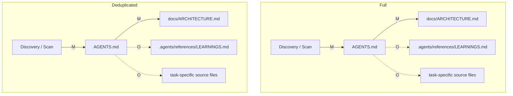

### Discovery / Frame

Metrics: chain depth 1; chain length 4; total loaded 4; deduplicated chain length 4; distinct loaded 4.

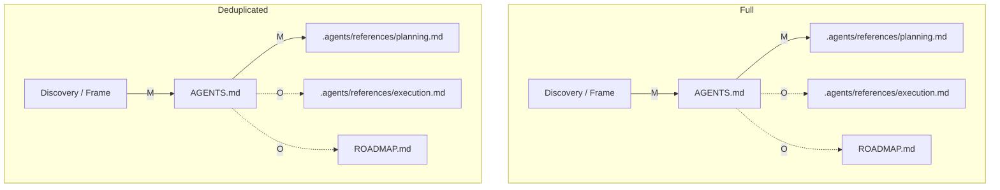

### Discovery / Clarify?

Metrics: chain depth 1; chain length 2; total loaded 2; deduplicated chain length 2; distinct loaded 2.

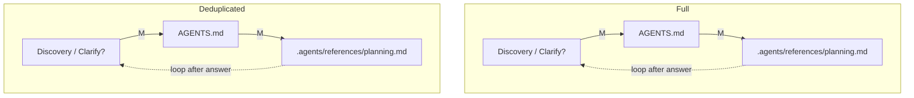

### Discovery / Capture?

Metrics: chain depth 1; chain length 4; total loaded 4; deduplicated chain length 4; distinct loaded 4.

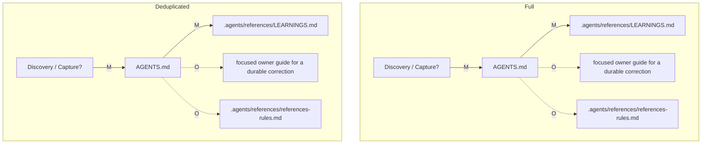

## Roadmap Intake

### Roadmap Intake / Intake

Metrics: chain depth 1; chain length 3; total loaded 3; deduplicated chain length 3; distinct loaded 3.

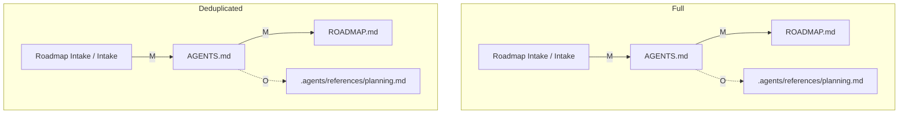

### Roadmap Intake / Refine

Metrics: chain depth 1; chain length 3; total loaded 3; deduplicated chain length 3; distinct loaded 3.

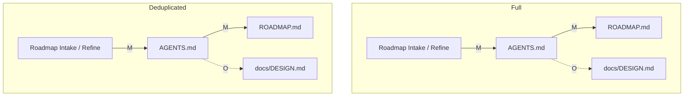

### Roadmap Intake / Prioritize

Metrics: chain depth 1; chain length 3; total loaded 3; deduplicated chain length 3; distinct loaded 3.

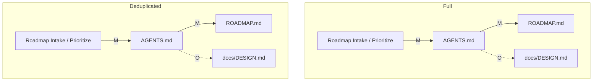

### Roadmap Intake / Sequence

Metrics: chain depth 1; chain length 3; total loaded 3; deduplicated chain length 3; distinct loaded 3.

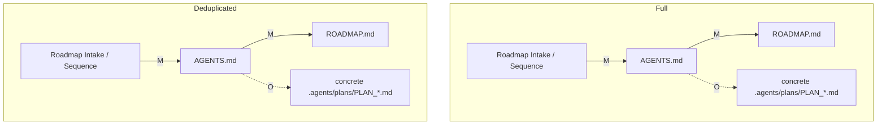

### Roadmap Intake / Sync

Metrics: chain depth 1; chain length 3; total loaded 3; deduplicated chain length 3; distinct loaded 3.

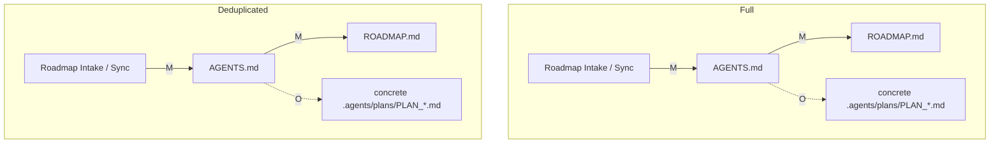

## Planning

### Planning / Frame

Metrics: chain depth 1; chain length 8; total loaded 8; deduplicated chain length 8; distinct loaded 8.

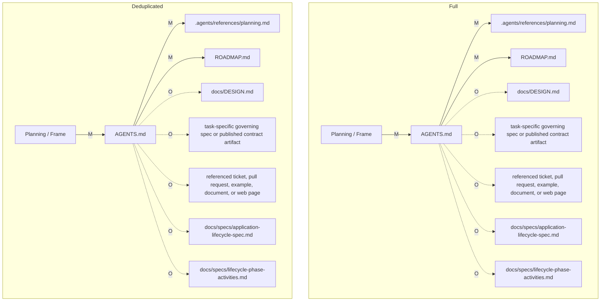

### Planning / Design

Metrics: chain depth 1; chain length 6; total loaded 6; deduplicated chain length 6; distinct loaded 6.

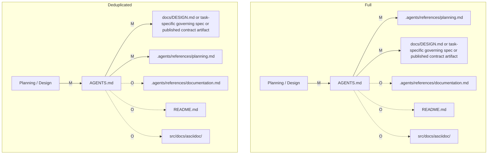

### Planning / Spec

Metrics: chain depth 1; chain length 7; total loaded 7; deduplicated chain length 7; distinct loaded 7.

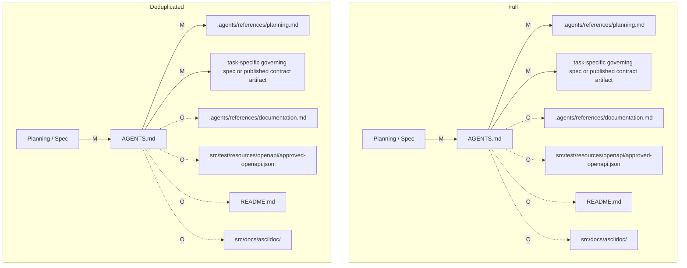

### Planning / Decompose

Metrics: chain depth 1; chain length 5; total loaded 5; deduplicated chain length 5; distinct loaded 5.

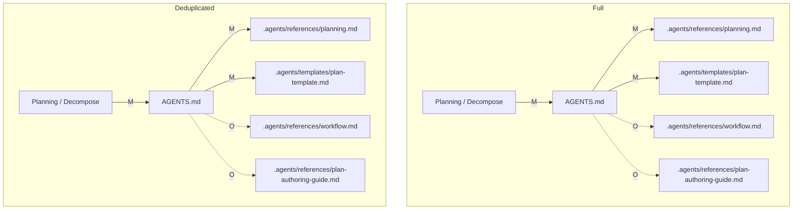

### Planning / Validate-Plan

Metrics: chain depth 1; chain length 6; total loaded 6; deduplicated chain length 6; distinct loaded 6.

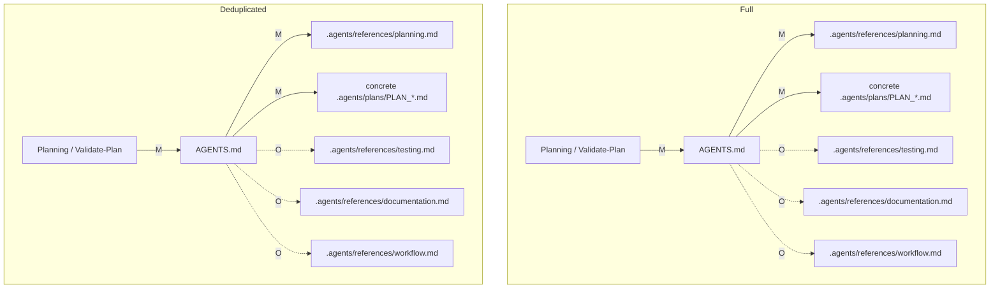

### Planning / Sync

Metrics: chain depth 1; chain length 3; total loaded 3; deduplicated chain length 3; distinct loaded 3.

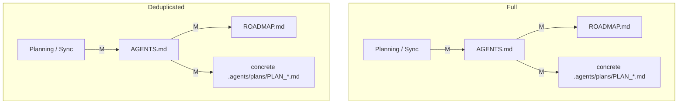

### Planning / Replan?

Metrics: chain depth 1; chain length 5; total loaded 5; deduplicated chain length 5; distinct loaded 5.

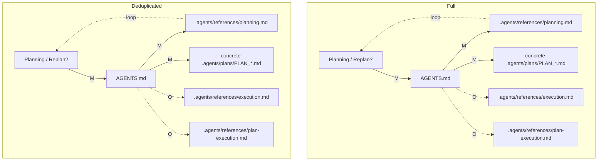

## Implementation

### Implementation / Spec

Metrics: chain depth 1; chain length 4; total loaded 4; deduplicated chain length 4; distinct loaded 4.

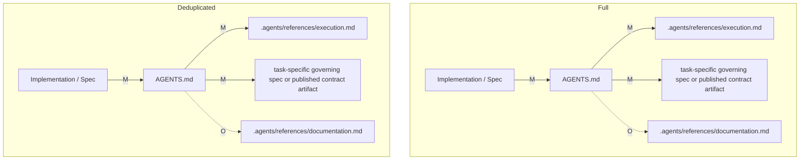

### Implementation / Code

Metrics: chain depth 1; chain length 7; total loaded 7; deduplicated chain length 7; distinct loaded 7.

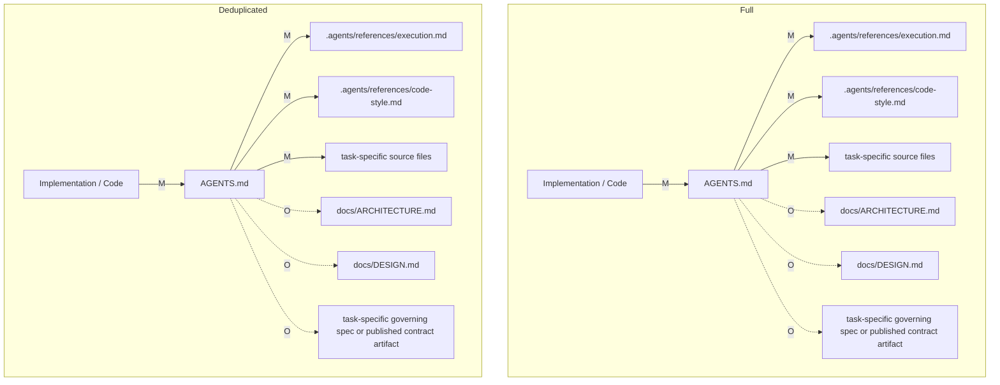

### Implementation / Docs

Metrics: chain depth 1; chain length 8; total loaded 8; deduplicated chain length 8; distinct loaded 8.

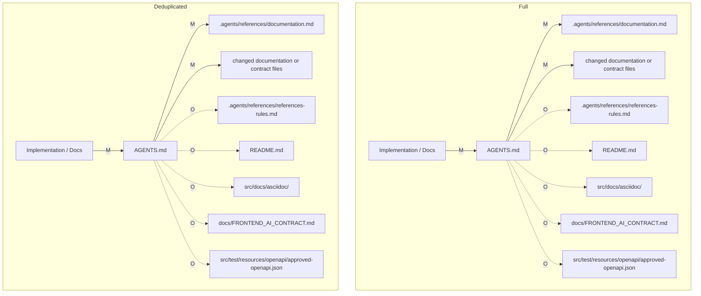

### Implementation / Run

Metrics: chain depth 1; chain length 5; total loaded 5; deduplicated chain length 5; distinct loaded 5.

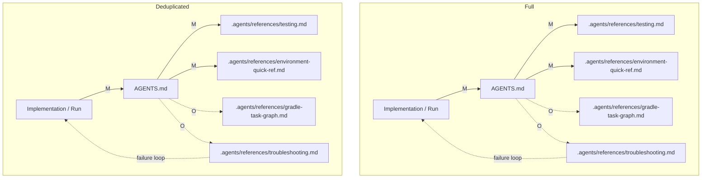

### Implementation / Replan?

Metrics: chain depth 1; chain length 5; total loaded 5; deduplicated chain length 5; distinct loaded 5.

```mermaid
flowchart TD
    subgraph Full
        FA["Implementation / Replan?"] -->|M| AGENTS_md_full["AGENTS.md"]
        AGENTS_md_full -->|M| agents_references_planning_md_full[".agents/references/planning.md"]
        AGENTS_md_full -->|M| concrete_agents_plans_PLAN_md_full["concrete .agents/plans/PLAN_*.md"]
        AGENTS_md_full -. O .-> agents_references_plan_execution_md_full[".agents/references/plan-execution.md"]
        AGENTS_md_full -. O .-> agents_references_workflow_md_full[".agents/references/workflow.md"]
        agents_references_planning_md_full -. returns to plan loop .-> FA
    end
    subgraph Deduplicated
        DA["Implementation / Replan?"] -->|M| AGENTS_md_dedup["AGENTS.md"]
        AGENTS_md_dedup -->|M| agents_references_planning_md_dedup[".agents/references/planning.md"]
        AGENTS_md_dedup -->|M| concrete_agents_plans_PLAN_md_dedup["concrete .agents/plans/PLAN_*.md"]
        AGENTS_md_dedup -. O .-> agents_references_plan_execution_md_dedup[".agents/references/plan-execution.md"]
        AGENTS_md_dedup -. O .-> agents_references_workflow_md_dedup[".agents/references/workflow.md"]
        agents_references_planning_md_dedup -. returns to plan loop .-> DA
    end
```

### Implementation / Self-Review

Metrics: chain depth 1; chain length 4; total loaded 4; deduplicated chain length 4; distinct loaded 4.

```mermaid
flowchart TD
    subgraph Full
        FA["Implementation / Self-Review"] -->|M| AGENTS_md_full["AGENTS.md"]
        AGENTS_md_full -->|M| agents_references_reviews_md_full[".agents/references/reviews.md"]
        AGENTS_md_full -. O .-> agents_references_testing_md_full[".agents/references/testing.md"]
        AGENTS_md_full -. O .-> agents_references_documentation_md_full[".agents/references/documentation.md"]
    end
    subgraph Deduplicated
        DA["Implementation / Self-Review"] -->|M| AGENTS_md_dedup["AGENTS.md"]
        AGENTS_md_dedup -->|M| agents_references_reviews_md_dedup[".agents/references/reviews.md"]
        AGENTS_md_dedup -. O .-> agents_references_testing_md_dedup[".agents/references/testing.md"]
        AGENTS_md_dedup -. O .-> agents_references_documentation_md_dedup[".agents/references/documentation.md"]
    end
```

### Implementation / Code Review

Metrics: chain depth 1; chain length 4; total loaded 4; deduplicated chain length 4; distinct loaded 4.

```mermaid
flowchart TD
    subgraph Full
        FA["Implementation / Code Review"] -->|M| AGENTS_md_full["AGENTS.md"]
        AGENTS_md_full -->|M| agents_references_reviews_md_full[".agents/references/reviews.md"]
        AGENTS_md_full -. O .-> task_specific_governing_spec_or_published_contract_artifact_full["task-specific governing spec or published contract artifact"]
        AGENTS_md_full -. O .-> task_specific_source_files_full["task-specific source files"]
    end
    subgraph Deduplicated
        DA["Implementation / Code Review"] -->|M| AGENTS_md_dedup["AGENTS.md"]
        AGENTS_md_dedup -->|M| agents_references_reviews_md_dedup[".agents/references/reviews.md"]
        AGENTS_md_dedup -. O .-> task_specific_governing_spec_or_published_contract_artifact_dedup["task-specific governing spec or published contract artifact"]
        AGENTS_md_dedup -. O .-> task_specific_source_files_dedup["task-specific source files"]
    end
```

### Implementation / Security Review?

Metrics: chain depth 1; chain length 5; total loaded 5; deduplicated chain length 5; distinct loaded 5.

```mermaid
flowchart TD
    subgraph Full
        FA["Implementation / Security Review?"] -->|M| AGENTS_md_full["AGENTS.md"]
        AGENTS_md_full -->|M| agents_references_reviews_md_full[".agents/references/reviews.md"]
        AGENTS_md_full -. O .-> security_sensitive_source_workflow_config_or_release_files_full["security-sensitive source, workflow, config, or release files"]
        AGENTS_md_full -. O .-> agents_references_testing_md_full[".agents/references/testing.md"]
        AGENTS_md_full -. O .-> agents_references_documentation_md_full[".agents/references/documentation.md"]
    end
    subgraph Deduplicated
        DA["Implementation / Security Review?"] -->|M| AGENTS_md_dedup["AGENTS.md"]
        AGENTS_md_dedup -->|M| agents_references_reviews_md_dedup[".agents/references/reviews.md"]
        AGENTS_md_dedup -. O .-> security_sensitive_source_workflow_config_or_release_files_dedup["security-sensitive source, workflow, config, or release files"]
        AGENTS_md_dedup -. O .-> agents_references_testing_md_dedup[".agents/references/testing.md"]
        AGENTS_md_dedup -. O .-> agents_references_documentation_md_dedup[".agents/references/documentation.md"]
    end
```

### Implementation / Commit

Metrics: chain depth 1; chain length 6; total loaded 6; deduplicated chain length 6; distinct loaded 6.

```mermaid
flowchart TD
    subgraph Full
        FA["Implementation / Commit"] -->|M| AGENTS_md_full["AGENTS.md"]
        AGENTS_md_full -->|M| agents_references_execution_md_full[".agents/references/execution.md"]
        AGENTS_md_full -->|M| gitmessage_full[".gitmessage"]
        AGENTS_md_full -. O .-> concrete_agents_plans_PLAN_md_full["concrete .agents/plans/PLAN_*.md"]
        AGENTS_md_full -. O .-> agents_tmp_workflow_md_full[".agents/tmp/workflow/*.md"]
        AGENTS_md_full -. O .-> agents_references_workflow_md_full[".agents/references/workflow.md"]
    end
    subgraph Deduplicated
        DA["Implementation / Commit"] -->|M| AGENTS_md_dedup["AGENTS.md"]
        AGENTS_md_dedup -->|M| agents_references_execution_md_dedup[".agents/references/execution.md"]
        AGENTS_md_dedup -->|M| gitmessage_dedup[".gitmessage"]
        AGENTS_md_dedup -. O .-> concrete_agents_plans_PLAN_md_dedup["concrete .agents/plans/PLAN_*.md"]
        AGENTS_md_dedup -. O .-> agents_tmp_workflow_md_dedup[".agents/tmp/workflow/*.md"]
        AGENTS_md_dedup -. O .-> agents_references_workflow_md_dedup[".agents/references/workflow.md"]
    end
```

### Implementation / Handoff

Metrics: chain depth 1; chain length 5; total loaded 5; deduplicated chain length 5; distinct loaded 5.

```mermaid
flowchart TD
    subgraph Full
        FA["Implementation / Handoff"] -->|M| AGENTS_md_full["AGENTS.md"]
        AGENTS_md_full -->|M| agents_references_execution_md_full[".agents/references/execution.md"]
        AGENTS_md_full -. O .-> agents_references_workflow_md_full[".agents/references/workflow.md"]
        AGENTS_md_full -. O .-> concrete_agents_plans_PLAN_md_full["concrete .agents/plans/PLAN_*.md"]
        AGENTS_md_full -. O .-> agents_tmp_workflow_md_full[".agents/tmp/workflow/*.md"]
    end
    subgraph Deduplicated
        DA["Implementation / Handoff"] -->|M| AGENTS_md_dedup["AGENTS.md"]
        AGENTS_md_dedup -->|M| agents_references_execution_md_dedup[".agents/references/execution.md"]
        AGENTS_md_dedup -. O .-> agents_references_workflow_md_dedup[".agents/references/workflow.md"]
        AGENTS_md_dedup -. O .-> concrete_agents_plans_PLAN_md_dedup["concrete .agents/plans/PLAN_*.md"]
        AGENTS_md_dedup -. O .-> agents_tmp_workflow_md_dedup[".agents/tmp/workflow/*.md"]
    end
```

## Testing

### Testing / Plan-Tests

Metrics: chain depth 1; chain length 4; total loaded 4; deduplicated chain length 4; distinct loaded 4.

```mermaid
flowchart TD
    subgraph Full
        FA["Testing / Plan-Tests"] -->|M| AGENTS_md_full["AGENTS.md"]
        AGENTS_md_full -->|M| agents_references_testing_md_full[".agents/references/testing.md"]
        AGENTS_md_full -. O .-> agents_references_documentation_md_full[".agents/references/documentation.md"]
        AGENTS_md_full -. O .-> agents_references_gradle_task_graph_md_full[".agents/references/gradle-task-graph.md"]
    end
    subgraph Deduplicated
        DA["Testing / Plan-Tests"] -->|M| AGENTS_md_dedup["AGENTS.md"]
        AGENTS_md_dedup -->|M| agents_references_testing_md_dedup[".agents/references/testing.md"]
        AGENTS_md_dedup -. O .-> agents_references_documentation_md_dedup[".agents/references/documentation.md"]
        AGENTS_md_dedup -. O .-> agents_references_gradle_task_graph_md_dedup[".agents/references/gradle-task-graph.md"]
    end
```

### Testing / Author-Tests

Metrics: chain depth 1; chain length 5; total loaded 5; deduplicated chain length 5; distinct loaded 5.

```mermaid
flowchart TD
    subgraph Full
        FA["Testing / Author-Tests"] -->|M| AGENTS_md_full["AGENTS.md"]
        AGENTS_md_full -->|M| agents_references_testing_md_full[".agents/references/testing.md"]
        AGENTS_md_full -->|M| task_specific_test_or_executable_spec_files_full["task-specific test or executable-spec files"]
        AGENTS_md_full -. O .-> agents_references_code_style_md_full[".agents/references/code-style.md"]
        AGENTS_md_full -. O .-> task_specific_source_files_full["task-specific source files"]
    end
    subgraph Deduplicated
        DA["Testing / Author-Tests"] -->|M| AGENTS_md_dedup["AGENTS.md"]
        AGENTS_md_dedup -->|M| agents_references_testing_md_dedup[".agents/references/testing.md"]
        AGENTS_md_dedup -->|M| task_specific_test_or_executable_spec_files_dedup["task-specific test or executable-spec files"]
        AGENTS_md_dedup -. O .-> agents_references_code_style_md_dedup[".agents/references/code-style.md"]
        AGENTS_md_dedup -. O .-> task_specific_source_files_dedup["task-specific source files"]
    end
```

### Testing / Run

Metrics: chain depth 1; chain length 5; total loaded 5; deduplicated chain length 5; distinct loaded 5.

```mermaid
flowchart TD
    subgraph Full
        FA["Testing / Run"] -->|M| AGENTS_md_full["AGENTS.md"]
        AGENTS_md_full -->|M| agents_references_testing_md_full[".agents/references/testing.md"]
        AGENTS_md_full -->|M| agents_references_environment_quick_ref_md_full[".agents/references/environment-quick-ref.md"]
        AGENTS_md_full -. O .-> agents_references_gradle_task_graph_md_full[".agents/references/gradle-task-graph.md"]
        AGENTS_md_full -. O .-> agents_references_troubleshooting_md_full[".agents/references/troubleshooting.md"]
        agents_references_troubleshooting_md_full -. failure .-> FA
    end
    subgraph Deduplicated
        DA["Testing / Run"] -->|M| AGENTS_md_dedup["AGENTS.md"]
        AGENTS_md_dedup -->|M| agents_references_testing_md_dedup[".agents/references/testing.md"]
        AGENTS_md_dedup -->|M| agents_references_environment_quick_ref_md_dedup[".agents/references/environment-quick-ref.md"]
        AGENTS_md_dedup -. O .-> agents_references_gradle_task_graph_md_dedup[".agents/references/gradle-task-graph.md"]
        AGENTS_md_dedup -. O .-> agents_references_troubleshooting_md_dedup[".agents/references/troubleshooting.md"]
        agents_references_troubleshooting_md_dedup -. failure .-> DA
    end
```

### Testing / Diagnose?

Metrics: chain depth 1; chain length 5; total loaded 5; deduplicated chain length 5; distinct loaded 5.

```mermaid
flowchart TD
    subgraph Full
        FA["Testing / Diagnose?"] -->|M| AGENTS_md_full["AGENTS.md"]
        AGENTS_md_full -->|M| agents_references_troubleshooting_md_full[".agents/references/troubleshooting.md"]
        AGENTS_md_full -. O .-> agents_references_testing_md_full[".agents/references/testing.md"]
        AGENTS_md_full -. O .-> SETUP_md_full["SETUP.md"]
        AGENTS_md_full -. O .-> agents_references_LEARNINGS_md_full[".agents/references/LEARNINGS.md"]
    end
    subgraph Deduplicated
        DA["Testing / Diagnose?"] -->|M| AGENTS_md_dedup["AGENTS.md"]
        AGENTS_md_dedup -->|M| agents_references_troubleshooting_md_dedup[".agents/references/troubleshooting.md"]
        AGENTS_md_dedup -. O .-> agents_references_testing_md_dedup[".agents/references/testing.md"]
        AGENTS_md_dedup -. O .-> SETUP_md_dedup["SETUP.md"]
        AGENTS_md_dedup -. O .-> agents_references_LEARNINGS_md_dedup[".agents/references/LEARNINGS.md"]
    end
```

### Testing / Fix?

Metrics: chain depth 1; chain length 4; total loaded 4; deduplicated chain length 4; distinct loaded 4.

```mermaid
flowchart TD
    subgraph Full
        FA["Testing / Fix?"] -->|M| AGENTS_md_full["AGENTS.md"]
        AGENTS_md_full -->|M| agents_references_execution_md_full[".agents/references/execution.md"]
        AGENTS_md_full -->|M| AffectedA["task-specific source files / task-specific test or executable-spec files / task-specific governing spec or published contract artifact"]
        AGENTS_md_full -. O .-> agents_references_planning_md_full[".agents/references/planning.md"]
    end
    subgraph Deduplicated
        DA["Testing / Fix?"] -->|M| AGENTS_md_dedup["AGENTS.md"]
        AGENTS_md_dedup -->|M| agents_references_execution_md_dedup[".agents/references/execution.md"]
        AGENTS_md_dedup -->|M| AffectedB["task-specific source files / task-specific test or executable-spec files / task-specific governing spec or published contract artifact"]
        AGENTS_md_dedup -. O .-> agents_references_planning_md_dedup[".agents/references/planning.md"]
    end
```

### Testing / Re-run

Metrics: chain depth 1; chain length 4; total loaded 4; deduplicated chain length 4; distinct loaded 4.

```mermaid
flowchart TD
    subgraph Full
        FA["Testing / Re-run"] -->|M| AGENTS_md_full["AGENTS.md"]
        AGENTS_md_full -->|M| agents_references_testing_md_full[".agents/references/testing.md"]
        AGENTS_md_full -->|M| agents_references_environment_quick_ref_md_full[".agents/references/environment-quick-ref.md"]
        AGENTS_md_full -. O .-> agents_references_gradle_task_graph_md_full[".agents/references/gradle-task-graph.md"]
        agents_references_gradle_task_graph_md_full -. still fails .-> FA
    end
    subgraph Deduplicated
        DA["Testing / Re-run"] -->|M| AGENTS_md_dedup["AGENTS.md"]
        AGENTS_md_dedup -->|M| agents_references_testing_md_dedup[".agents/references/testing.md"]
        AGENTS_md_dedup -->|M| agents_references_environment_quick_ref_md_dedup[".agents/references/environment-quick-ref.md"]
        AGENTS_md_dedup -. O .-> agents_references_gradle_task_graph_md_dedup[".agents/references/gradle-task-graph.md"]
        agents_references_gradle_task_graph_md_dedup -. still fails .-> DA
    end
```

### Testing / Record

Metrics: chain depth 1; chain length 4; total loaded 4; deduplicated chain length 4; distinct loaded 4.

```mermaid
flowchart TD
    subgraph Full
        FA["Testing / Record"] -->|M| AGENTS_md_full["AGENTS.md"]
        AGENTS_md_full -->|M| agents_references_testing_md_full[".agents/references/testing.md"]
        AGENTS_md_full -->|M| PlanOrLogA["concrete .agents/plans/PLAN_*.md or .agents/tmp/workflow/*.md"]
        AGENTS_md_full -. O .-> agents_references_workflow_md_full[".agents/references/workflow.md"]
    end
    subgraph Deduplicated
        DA["Testing / Record"] -->|M| AGENTS_md_dedup["AGENTS.md"]
        AGENTS_md_dedup -->|M| agents_references_testing_md_dedup[".agents/references/testing.md"]
        AGENTS_md_dedup -->|M| PlanOrLogB["concrete .agents/plans/PLAN_*.md or .agents/tmp/workflow/*.md"]
        AGENTS_md_dedup -. O .-> agents_references_workflow_md_dedup[".agents/references/workflow.md"]
    end
```

## Review

### Review / Self-Review

Metrics: chain depth 1; chain length 4; total loaded 4; deduplicated chain length 4; distinct loaded 4.

```mermaid
flowchart TD
    subgraph Full
        FA["Review / Self-Review"] -->|M| AGENTS_md_full["AGENTS.md"]
        AGENTS_md_full -->|M| agents_references_reviews_md_full[".agents/references/reviews.md"]
        AGENTS_md_full -. O .-> agents_references_testing_md_full[".agents/references/testing.md"]
        AGENTS_md_full -. O .-> agents_references_documentation_md_full[".agents/references/documentation.md"]
    end
    subgraph Deduplicated
        DA["Review / Self-Review"] -->|M| AGENTS_md_dedup["AGENTS.md"]
        AGENTS_md_dedup -->|M| agents_references_reviews_md_dedup[".agents/references/reviews.md"]
        AGENTS_md_dedup -. O .-> agents_references_testing_md_dedup[".agents/references/testing.md"]
        AGENTS_md_dedup -. O .-> agents_references_documentation_md_dedup[".agents/references/documentation.md"]
    end
```

### Review / Code Review

Metrics: chain depth 1; chain length 5; total loaded 5; deduplicated chain length 5; distinct loaded 5.

```mermaid
flowchart TD
    subgraph Full
        FA["Review / Code Review"] -->|M| AGENTS_md_full["AGENTS.md"]
        AGENTS_md_full -->|M| agents_references_reviews_md_full[".agents/references/reviews.md"]
        AGENTS_md_full -->|M| changed_documentation_or_contract_files_full["changed documentation or contract files"]
        AGENTS_md_full -. O .-> task_specific_governing_spec_or_published_contract_artifact_full["task-specific governing spec or published contract artifact"]
        AGENTS_md_full -. O .-> agents_references_testing_md_full[".agents/references/testing.md"]
    end
    subgraph Deduplicated
        DA["Review / Code Review"] -->|M| AGENTS_md_dedup["AGENTS.md"]
        AGENTS_md_dedup -->|M| agents_references_reviews_md_dedup[".agents/references/reviews.md"]
        AGENTS_md_dedup -->|M| changed_documentation_or_contract_files_dedup["changed documentation or contract files"]
        AGENTS_md_dedup -. O .-> task_specific_governing_spec_or_published_contract_artifact_dedup["task-specific governing spec or published contract artifact"]
        AGENTS_md_dedup -. O .-> agents_references_testing_md_dedup[".agents/references/testing.md"]
    end
```

### Review / Security Review?

Metrics: chain depth 1; chain length 5; total loaded 5; deduplicated chain length 5; distinct loaded 5.

```mermaid
flowchart TD
    subgraph Full
        FA["Review / Security Review?"] -->|M| AGENTS_md_full["AGENTS.md"]
        AGENTS_md_full -->|M| agents_references_reviews_md_full[".agents/references/reviews.md"]
        AGENTS_md_full -. O .-> security_sensitive_source_workflow_config_or_release_files_full["security-sensitive source, workflow, config, or release files"]
        AGENTS_md_full -. O .-> agents_references_testing_md_full[".agents/references/testing.md"]
        AGENTS_md_full -. O .-> agents_references_documentation_md_full[".agents/references/documentation.md"]
    end
    subgraph Deduplicated
        DA["Review / Security Review?"] -->|M| AGENTS_md_dedup["AGENTS.md"]
        AGENTS_md_dedup -->|M| agents_references_reviews_md_dedup[".agents/references/reviews.md"]
        AGENTS_md_dedup -. O .-> security_sensitive_source_workflow_config_or_release_files_dedup["security-sensitive source, workflow, config, or release files"]
        AGENTS_md_dedup -. O .-> agents_references_testing_md_dedup[".agents/references/testing.md"]
        AGENTS_md_dedup -. O .-> agents_references_documentation_md_dedup[".agents/references/documentation.md"]
    end
```

### Review / Docs Review?

Metrics: chain depth 1; chain length 5; total loaded 5; deduplicated chain length 5; distinct loaded 5.

```mermaid
flowchart TD
    subgraph Full
        FA["Review / Docs Review?"] -->|M| AGENTS_md_full["AGENTS.md"]
        AGENTS_md_full -->|M| agents_references_reviews_md_full[".agents/references/reviews.md"]
        AGENTS_md_full -->|M| agents_references_documentation_md_full[".agents/references/documentation.md"]
        AGENTS_md_full -. O .-> agents_references_references_rules_md_full[".agents/references/references-rules.md"]
        AGENTS_md_full -. O .-> published_contract_docs_not_otherwise_named_in_this_row_full["published contract docs not otherwise named in this row"]
    end
    subgraph Deduplicated
        DA["Review / Docs Review?"] -->|M| AGENTS_md_dedup["AGENTS.md"]
        AGENTS_md_dedup -->|M| agents_references_reviews_md_dedup[".agents/references/reviews.md"]
        AGENTS_md_dedup -->|M| agents_references_documentation_md_dedup[".agents/references/documentation.md"]
        AGENTS_md_dedup -. O .-> agents_references_references_rules_md_dedup[".agents/references/references-rules.md"]
        AGENTS_md_dedup -. O .-> published_contract_docs_not_otherwise_named_in_this_row_dedup["published contract docs not otherwise named in this row"]
    end
```

### Review / Decide

Metrics: chain depth 1; chain length 4; total loaded 4; deduplicated chain length 4; distinct loaded 4.

```mermaid
flowchart TD
    subgraph Full
        FA["Review / Decide"] -->|M| AGENTS_md_full["AGENTS.md"]
        AGENTS_md_full -->|M| agents_references_reviews_md_full[".agents/references/reviews.md"]
        AGENTS_md_full -. O .-> agents_references_execution_md_full[".agents/references/execution.md"]
        AGENTS_md_full -. O .-> agents_references_testing_md_full[".agents/references/testing.md"]
        agents_references_execution_md_full -. changes requested .-> FA
    end
    subgraph Deduplicated
        DA["Review / Decide"] -->|M| AGENTS_md_dedup["AGENTS.md"]
        AGENTS_md_dedup -->|M| agents_references_reviews_md_dedup[".agents/references/reviews.md"]
        AGENTS_md_dedup -. O .-> agents_references_execution_md_dedup[".agents/references/execution.md"]
        AGENTS_md_dedup -. O .-> agents_references_testing_md_dedup[".agents/references/testing.md"]
        agents_references_execution_md_dedup -. changes requested .-> DA
    end
```

## Integration

### Integration / Re-validate

Metrics: chain depth 1; chain length 5; total loaded 5; deduplicated chain length 5; distinct loaded 5.

```mermaid
flowchart TD
    subgraph Full
        FA["Integration / Re-validate"] -->|M| AGENTS_md_full["AGENTS.md"]
        AGENTS_md_full -->|M| agents_references_testing_md_full[".agents/references/testing.md"]
        AGENTS_md_full -->|M| agents_references_environment_quick_ref_md_full[".agents/references/environment-quick-ref.md"]
        AGENTS_md_full -. O .-> agents_references_workflow_md_full[".agents/references/workflow.md"]
        AGENTS_md_full -. O .-> agents_references_gradle_task_graph_md_full[".agents/references/gradle-task-graph.md"]
    end
    subgraph Deduplicated
        DA["Integration / Re-validate"] -->|M| AGENTS_md_dedup["AGENTS.md"]
        AGENTS_md_dedup -->|M| agents_references_testing_md_dedup[".agents/references/testing.md"]
        AGENTS_md_dedup -->|M| agents_references_environment_quick_ref_md_dedup[".agents/references/environment-quick-ref.md"]
        AGENTS_md_dedup -. O .-> agents_references_workflow_md_dedup[".agents/references/workflow.md"]
        AGENTS_md_dedup -. O .-> agents_references_gradle_task_graph_md_dedup[".agents/references/gradle-task-graph.md"]
    end
```

### Integration / Resolve-Conflicts?

Metrics: chain depth 1; chain length 5; total loaded 5; deduplicated chain length 5; distinct loaded 5.

```mermaid
flowchart TD
    subgraph Full
        FA["Integration / Resolve-Conflicts?"] -->|M| AGENTS_md_full["AGENTS.md"]
        AGENTS_md_full -->|M| agents_references_workflow_md_full[".agents/references/workflow.md"]
        AGENTS_md_full -->|M| conflicting_files_being_resolved_full["conflicting files being resolved"]
        AGENTS_md_full -. O .-> concrete_agents_plans_PLAN_md_full["concrete .agents/plans/PLAN_*.md"]
        AGENTS_md_full -. O .-> agents_references_reviews_md_full[".agents/references/reviews.md"]
    end
    subgraph Deduplicated
        DA["Integration / Resolve-Conflicts?"] -->|M| AGENTS_md_dedup["AGENTS.md"]
        AGENTS_md_dedup -->|M| agents_references_workflow_md_dedup[".agents/references/workflow.md"]
        AGENTS_md_dedup -->|M| conflicting_files_being_resolved_dedup["conflicting files being resolved"]
        AGENTS_md_dedup -. O .-> concrete_agents_plans_PLAN_md_dedup["concrete .agents/plans/PLAN_*.md"]
        AGENTS_md_dedup -. O .-> agents_references_reviews_md_dedup[".agents/references/reviews.md"]
    end
```

### Integration / Merge

Metrics: chain depth 1; chain length 4; total loaded 4; deduplicated chain length 4; distinct loaded 4.

```mermaid
flowchart TD
    subgraph Full
        FA["Integration / Merge"] -->|M| AGENTS_md_full["AGENTS.md"]
        AGENTS_md_full -->|M| agents_references_workflow_md_full[".agents/references/workflow.md"]
        AGENTS_md_full -. O .-> concrete_agents_plans_PLAN_md_full["concrete .agents/plans/PLAN_*.md"]
        AGENTS_md_full -. O .-> agents_tmp_workflow_md_full[".agents/tmp/workflow/*.md"]
    end
    subgraph Deduplicated
        DA["Integration / Merge"] -->|M| AGENTS_md_dedup["AGENTS.md"]
        AGENTS_md_dedup -->|M| agents_references_workflow_md_dedup[".agents/references/workflow.md"]
        AGENTS_md_dedup -. O .-> concrete_agents_plans_PLAN_md_dedup["concrete .agents/plans/PLAN_*.md"]
        AGENTS_md_dedup -. O .-> agents_tmp_workflow_md_dedup[".agents/tmp/workflow/*.md"]
    end
```

### Integration / Post-Merge-Verify

Metrics: chain depth 1; chain length 5; total loaded 5; deduplicated chain length 5; distinct loaded 5.

```mermaid
flowchart TD
    subgraph Full
        FA["Integration / Post-Merge-Verify"] -->|M| AGENTS_md_full["AGENTS.md"]
        AGENTS_md_full -->|M| agents_references_testing_md_full[".agents/references/testing.md"]
        AGENTS_md_full -->|M| agents_references_workflow_md_full[".agents/references/workflow.md"]
        AGENTS_md_full -. O .-> agents_references_execution_md_full[".agents/references/execution.md"]
        AGENTS_md_full -. O .-> agents_references_plan_execution_md_full[".agents/references/plan-execution.md"]
        agents_references_testing_md_full -. failure .-> FA
    end
    subgraph Deduplicated
        DA["Integration / Post-Merge-Verify"] -->|M| AGENTS_md_dedup["AGENTS.md"]
        AGENTS_md_dedup -->|M| agents_references_testing_md_dedup[".agents/references/testing.md"]
        AGENTS_md_dedup -->|M| agents_references_workflow_md_dedup[".agents/references/workflow.md"]
        AGENTS_md_dedup -. O .-> agents_references_execution_md_dedup[".agents/references/execution.md"]
        AGENTS_md_dedup -. O .-> agents_references_plan_execution_md_dedup[".agents/references/plan-execution.md"]
        agents_references_testing_md_dedup -. failure .-> DA
    end
```

## Release

### Release / Gate

Metrics: chain depth 1; chain length 7; total loaded 7; deduplicated chain length 7; distinct loaded 7.

```mermaid
flowchart TD
    subgraph Full
        FA["Release / Gate"] -->|M| AGENTS_md_full["AGENTS.md"]
        AGENTS_md_full -->|M| agents_references_releases_md_full[".agents/references/releases.md"]
        AGENTS_md_full -->|M| agents_references_testing_md_full[".agents/references/testing.md"]
        AGENTS_md_full -->|M| agents_references_documentation_md_full[".agents/references/documentation.md"]
        AGENTS_md_full -. O .-> concrete_agents_plans_PLAN_md_full["concrete .agents/plans/PLAN_*.md"]
        AGENTS_md_full -. O .-> ROADMAP_md_full["ROADMAP.md"]
        AGENTS_md_full -. O .-> CHANGELOG_md_full["CHANGELOG.md"]
        agents_references_releases_md_full -. precondition fails .-> FA
    end
    subgraph Deduplicated
        DA["Release / Gate"] -->|M| AGENTS_md_dedup["AGENTS.md"]
        AGENTS_md_dedup -->|M| agents_references_releases_md_dedup[".agents/references/releases.md"]
        AGENTS_md_dedup -->|M| agents_references_testing_md_dedup[".agents/references/testing.md"]
        AGENTS_md_dedup -->|M| agents_references_documentation_md_dedup[".agents/references/documentation.md"]
        AGENTS_md_dedup -. O .-> concrete_agents_plans_PLAN_md_dedup["concrete .agents/plans/PLAN_*.md"]
        AGENTS_md_dedup -. O .-> ROADMAP_md_dedup["ROADMAP.md"]
        AGENTS_md_dedup -. O .-> CHANGELOG_md_dedup["CHANGELOG.md"]
        agents_references_releases_md_dedup -. precondition fails .-> DA
    end
```

### Release / Tag

Metrics: chain depth 1; chain length 7; total loaded 7; deduplicated chain length 7; distinct loaded 7.

```mermaid
flowchart TD
    subgraph Full
        FA["Release / Tag"] -->|M| AGENTS_md_full["AGENTS.md"]
        AGENTS_md_full -->|M| agents_references_releases_md_full[".agents/references/releases.md"]
        AGENTS_md_full -->|M| agents_references_release_checklist_md_full[".agents/references/release-checklist.md"]
        AGENTS_md_full -->|M| CHANGELOG_md_full["CHANGELOG.md"]
        AGENTS_md_full -->|M| ROADMAP_md_full["ROADMAP.md"]
        AGENTS_md_full -. O .-> agents_references_LEARNINGS_md_full[".agents/references/LEARNINGS.md"]
        AGENTS_md_full -. O .-> agents_archive_full[".agents/archive/"]
    end
    subgraph Deduplicated
        DA["Release / Tag"] -->|M| AGENTS_md_dedup["AGENTS.md"]
        AGENTS_md_dedup -->|M| agents_references_releases_md_dedup[".agents/references/releases.md"]
        AGENTS_md_dedup -->|M| agents_references_release_checklist_md_dedup[".agents/references/release-checklist.md"]
        AGENTS_md_dedup -->|M| CHANGELOG_md_dedup["CHANGELOG.md"]
        AGENTS_md_dedup -->|M| ROADMAP_md_dedup["ROADMAP.md"]
        AGENTS_md_dedup -. O .-> agents_references_LEARNINGS_md_dedup[".agents/references/LEARNINGS.md"]
        AGENTS_md_dedup -. O .-> agents_archive_dedup[".agents/archive/"]
    end
```

### Release / Notes

Metrics: chain depth 1; chain length 5; total loaded 5; deduplicated chain length 5; distinct loaded 5.

```mermaid
flowchart TD
    subgraph Full
        FA["Release / Notes"] -->|M| AGENTS_md_full["AGENTS.md"]
        AGENTS_md_full -->|M| agents_references_releases_md_full[".agents/references/releases.md"]
        AGENTS_md_full -->|M| CHANGELOG_md_full["CHANGELOG.md"]
        AGENTS_md_full -. O .-> agents_references_release_checklist_md_full[".agents/references/release-checklist.md"]
        AGENTS_md_full -. O .-> temporary_CHANGELOG_topic_md_files_full["temporary CHANGELOG_<topic>.md files"]
    end
    subgraph Deduplicated
        DA["Release / Notes"] -->|M| AGENTS_md_dedup["AGENTS.md"]
        AGENTS_md_dedup -->|M| agents_references_releases_md_dedup[".agents/references/releases.md"]
        AGENTS_md_dedup -->|M| CHANGELOG_md_dedup["CHANGELOG.md"]
        AGENTS_md_dedup -. O .-> agents_references_release_checklist_md_dedup[".agents/references/release-checklist.md"]
        AGENTS_md_dedup -. O .-> temporary_CHANGELOG_topic_md_files_dedup["temporary CHANGELOG_<topic>.md files"]
    end
```

### Release / Publish

Metrics: chain depth 1; chain length 3; total loaded 3; deduplicated chain length 3; distinct loaded 3.

```mermaid
flowchart TD
    subgraph Full
        FA["Release / Publish"] -->|M| AGENTS_md_full["AGENTS.md"]
        AGENTS_md_full -->|M| agents_references_releases_md_full[".agents/references/releases.md"]
        AGENTS_md_full -. O .-> agents_references_release_artifact_verification_md_full[".agents/references/release-artifact-verification.md"]
    end
    subgraph Deduplicated
        DA["Release / Publish"] -->|M| AGENTS_md_dedup["AGENTS.md"]
        AGENTS_md_dedup -->|M| agents_references_releases_md_dedup[".agents/references/releases.md"]
        AGENTS_md_dedup -. O .-> agents_references_release_artifact_verification_md_dedup[".agents/references/release-artifact-verification.md"]
    end
```

### Release / Post-Release-Cleanup

Metrics: chain depth 1; chain length 8; total loaded 8; deduplicated chain length 8; distinct loaded 8.

```mermaid
flowchart TD
    subgraph Full
        FA["Release / Post-Release-Cleanup"] -->|M| AGENTS_md_full["AGENTS.md"]
        AGENTS_md_full -->|M| agents_references_releases_md_full[".agents/references/releases.md"]
        AGENTS_md_full -->|M| agents_references_release_checklist_md_full[".agents/references/release-checklist.md"]
        AGENTS_md_full -->|M| ROADMAP_md_full["ROADMAP.md"]
        AGENTS_md_full -->|M| CHANGELOG_md_full["CHANGELOG.md"]
        AGENTS_md_full -->|M| agents_archive_full[".agents/archive/"]
        AGENTS_md_full -. O .-> agents_references_LEARNINGS_md_full[".agents/references/LEARNINGS.md"]
        AGENTS_md_full -. O .-> agents_references_workflow_md_full[".agents/references/workflow.md"]
    end
    subgraph Deduplicated
        DA["Release / Post-Release-Cleanup"] -->|M| AGENTS_md_dedup["AGENTS.md"]
        AGENTS_md_dedup -->|M| agents_references_releases_md_dedup[".agents/references/releases.md"]
        AGENTS_md_dedup -->|M| agents_references_release_checklist_md_dedup[".agents/references/release-checklist.md"]
        AGENTS_md_dedup -->|M| ROADMAP_md_dedup["ROADMAP.md"]
        AGENTS_md_dedup -->|M| CHANGELOG_md_dedup["CHANGELOG.md"]
        AGENTS_md_dedup -->|M| agents_archive_dedup[".agents/archive/"]
        AGENTS_md_dedup -. O .-> agents_references_LEARNINGS_md_dedup[".agents/references/LEARNINGS.md"]
        AGENTS_md_dedup -. O .-> agents_references_workflow_md_dedup[".agents/references/workflow.md"]
    end
```

## Deployment

### Deployment / Stage

Metrics: chain depth 1; chain length 4; total loaded 4; deduplicated chain length 4; distinct loaded 4.

```mermaid
flowchart TD
    subgraph Full
        FA["Deployment / Stage"] -->|M| AGENTS_md_full["AGENTS.md"]
        AGENTS_md_full -. O .-> agents_references_release_artifact_verification_md_full[".agents/references/release-artifact-verification.md"]
        AGENTS_md_full -. O .-> infra_full["infra/"]
        AGENTS_md_full -. O .-> src_externalTest_full["src/externalTest/"]
    end
    subgraph Deduplicated
        DA["Deployment / Stage"] -->|M| AGENTS_md_dedup["AGENTS.md"]
        AGENTS_md_dedup -. O .-> agents_references_release_artifact_verification_md_dedup[".agents/references/release-artifact-verification.md"]
        AGENTS_md_dedup -. O .-> infra_dedup["infra/"]
        AGENTS_md_dedup -. O .-> src_externalTest_dedup["src/externalTest/"]
    end
```

### Deployment / Smoke

Metrics: chain depth 1; chain length 4; total loaded 4; deduplicated chain length 4; distinct loaded 4.

```mermaid
flowchart TD
    subgraph Full
        FA["Deployment / Smoke"] -->|M| AGENTS_md_full["AGENTS.md"]
        AGENTS_md_full -. O .-> agents_references_release_artifact_verification_md_full[".agents/references/release-artifact-verification.md"]
        AGENTS_md_full -. O .-> src_manualTests_http_suites_README_md_full["src/manualTests/http/suites/README.md"]
        AGENTS_md_full -. O .-> src_externalTest_full["src/externalTest/"]
    end
    subgraph Deduplicated
        DA["Deployment / Smoke"] -->|M| AGENTS_md_dedup["AGENTS.md"]
        AGENTS_md_dedup -. O .-> agents_references_release_artifact_verification_md_dedup[".agents/references/release-artifact-verification.md"]
        AGENTS_md_dedup -. O .-> src_manualTests_http_suites_README_md_dedup["src/manualTests/http/suites/README.md"]
        AGENTS_md_dedup -. O .-> src_externalTest_dedup["src/externalTest/"]
    end
```

### Deployment / Promote

Metrics: chain depth 1; chain length 2; total loaded 2; deduplicated chain length 2; distinct loaded 2.

```mermaid
flowchart TD
    subgraph Full
        FA["Deployment / Promote"] -->|M| AGENTS_md_full["AGENTS.md"]
        AGENTS_md_full -. O .-> deployment_specific_workflow_configuration_or_check_files_full["deployment-specific workflow, configuration, or check files"]
    end
    subgraph Deduplicated
        DA["Deployment / Promote"] -->|M| AGENTS_md_dedup["AGENTS.md"]
        AGENTS_md_dedup -. O .-> deployment_specific_workflow_configuration_or_check_files_dedup["deployment-specific workflow, configuration, or check files"]
    end
```

### Deployment / Verify

Metrics: chain depth 1; chain length 3; total loaded 3; deduplicated chain length 3; distinct loaded 3.

```mermaid
flowchart TD
    subgraph Full
        FA["Deployment / Verify"] -->|M| AGENTS_md_full["AGENTS.md"]
        AGENTS_md_full -. O .-> agents_references_release_artifact_verification_md_full[".agents/references/release-artifact-verification.md"]
        AGENTS_md_full -. O .-> deployment_specific_workflow_configuration_or_check_files_full["deployment-specific workflow, configuration, or check files"]
    end
    subgraph Deduplicated
        DA["Deployment / Verify"] -->|M| AGENTS_md_dedup["AGENTS.md"]
        AGENTS_md_dedup -. O .-> agents_references_release_artifact_verification_md_dedup[".agents/references/release-artifact-verification.md"]
        AGENTS_md_dedup -. O .-> deployment_specific_workflow_configuration_or_check_files_dedup["deployment-specific workflow, configuration, or check files"]
    end
```

### Deployment / Rollback?

Metrics: chain depth 1; chain length 4; total loaded 4; deduplicated chain length 4; distinct loaded 4.

```mermaid
flowchart TD
    subgraph Full
        FA["Deployment / Rollback?"] -->|M| AGENTS_md_full["AGENTS.md"]
        AGENTS_md_full -. O .-> agents_references_workflow_md_full[".agents/references/workflow.md"]
        AGENTS_md_full -. O .-> agents_references_releases_md_full[".agents/references/releases.md"]
        AGENTS_md_full -. O .-> deployment_specific_workflow_configuration_or_check_files_full["deployment-specific workflow, configuration, or check files"]
    end
    subgraph Deduplicated
        DA["Deployment / Rollback?"] -->|M| AGENTS_md_dedup["AGENTS.md"]
        AGENTS_md_dedup -. O .-> agents_references_workflow_md_dedup[".agents/references/workflow.md"]
        AGENTS_md_dedup -. O .-> agents_references_releases_md_dedup[".agents/references/releases.md"]
        AGENTS_md_dedup -. O .-> deployment_specific_workflow_configuration_or_check_files_dedup["deployment-specific workflow, configuration, or check files"]
    end
```

## Operations

### Operations / Observe

Metrics: chain depth 1; chain length 2; total loaded 2; deduplicated chain length 2; distinct loaded 2.

```mermaid
flowchart TD
    subgraph Full
        FA["Operations / Observe"] -->|M| AGENTS_md_full["AGENTS.md"]
        AGENTS_md_full -. O .-> user_supplied_monitoring_log_trace_or_incident_files_full["user-supplied monitoring, log, trace, or incident files"]
    end
    subgraph Deduplicated
        DA["Operations / Observe"] -->|M| AGENTS_md_dedup["AGENTS.md"]
        AGENTS_md_dedup -. O .-> user_supplied_monitoring_log_trace_or_incident_files_dedup["user-supplied monitoring, log, trace, or incident files"]
    end
```

### Operations / Triage

Metrics: chain depth 1; chain length 5; total loaded 5; deduplicated chain length 5; distinct loaded 5.

```mermaid
flowchart TD
    subgraph Full
        FA["Operations / Triage"] -->|M| AGENTS_md_full["AGENTS.md"]
        AGENTS_md_full -->|M| ROADMAP_md_full["ROADMAP.md"]
        AGENTS_md_full -. O .-> agents_references_planning_md_full[".agents/references/planning.md"]
        AGENTS_md_full -. O .-> agents_references_LEARNINGS_md_full[".agents/references/LEARNINGS.md"]
        AGENTS_md_full -. O .-> user_supplied_monitoring_log_trace_or_incident_files_full["user-supplied monitoring, log, trace, or incident files"]
    end
    subgraph Deduplicated
        DA["Operations / Triage"] -->|M| AGENTS_md_dedup["AGENTS.md"]
        AGENTS_md_dedup -->|M| ROADMAP_md_dedup["ROADMAP.md"]
        AGENTS_md_dedup -. O .-> agents_references_planning_md_dedup[".agents/references/planning.md"]
        AGENTS_md_dedup -. O .-> agents_references_LEARNINGS_md_dedup[".agents/references/LEARNINGS.md"]
        AGENTS_md_dedup -. O .-> user_supplied_monitoring_log_trace_or_incident_files_dedup["user-supplied monitoring, log, trace, or incident files"]
    end
```

### Operations / Hotfix?

Metrics: chain depth 1; chain length 6; total loaded 6; deduplicated chain length 6; distinct loaded 6.

```mermaid
flowchart TD
    subgraph Full
        FA["Operations / Hotfix?"] -->|M| AGENTS_md_full["AGENTS.md"]
        AGENTS_md_full -->|M| agents_references_execution_md_full[".agents/references/execution.md"]
        AGENTS_md_full -->|M| agents_references_testing_md_full[".agents/references/testing.md"]
        AGENTS_md_full -->|M| agents_references_reviews_md_full[".agents/references/reviews.md"]
        AGENTS_md_full -. O .-> agents_references_workflow_md_full[".agents/references/workflow.md"]
        AGENTS_md_full -. O .-> agents_references_planning_md_full[".agents/references/planning.md"]
    end
    subgraph Deduplicated
        DA["Operations / Hotfix?"] -->|M| AGENTS_md_dedup["AGENTS.md"]
        AGENTS_md_dedup -->|M| agents_references_execution_md_dedup[".agents/references/execution.md"]
        AGENTS_md_dedup -->|M| agents_references_testing_md_dedup[".agents/references/testing.md"]
        AGENTS_md_dedup -->|M| agents_references_reviews_md_dedup[".agents/references/reviews.md"]
        AGENTS_md_dedup -. O .-> agents_references_workflow_md_dedup[".agents/references/workflow.md"]
        AGENTS_md_dedup -. O .-> agents_references_planning_md_dedup[".agents/references/planning.md"]
    end
```

### Operations / Patch?

Metrics: chain depth 1; chain length 5; total loaded 5; deduplicated chain length 5; distinct loaded 5.

```mermaid
flowchart TD
    subgraph Full
        FA["Operations / Patch?"] -->|M| AGENTS_md_full["AGENTS.md"]
        AGENTS_md_full -->|M| AltA[".agents/references/planning.md or .agents/references/execution.md"]
        AGENTS_md_full -. O .-> ROADMAP_md_full["ROADMAP.md"]
        AGENTS_md_full -. O .-> agents_references_testing_md_full[".agents/references/testing.md"]
        AGENTS_md_full -. O .-> agents_references_reviews_md_full[".agents/references/reviews.md"]
    end
    subgraph Deduplicated
        DA["Operations / Patch?"] -->|M| AGENTS_md_dedup["AGENTS.md"]
        AGENTS_md_dedup -->|M| AltB[".agents/references/planning.md or .agents/references/execution.md"]
        AGENTS_md_dedup -. O .-> ROADMAP_md_dedup["ROADMAP.md"]
        AGENTS_md_dedup -. O .-> agents_references_testing_md_dedup[".agents/references/testing.md"]
        AGENTS_md_dedup -. O .-> agents_references_reviews_md_dedup[".agents/references/reviews.md"]
    end
```

### Operations / Backport?

Metrics: chain depth 1; chain length 3; total loaded 3; deduplicated chain length 3; distinct loaded 3.

```mermaid
flowchart TD
    subgraph Full
        FA["Operations / Backport?"] -->|M| AGENTS_md_full["AGENTS.md"]
        AGENTS_md_full -. O .-> agents_references_workflow_md_full[".agents/references/workflow.md"]
        AGENTS_md_full -. O .-> CHANGELOG_md_full["CHANGELOG.md"]
    end
    subgraph Deduplicated
        DA["Operations / Backport?"] -->|M| AGENTS_md_dedup["AGENTS.md"]
        AGENTS_md_dedup -. O .-> agents_references_workflow_md_dedup[".agents/references/workflow.md"]
        AGENTS_md_dedup -. O .-> CHANGELOG_md_dedup["CHANGELOG.md"]
    end
```

### Operations / Deprecate?

Metrics: chain depth 1; chain length 5; total loaded 5; deduplicated chain length 5; distinct loaded 5.

```mermaid
flowchart TD
    subgraph Full
        FA["Operations / Deprecate?"] -->|M| AGENTS_md_full["AGENTS.md"]
        AGENTS_md_full -->|M| ROADMAP_md_full["ROADMAP.md"]
        AGENTS_md_full -->|M| docs_DESIGN_md_full["docs/DESIGN.md"]
        AGENTS_md_full -. O .-> agents_references_planning_md_full[".agents/references/planning.md"]
        AGENTS_md_full -. O .-> published_contract_docs_not_otherwise_named_in_this_row_full["published contract docs not otherwise named in this row"]
    end
    subgraph Deduplicated
        DA["Operations / Deprecate?"] -->|M| AGENTS_md_dedup["AGENTS.md"]
        AGENTS_md_dedup -->|M| ROADMAP_md_dedup["ROADMAP.md"]
        AGENTS_md_dedup -->|M| docs_DESIGN_md_dedup["docs/DESIGN.md"]
        AGENTS_md_dedup -. O .-> agents_references_planning_md_dedup[".agents/references/planning.md"]
        AGENTS_md_dedup -. O .-> published_contract_docs_not_otherwise_named_in_this_row_dedup["published contract docs not otherwise named in this row"]
    end
```

## Continuous Improvement

### Continuous Improvement / Retrospect

Metrics: chain depth 1; chain length 5; total loaded 5; deduplicated chain length 5; distinct loaded 5.

```mermaid
flowchart TD
    subgraph Full
        FA["Continuous Improvement / Retrospect"] -->|M| AGENTS_md_full["AGENTS.md"]
        AGENTS_md_full -->|M| agents_references_LEARNINGS_md_full[".agents/references/LEARNINGS.md"]
        AGENTS_md_full -. O .-> agents_references_releases_md_full[".agents/references/releases.md"]
        AGENTS_md_full -. O .-> concrete_agents_plans_PLAN_md_full["concrete .agents/plans/PLAN_*.md"]
        AGENTS_md_full -. O .-> ROADMAP_md_full["ROADMAP.md"]
    end
    subgraph Deduplicated
        DA["Continuous Improvement / Retrospect"] -->|M| AGENTS_md_dedup["AGENTS.md"]
        AGENTS_md_dedup -->|M| agents_references_LEARNINGS_md_dedup[".agents/references/LEARNINGS.md"]
        AGENTS_md_dedup -. O .-> agents_references_releases_md_dedup[".agents/references/releases.md"]
        AGENTS_md_dedup -. O .-> concrete_agents_plans_PLAN_md_dedup["concrete .agents/plans/PLAN_*.md"]
        AGENTS_md_dedup -. O .-> ROADMAP_md_dedup["ROADMAP.md"]
    end
```

### Continuous Improvement / Capture-Learning

Metrics: chain depth 1; chain length 4; total loaded 4; deduplicated chain length 4; distinct loaded 4.

```mermaid
flowchart TD
    subgraph Full
        FA["Continuous Improvement / Capture-Learning"] -->|M| AGENTS_md_full["AGENTS.md"]
        AGENTS_md_full -->|M| agents_references_LEARNINGS_md_full[".agents/references/LEARNINGS.md"]
        AGENTS_md_full -. O .-> focused_owner_guide_for_a_durable_correction_full["focused owner guide for a durable correction"]
        AGENTS_md_full -. O .-> agents_references_references_rules_md_full[".agents/references/references-rules.md"]
    end
    subgraph Deduplicated
        DA["Continuous Improvement / Capture-Learning"] -->|M| AGENTS_md_dedup["AGENTS.md"]
        AGENTS_md_dedup -->|M| agents_references_LEARNINGS_md_dedup[".agents/references/LEARNINGS.md"]
        AGENTS_md_dedup -. O .-> focused_owner_guide_for_a_durable_correction_dedup["focused owner guide for a durable correction"]
        AGENTS_md_dedup -. O .-> agents_references_references_rules_md_dedup[".agents/references/references-rules.md"]
    end
```

### Continuous Improvement / Refactor?

Metrics: chain depth 1; chain length 6; total loaded 6; deduplicated chain length 6; distinct loaded 6.

```mermaid
flowchart TD
    subgraph Full
        FA["Continuous Improvement / Refactor?"] -->|M| AGENTS_md_full["AGENTS.md"]
        AGENTS_md_full -->|M| agents_references_planning_md_full[".agents/references/planning.md"]
        AGENTS_md_full -->|M| ROADMAP_md_full["ROADMAP.md"]
        AGENTS_md_full -. O .-> docs_ARCHITECTURE_md_full["docs/ARCHITECTURE.md"]
        AGENTS_md_full -. O .-> agents_references_code_style_md_full[".agents/references/code-style.md"]
        AGENTS_md_full -. O .-> agents_references_testing_md_full[".agents/references/testing.md"]
    end
    subgraph Deduplicated
        DA["Continuous Improvement / Refactor?"] -->|M| AGENTS_md_dedup["AGENTS.md"]
        AGENTS_md_dedup -->|M| agents_references_planning_md_dedup[".agents/references/planning.md"]
        AGENTS_md_dedup -->|M| ROADMAP_md_dedup["ROADMAP.md"]
        AGENTS_md_dedup -. O .-> docs_ARCHITECTURE_md_dedup["docs/ARCHITECTURE.md"]
        AGENTS_md_dedup -. O .-> agents_references_code_style_md_dedup[".agents/references/code-style.md"]
        AGENTS_md_dedup -. O .-> agents_references_testing_md_dedup[".agents/references/testing.md"]
    end
```

### Continuous Improvement / Tech-Debt-Plan?

Metrics: chain depth 1; chain length 6; total loaded 6; deduplicated chain length 6; distinct loaded 6.

```mermaid
flowchart TD
    subgraph Full
        FA["Continuous Improvement / Tech-Debt-Plan?"] -->|M| AGENTS_md_full["AGENTS.md"]
        AGENTS_md_full -->|M| agents_references_planning_md_full[".agents/references/planning.md"]
        AGENTS_md_full -->|M| ROADMAP_md_full["ROADMAP.md"]
        AGENTS_md_full -. O .-> agents_references_LEARNINGS_md_full[".agents/references/LEARNINGS.md"]
        AGENTS_md_full -. O .-> docs_ARCHITECTURE_md_full["docs/ARCHITECTURE.md"]
        AGENTS_md_full -. O .-> docs_DESIGN_md_full["docs/DESIGN.md"]
    end
    subgraph Deduplicated
        DA["Continuous Improvement / Tech-Debt-Plan?"] -->|M| AGENTS_md_dedup["AGENTS.md"]
        AGENTS_md_dedup -->|M| agents_references_planning_md_dedup[".agents/references/planning.md"]
        AGENTS_md_dedup -->|M| ROADMAP_md_dedup["ROADMAP.md"]
        AGENTS_md_dedup -. O .-> agents_references_LEARNINGS_md_dedup[".agents/references/LEARNINGS.md"]
        AGENTS_md_dedup -. O .-> docs_ARCHITECTURE_md_dedup["docs/ARCHITECTURE.md"]
        AGENTS_md_dedup -. O .-> docs_DESIGN_md_dedup["docs/DESIGN.md"]
    end
```

### Continuous Improvement / Sync

Metrics: chain depth 1; chain length 3; total loaded 3; deduplicated chain length 3; distinct loaded 3.

```mermaid
flowchart TD
    subgraph Full
        FA["Continuous Improvement / Sync"] -->|M| AGENTS_md_full["AGENTS.md"]
        AGENTS_md_full -->|M| ROADMAP_md_full["ROADMAP.md"]
        AGENTS_md_full -. O .-> CHANGELOG_md_full["CHANGELOG.md"]
    end
    subgraph Deduplicated
        DA["Continuous Improvement / Sync"] -->|M| AGENTS_md_dedup["AGENTS.md"]
        AGENTS_md_dedup -->|M| ROADMAP_md_dedup["ROADMAP.md"]
        AGENTS_md_dedup -. O .-> CHANGELOG_md_dedup["CHANGELOG.md"]
    end
```

