# Lifecycle Action Load Graph Pairs Report

This report maps each user-initiated phase-action occurrence from `docs/specs/application-lifecycle-spec.md` and `docs/specs/lifecycle-phase-activities.md` to document-load graphs:

- `Full`: all mandatory and optional load edges for the action.
- `Deduplicated`: shown only when removing edges whose target document was already loaded earlier in that action graph changes the visible graph.

The report is descriptive. `AGENTS.md` and the focused owner guides remain authoritative.

The graphs show full document and file-family names directly.
Every action includes mandatory `AGENTS.md`.
Solid edges marked `M` are mandatory. Dashed edges marked `O` are optional or conditional.
Alternative nodes such as `docs/DESIGN.md or task-specific governing spec or published contract artifact` count as one selected load slot in the metrics because a single execution selects one of the alternatives.
Task-specific file-family names count as one abstract load slot even when a real task touches several concrete files.
The action node names the user-initiated action only; it is not a loaded document and does not contribute to chain depth. `AGENTS.md` is the mandatory first loaded document and the routing source for the other loads. Chain depth is the longest acyclic document-to-document load depth; if document A loads documents B and C directly, depth is `1`. Loop-back edges are shown but excluded from depth counting.

This report shows only the full graph for each action because all current full and deduplicated action graphs resolve to the same document-load targets. If a future action has a real deduplicated difference, include both graphs for that action.

## Stats

| Statistic | Value |
| --- | ---: |
| User-initiated action occurrences | 63 |
| Actions with identical full and deduplicated graph targets | 63 |
| Actions shown as full-only graphs | 63 |
| Actions showing both full and deduplicated graphs | 0 |
| Chain depth range | 1 |
| Chain length range | 2-8 |
| Total loaded slots across all actions | 292 |
| Distinct loaded slots across all actions | 292 |
| Chain length distribution | 2: 3; 3: 10; 4: 17; 5: 20; 6: 6; 7: 4; 8: 3 |

## Prompt-Triggered Action Chains

These charts show common chained lifecycle actions for concrete prompts. Each action node uses the per-action document-load graph defined later in this report. Conditional branches are dashed and are not unrolled indefinitely.

| Prompt | Primary actions | Primary loaded slots | Primary distinct documents | Loaded slots with conditionals once | Distinct documents with conditionals |
| --- | ---: | ---: | ---: | ---: | ---: |
| `create plan PLAN_book_publisher.md to add publisher field to Book entity` | 6 | 35 | 18 | 46 | 20 |
| `implement plan PLAN_book_publisher.md` | 8 | 43 | 23 | 53 | 26 |
| `integrate changes and prepare release and publish it` | 8 | 44 | 18 | 49 | 20 |

### Prompt Chain / Create Plan

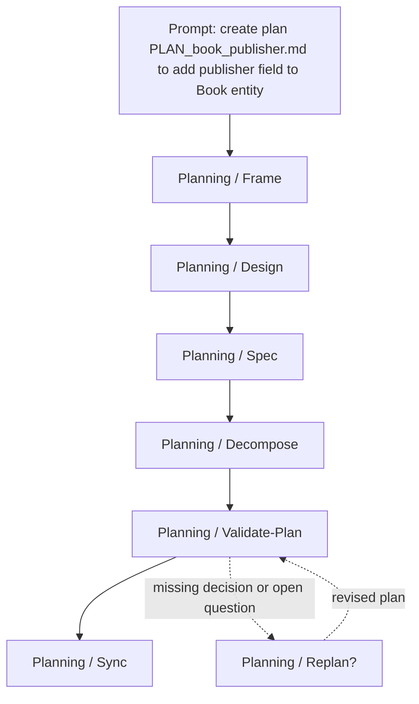

### Prompt Chain / Implement Plan

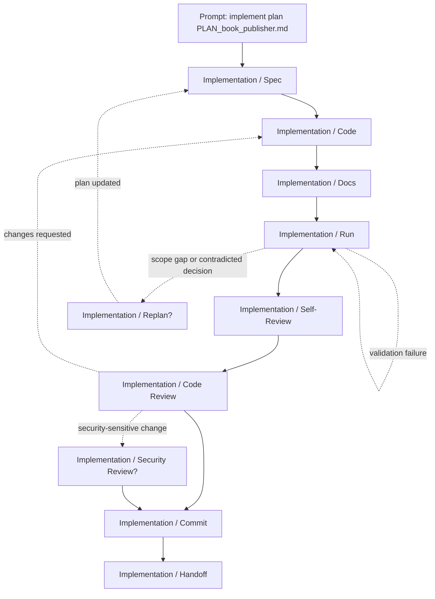

### Prompt Chain / Integrate And Release

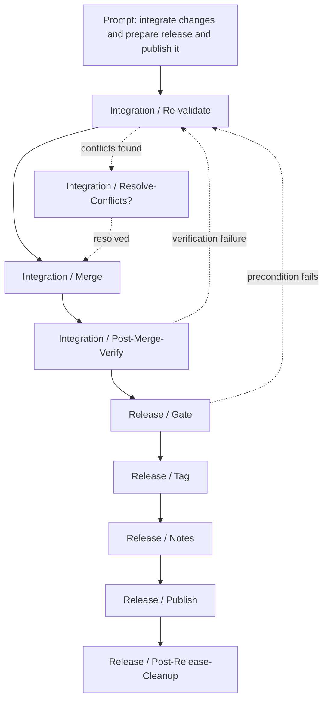

## Discovery

### Discovery / Scan

Metrics: chain depth 1; chain length 4; total loaded 4; deduplicated chain length 4; distinct loaded 4.

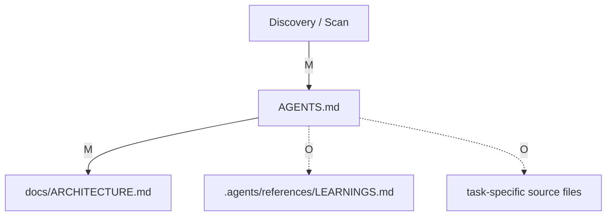

### Discovery / Frame

Metrics: chain depth 1; chain length 4; total loaded 4; deduplicated chain length 4; distinct loaded 4.

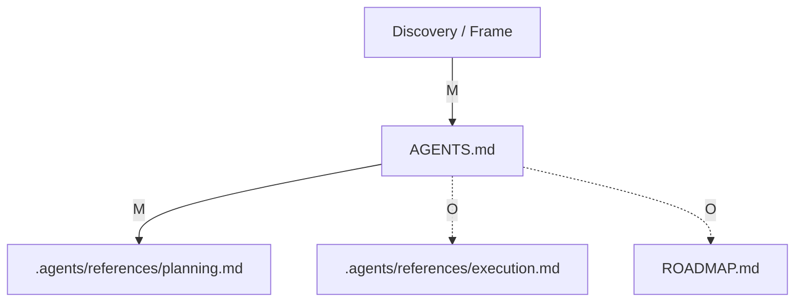

### Discovery / Clarify?

Metrics: chain depth 1; chain length 2; total loaded 2; deduplicated chain length 2; distinct loaded 2.

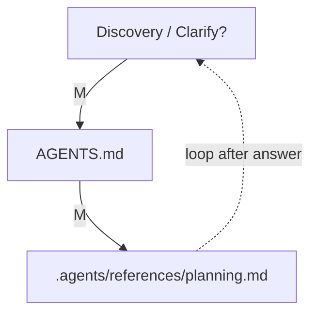

### Discovery / Capture?

Metrics: chain depth 1; chain length 4; total loaded 4; deduplicated chain length 4; distinct loaded 4.

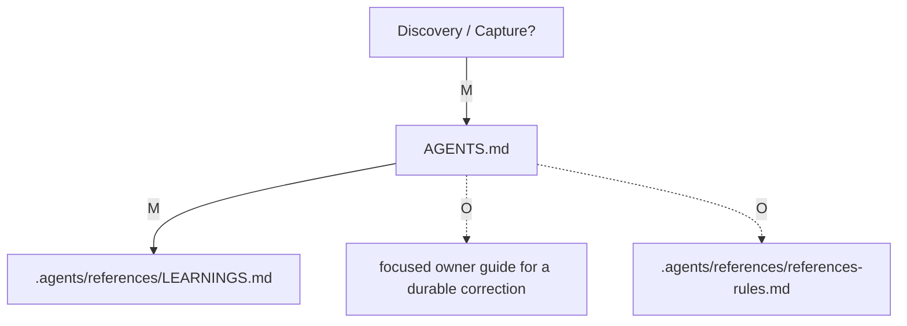

## Roadmap Intake

### Roadmap Intake / Intake

Metrics: chain depth 1; chain length 3; total loaded 3; deduplicated chain length 3; distinct loaded 3.

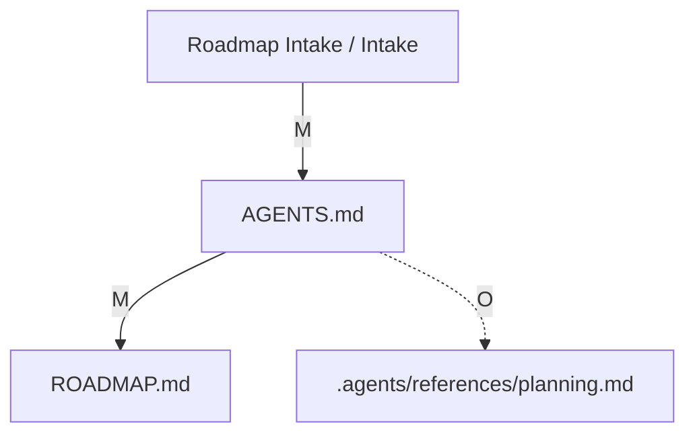

### Roadmap Intake / Refine

Metrics: chain depth 1; chain length 3; total loaded 3; deduplicated chain length 3; distinct loaded 3.

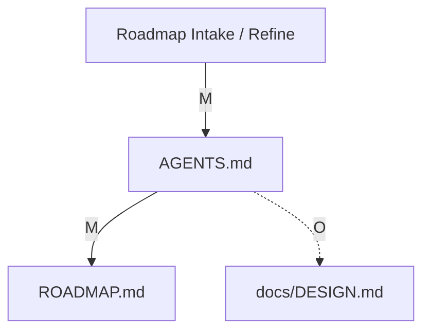

### Roadmap Intake / Prioritize

Metrics: chain depth 1; chain length 3; total loaded 3; deduplicated chain length 3; distinct loaded 3.

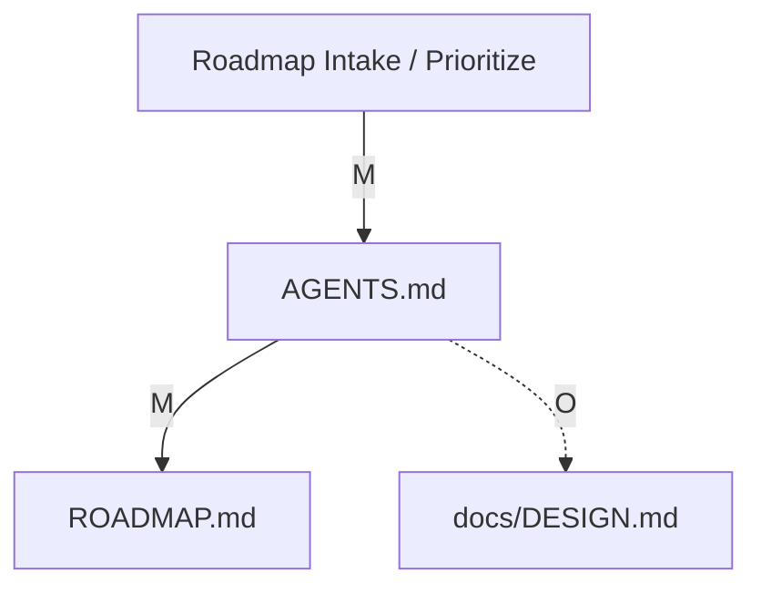

### Roadmap Intake / Sequence

Metrics: chain depth 1; chain length 3; total loaded 3; deduplicated chain length 3; distinct loaded 3.

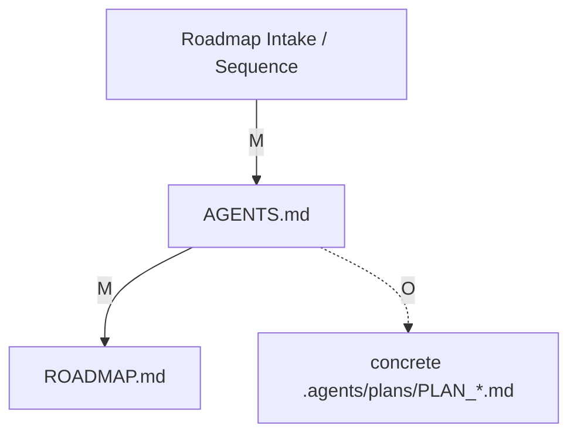

### Roadmap Intake / Sync

Metrics: chain depth 1; chain length 3; total loaded 3; deduplicated chain length 3; distinct loaded 3.

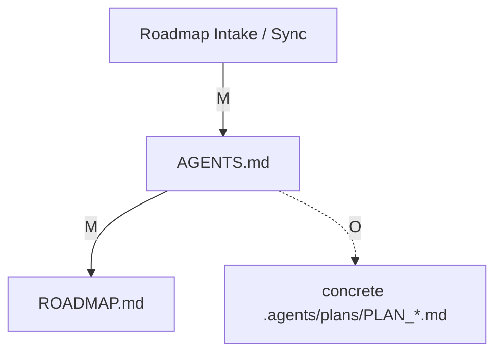

## Planning

### Planning / Frame

Metrics: chain depth 1; chain length 8; total loaded 8; deduplicated chain length 8; distinct loaded 8.

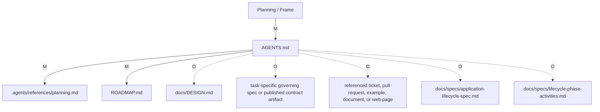

### Planning / Design

Metrics: chain depth 1; chain length 6; total loaded 6; deduplicated chain length 6; distinct loaded 6.

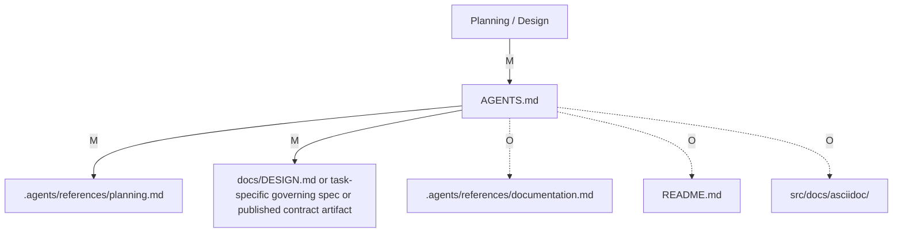

### Planning / Spec

Metrics: chain depth 1; chain length 7; total loaded 7; deduplicated chain length 7; distinct loaded 7.

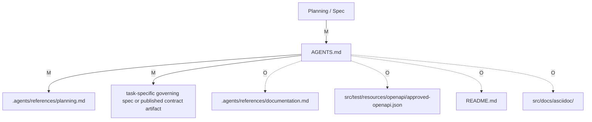

### Planning / Decompose

Metrics: chain depth 1; chain length 5; total loaded 5; deduplicated chain length 5; distinct loaded 5.

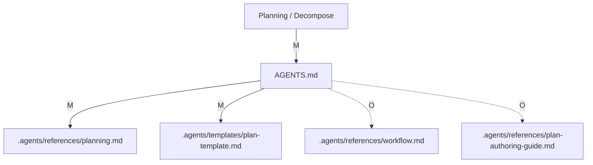

### Planning / Validate-Plan

Metrics: chain depth 1; chain length 6; total loaded 6; deduplicated chain length 6; distinct loaded 6.

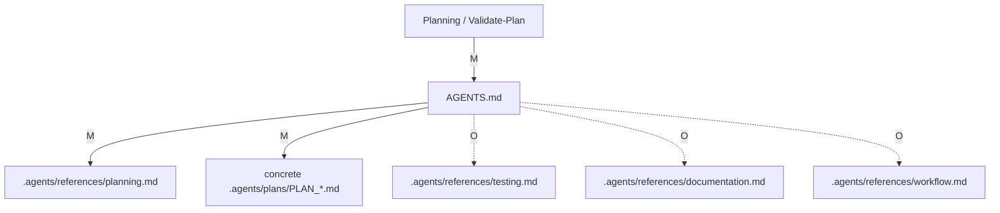

### Planning / Sync

Metrics: chain depth 1; chain length 3; total loaded 3; deduplicated chain length 3; distinct loaded 3.

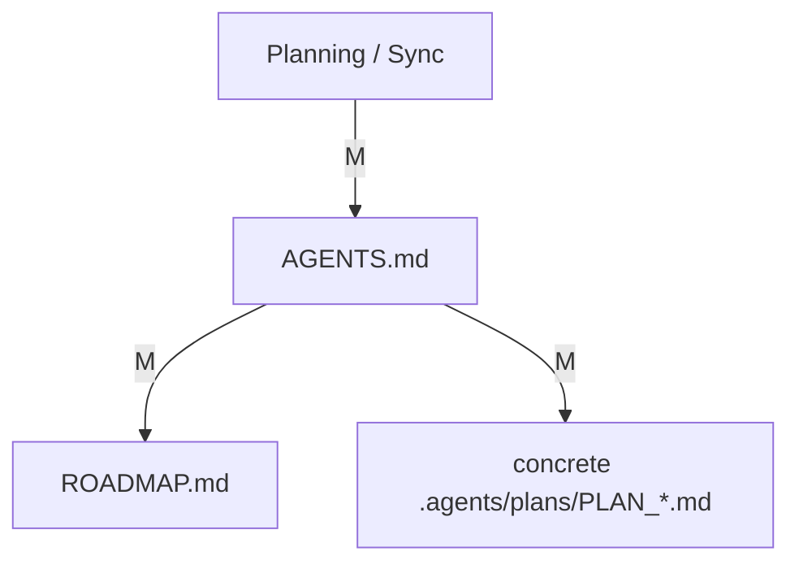

### Planning / Replan?

Metrics: chain depth 1; chain length 5; total loaded 5; deduplicated chain length 5; distinct loaded 5.

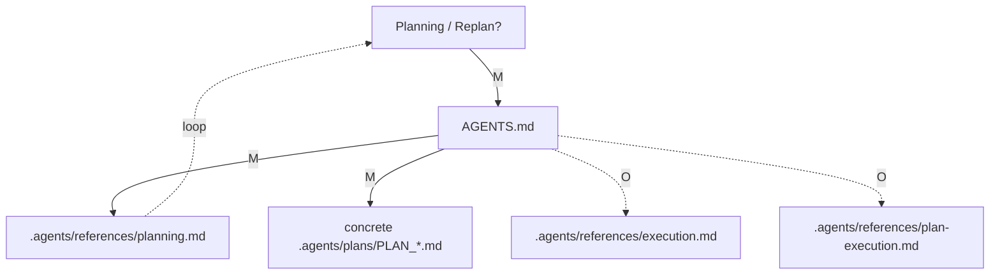

## Implementation

### Implementation / Spec

Metrics: chain depth 1; chain length 4; total loaded 4; deduplicated chain length 4; distinct loaded 4.

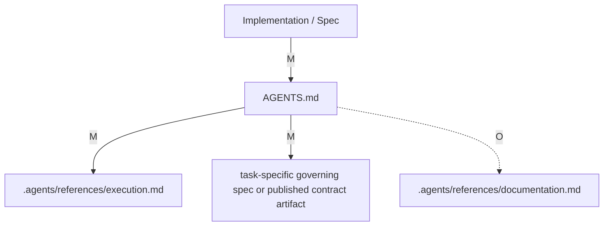

### Implementation / Code

Metrics: chain depth 1; chain length 7; total loaded 7; deduplicated chain length 7; distinct loaded 7.

```mermaid
flowchart TD
    FA["Implementation / Code"] -->|M| AGENTS_md_full["AGENTS.md"]
    AGENTS_md_full -->|M| agents_references_execution_md_full[".agents/references/execution.md"]
    AGENTS_md_full -->|M| agents_references_code_style_md_full[".agents/references/code-style.md"]
    AGENTS_md_full -->|M| task_specific_source_files_full["task-specific source files"]
    AGENTS_md_full -. O .-> docs_ARCHITECTURE_md_full["docs/ARCHITECTURE.md"]
    AGENTS_md_full -. O .-> docs_DESIGN_md_full["docs/DESIGN.md"]
    AGENTS_md_full -. O .-> task_specific_governing_spec_or_published_contract_artifact_full["task-specific governing spec or published contract artifact"]
```

### Implementation / Docs

Metrics: chain depth 1; chain length 8; total loaded 8; deduplicated chain length 8; distinct loaded 8.

```mermaid
flowchart TD
    FA["Implementation / Docs"] -->|M| AGENTS_md_full["AGENTS.md"]
    AGENTS_md_full -->|M| agents_references_documentation_md_full[".agents/references/documentation.md"]
    AGENTS_md_full -->|M| changed_documentation_or_contract_files_full["changed documentation or contract files"]
    AGENTS_md_full -. O .-> agents_references_references_rules_md_full[".agents/references/references-rules.md"]
    AGENTS_md_full -. O .-> README_md_full["README.md"]
    AGENTS_md_full -. O .-> src_docs_asciidoc_full["src/docs/asciidoc/"]
    AGENTS_md_full -. O .-> docs_FRONTEND_AI_CONTRACT_md_full["docs/FRONTEND_AI_CONTRACT.md"]
    AGENTS_md_full -. O .-> src_test_resources_openapi_approved_openapi_json_full["src/test/resources/openapi/approved-openapi.json"]
```

### Implementation / Run

Metrics: chain depth 1; chain length 5; total loaded 5; deduplicated chain length 5; distinct loaded 5.

```mermaid
flowchart TD
    FA["Implementation / Run"] -->|M| AGENTS_md_full["AGENTS.md"]
    AGENTS_md_full -->|M| agents_references_testing_md_full[".agents/references/testing.md"]
    AGENTS_md_full -->|M| agents_references_environment_quick_ref_md_full[".agents/references/environment-quick-ref.md"]
    AGENTS_md_full -. O .-> agents_references_gradle_task_graph_md_full[".agents/references/gradle-task-graph.md"]
    AGENTS_md_full -. O .-> agents_references_troubleshooting_md_full[".agents/references/troubleshooting.md"]
    agents_references_troubleshooting_md_full -. failure loop .-> FA
```

### Implementation / Replan?

Metrics: chain depth 1; chain length 5; total loaded 5; deduplicated chain length 5; distinct loaded 5.

```mermaid
flowchart TD
    FA["Implementation / Replan?"] -->|M| AGENTS_md_full["AGENTS.md"]
    AGENTS_md_full -->|M| agents_references_planning_md_full[".agents/references/planning.md"]
    AGENTS_md_full -->|M| concrete_agents_plans_PLAN_md_full["concrete .agents/plans/PLAN_*.md"]
    AGENTS_md_full -. O .-> agents_references_plan_execution_md_full[".agents/references/plan-execution.md"]
    AGENTS_md_full -. O .-> agents_references_workflow_md_full[".agents/references/workflow.md"]
    agents_references_planning_md_full -. returns to plan loop .-> FA
```

### Implementation / Self-Review

Metrics: chain depth 1; chain length 4; total loaded 4; deduplicated chain length 4; distinct loaded 4.

```mermaid
flowchart TD
    FA["Implementation / Self-Review"] -->|M| AGENTS_md_full["AGENTS.md"]
    AGENTS_md_full -->|M| agents_references_reviews_md_full[".agents/references/reviews.md"]
    AGENTS_md_full -. O .-> agents_references_testing_md_full[".agents/references/testing.md"]
    AGENTS_md_full -. O .-> agents_references_documentation_md_full[".agents/references/documentation.md"]
```

### Implementation / Code Review

Metrics: chain depth 1; chain length 4; total loaded 4; deduplicated chain length 4; distinct loaded 4.

```mermaid
flowchart TD
    FA["Implementation / Code Review"] -->|M| AGENTS_md_full["AGENTS.md"]
    AGENTS_md_full -->|M| agents_references_reviews_md_full[".agents/references/reviews.md"]
    AGENTS_md_full -. O .-> task_specific_governing_spec_or_published_contract_artifact_full["task-specific governing spec or published contract artifact"]
    AGENTS_md_full -. O .-> task_specific_source_files_full["task-specific source files"]
```

### Implementation / Security Review?

Metrics: chain depth 1; chain length 5; total loaded 5; deduplicated chain length 5; distinct loaded 5.

```mermaid
flowchart TD
    FA["Implementation / Security Review?"] -->|M| AGENTS_md_full["AGENTS.md"]
    AGENTS_md_full -->|M| agents_references_reviews_md_full[".agents/references/reviews.md"]
    AGENTS_md_full -. O .-> security_sensitive_source_workflow_config_or_release_files_full["security-sensitive source, workflow, config, or release files"]
    AGENTS_md_full -. O .-> agents_references_testing_md_full[".agents/references/testing.md"]
    AGENTS_md_full -. O .-> agents_references_documentation_md_full[".agents/references/documentation.md"]
```

### Implementation / Commit

Metrics: chain depth 1; chain length 6; total loaded 6; deduplicated chain length 6; distinct loaded 6.

```mermaid
flowchart TD
    FA["Implementation / Commit"] -->|M| AGENTS_md_full["AGENTS.md"]
    AGENTS_md_full -->|M| agents_references_execution_md_full[".agents/references/execution.md"]
    AGENTS_md_full -->|M| gitmessage_full[".gitmessage"]
    AGENTS_md_full -. O .-> concrete_agents_plans_PLAN_md_full["concrete .agents/plans/PLAN_*.md"]
    AGENTS_md_full -. O .-> agents_tmp_workflow_md_full[".agents/tmp/workflow/*.md"]
    AGENTS_md_full -. O .-> agents_references_workflow_md_full[".agents/references/workflow.md"]
```

### Implementation / Handoff

Metrics: chain depth 1; chain length 5; total loaded 5; deduplicated chain length 5; distinct loaded 5.

```mermaid
flowchart TD
    FA["Implementation / Handoff"] -->|M| AGENTS_md_full["AGENTS.md"]
    AGENTS_md_full -->|M| agents_references_execution_md_full[".agents/references/execution.md"]
    AGENTS_md_full -. O .-> agents_references_workflow_md_full[".agents/references/workflow.md"]
    AGENTS_md_full -. O .-> concrete_agents_plans_PLAN_md_full["concrete .agents/plans/PLAN_*.md"]
    AGENTS_md_full -. O .-> agents_tmp_workflow_md_full[".agents/tmp/workflow/*.md"]
```

## Testing

### Testing / Plan-Tests

Metrics: chain depth 1; chain length 4; total loaded 4; deduplicated chain length 4; distinct loaded 4.

```mermaid
flowchart TD
    FA["Testing / Plan-Tests"] -->|M| AGENTS_md_full["AGENTS.md"]
    AGENTS_md_full -->|M| agents_references_testing_md_full[".agents/references/testing.md"]
    AGENTS_md_full -. O .-> agents_references_documentation_md_full[".agents/references/documentation.md"]
    AGENTS_md_full -. O .-> agents_references_gradle_task_graph_md_full[".agents/references/gradle-task-graph.md"]
```

### Testing / Author-Tests

Metrics: chain depth 1; chain length 5; total loaded 5; deduplicated chain length 5; distinct loaded 5.

```mermaid
flowchart TD
    FA["Testing / Author-Tests"] -->|M| AGENTS_md_full["AGENTS.md"]
    AGENTS_md_full -->|M| agents_references_testing_md_full[".agents/references/testing.md"]
    AGENTS_md_full -->|M| task_specific_test_or_executable_spec_files_full["task-specific test or executable-spec files"]
    AGENTS_md_full -. O .-> agents_references_code_style_md_full[".agents/references/code-style.md"]
    AGENTS_md_full -. O .-> task_specific_source_files_full["task-specific source files"]
```

### Testing / Run

Metrics: chain depth 1; chain length 5; total loaded 5; deduplicated chain length 5; distinct loaded 5.

```mermaid
flowchart TD
    FA["Testing / Run"] -->|M| AGENTS_md_full["AGENTS.md"]
    AGENTS_md_full -->|M| agents_references_testing_md_full[".agents/references/testing.md"]
    AGENTS_md_full -->|M| agents_references_environment_quick_ref_md_full[".agents/references/environment-quick-ref.md"]
    AGENTS_md_full -. O .-> agents_references_gradle_task_graph_md_full[".agents/references/gradle-task-graph.md"]
    AGENTS_md_full -. O .-> agents_references_troubleshooting_md_full[".agents/references/troubleshooting.md"]
    agents_references_troubleshooting_md_full -. failure .-> FA
```

### Testing / Diagnose?

Metrics: chain depth 1; chain length 5; total loaded 5; deduplicated chain length 5; distinct loaded 5.

```mermaid
flowchart TD
    FA["Testing / Diagnose?"] -->|M| AGENTS_md_full["AGENTS.md"]
    AGENTS_md_full -->|M| agents_references_troubleshooting_md_full[".agents/references/troubleshooting.md"]
    AGENTS_md_full -. O .-> agents_references_testing_md_full[".agents/references/testing.md"]
    AGENTS_md_full -. O .-> SETUP_md_full["SETUP.md"]
    AGENTS_md_full -. O .-> agents_references_LEARNINGS_md_full[".agents/references/LEARNINGS.md"]
```

### Testing / Fix?

Metrics: chain depth 1; chain length 4; total loaded 4; deduplicated chain length 4; distinct loaded 4.

```mermaid
flowchart TD
    FA["Testing / Fix?"] -->|M| AGENTS_md_full["AGENTS.md"]
    AGENTS_md_full -->|M| agents_references_execution_md_full[".agents/references/execution.md"]
    AGENTS_md_full -->|M| AffectedA["task-specific source files / task-specific test or executable-spec files / task-specific governing spec or published contract artifact"]
    AGENTS_md_full -. O .-> agents_references_planning_md_full[".agents/references/planning.md"]
```

### Testing / Re-run

Metrics: chain depth 1; chain length 4; total loaded 4; deduplicated chain length 4; distinct loaded 4.

```mermaid
flowchart TD
    FA["Testing / Re-run"] -->|M| AGENTS_md_full["AGENTS.md"]
    AGENTS_md_full -->|M| agents_references_testing_md_full[".agents/references/testing.md"]
    AGENTS_md_full -->|M| agents_references_environment_quick_ref_md_full[".agents/references/environment-quick-ref.md"]
    AGENTS_md_full -. O .-> agents_references_gradle_task_graph_md_full[".agents/references/gradle-task-graph.md"]
    agents_references_gradle_task_graph_md_full -. still fails .-> FA
```

### Testing / Record

Metrics: chain depth 1; chain length 4; total loaded 4; deduplicated chain length 4; distinct loaded 4.

```mermaid
flowchart TD
    FA["Testing / Record"] -->|M| AGENTS_md_full["AGENTS.md"]
    AGENTS_md_full -->|M| agents_references_testing_md_full[".agents/references/testing.md"]
    AGENTS_md_full -->|M| PlanOrLogA["concrete .agents/plans/PLAN_*.md or .agents/tmp/workflow/*.md"]
    AGENTS_md_full -. O .-> agents_references_workflow_md_full[".agents/references/workflow.md"]
```

## Review

### Review / Self-Review

Metrics: chain depth 1; chain length 4; total loaded 4; deduplicated chain length 4; distinct loaded 4.

```mermaid
flowchart TD
    FA["Review / Self-Review"] -->|M| AGENTS_md_full["AGENTS.md"]
    AGENTS_md_full -->|M| agents_references_reviews_md_full[".agents/references/reviews.md"]
    AGENTS_md_full -. O .-> agents_references_testing_md_full[".agents/references/testing.md"]
    AGENTS_md_full -. O .-> agents_references_documentation_md_full[".agents/references/documentation.md"]
```

### Review / Code Review

Metrics: chain depth 1; chain length 5; total loaded 5; deduplicated chain length 5; distinct loaded 5.

```mermaid
flowchart TD
    FA["Review / Code Review"] -->|M| AGENTS_md_full["AGENTS.md"]
    AGENTS_md_full -->|M| agents_references_reviews_md_full[".agents/references/reviews.md"]
    AGENTS_md_full -->|M| changed_documentation_or_contract_files_full["changed documentation or contract files"]
    AGENTS_md_full -. O .-> task_specific_governing_spec_or_published_contract_artifact_full["task-specific governing spec or published contract artifact"]
    AGENTS_md_full -. O .-> agents_references_testing_md_full[".agents/references/testing.md"]
```

### Review / Security Review?

Metrics: chain depth 1; chain length 5; total loaded 5; deduplicated chain length 5; distinct loaded 5.

```mermaid
flowchart TD
    FA["Review / Security Review?"] -->|M| AGENTS_md_full["AGENTS.md"]
    AGENTS_md_full -->|M| agents_references_reviews_md_full[".agents/references/reviews.md"]
    AGENTS_md_full -. O .-> security_sensitive_source_workflow_config_or_release_files_full["security-sensitive source, workflow, config, or release files"]
    AGENTS_md_full -. O .-> agents_references_testing_md_full[".agents/references/testing.md"]
    AGENTS_md_full -. O .-> agents_references_documentation_md_full[".agents/references/documentation.md"]
```

### Review / Docs Review?

Metrics: chain depth 1; chain length 5; total loaded 5; deduplicated chain length 5; distinct loaded 5.

```mermaid
flowchart TD
    FA["Review / Docs Review?"] -->|M| AGENTS_md_full["AGENTS.md"]
    AGENTS_md_full -->|M| agents_references_reviews_md_full[".agents/references/reviews.md"]
    AGENTS_md_full -->|M| agents_references_documentation_md_full[".agents/references/documentation.md"]
    AGENTS_md_full -. O .-> agents_references_references_rules_md_full[".agents/references/references-rules.md"]
    AGENTS_md_full -. O .-> published_contract_docs_not_otherwise_named_in_this_row_full["published contract docs not otherwise named in this row"]
```

### Review / Decide

Metrics: chain depth 1; chain length 4; total loaded 4; deduplicated chain length 4; distinct loaded 4.

```mermaid
flowchart TD
    FA["Review / Decide"] -->|M| AGENTS_md_full["AGENTS.md"]
    AGENTS_md_full -->|M| agents_references_reviews_md_full[".agents/references/reviews.md"]
    AGENTS_md_full -. O .-> agents_references_execution_md_full[".agents/references/execution.md"]
    AGENTS_md_full -. O .-> agents_references_testing_md_full[".agents/references/testing.md"]
    agents_references_execution_md_full -. changes requested .-> FA
```

## Integration

### Integration / Re-validate

Metrics: chain depth 1; chain length 5; total loaded 5; deduplicated chain length 5; distinct loaded 5.

```mermaid
flowchart TD
    FA["Integration / Re-validate"] -->|M| AGENTS_md_full["AGENTS.md"]
    AGENTS_md_full -->|M| agents_references_testing_md_full[".agents/references/testing.md"]
    AGENTS_md_full -->|M| agents_references_environment_quick_ref_md_full[".agents/references/environment-quick-ref.md"]
    AGENTS_md_full -. O .-> agents_references_workflow_md_full[".agents/references/workflow.md"]
    AGENTS_md_full -. O .-> agents_references_gradle_task_graph_md_full[".agents/references/gradle-task-graph.md"]
```

### Integration / Resolve-Conflicts?

Metrics: chain depth 1; chain length 5; total loaded 5; deduplicated chain length 5; distinct loaded 5.

```mermaid
flowchart TD
    FA["Integration / Resolve-Conflicts?"] -->|M| AGENTS_md_full["AGENTS.md"]
    AGENTS_md_full -->|M| agents_references_workflow_md_full[".agents/references/workflow.md"]
    AGENTS_md_full -->|M| conflicting_files_being_resolved_full["conflicting files being resolved"]
    AGENTS_md_full -. O .-> concrete_agents_plans_PLAN_md_full["concrete .agents/plans/PLAN_*.md"]
    AGENTS_md_full -. O .-> agents_references_reviews_md_full[".agents/references/reviews.md"]
```

### Integration / Merge

Metrics: chain depth 1; chain length 4; total loaded 4; deduplicated chain length 4; distinct loaded 4.

```mermaid
flowchart TD
    FA["Integration / Merge"] -->|M| AGENTS_md_full["AGENTS.md"]
    AGENTS_md_full -->|M| agents_references_workflow_md_full[".agents/references/workflow.md"]
    AGENTS_md_full -. O .-> concrete_agents_plans_PLAN_md_full["concrete .agents/plans/PLAN_*.md"]
    AGENTS_md_full -. O .-> agents_tmp_workflow_md_full[".agents/tmp/workflow/*.md"]
```

### Integration / Post-Merge-Verify

Metrics: chain depth 1; chain length 5; total loaded 5; deduplicated chain length 5; distinct loaded 5.

```mermaid
flowchart TD
    FA["Integration / Post-Merge-Verify"] -->|M| AGENTS_md_full["AGENTS.md"]
    AGENTS_md_full -->|M| agents_references_testing_md_full[".agents/references/testing.md"]
    AGENTS_md_full -->|M| agents_references_workflow_md_full[".agents/references/workflow.md"]
    AGENTS_md_full -. O .-> agents_references_execution_md_full[".agents/references/execution.md"]
    AGENTS_md_full -. O .-> agents_references_plan_execution_md_full[".agents/references/plan-execution.md"]
    agents_references_testing_md_full -. failure .-> FA
```

## Release

### Release / Gate

Metrics: chain depth 1; chain length 7; total loaded 7; deduplicated chain length 7; distinct loaded 7.

```mermaid
flowchart TD
    FA["Release / Gate"] -->|M| AGENTS_md_full["AGENTS.md"]
    AGENTS_md_full -->|M| agents_references_releases_md_full[".agents/references/releases.md"]
    AGENTS_md_full -->|M| agents_references_testing_md_full[".agents/references/testing.md"]
    AGENTS_md_full -->|M| agents_references_documentation_md_full[".agents/references/documentation.md"]
    AGENTS_md_full -. O .-> concrete_agents_plans_PLAN_md_full["concrete .agents/plans/PLAN_*.md"]
    AGENTS_md_full -. O .-> ROADMAP_md_full["ROADMAP.md"]
    AGENTS_md_full -. O .-> CHANGELOG_md_full["CHANGELOG.md"]
    agents_references_releases_md_full -. precondition fails .-> FA
```

### Release / Tag

Metrics: chain depth 1; chain length 7; total loaded 7; deduplicated chain length 7; distinct loaded 7.

```mermaid
flowchart TD
    FA["Release / Tag"] -->|M| AGENTS_md_full["AGENTS.md"]
    AGENTS_md_full -->|M| agents_references_releases_md_full[".agents/references/releases.md"]
    AGENTS_md_full -->|M| agents_references_release_checklist_md_full[".agents/references/release-checklist.md"]
    AGENTS_md_full -->|M| CHANGELOG_md_full["CHANGELOG.md"]
    AGENTS_md_full -->|M| ROADMAP_md_full["ROADMAP.md"]
    AGENTS_md_full -. O .-> agents_references_LEARNINGS_md_full[".agents/references/LEARNINGS.md"]
    AGENTS_md_full -. O .-> agents_archive_full[".agents/archive/"]
```

### Release / Notes

Metrics: chain depth 1; chain length 5; total loaded 5; deduplicated chain length 5; distinct loaded 5.

```mermaid
flowchart TD
    FA["Release / Notes"] -->|M| AGENTS_md_full["AGENTS.md"]
    AGENTS_md_full -->|M| agents_references_releases_md_full[".agents/references/releases.md"]
    AGENTS_md_full -->|M| CHANGELOG_md_full["CHANGELOG.md"]
    AGENTS_md_full -. O .-> agents_references_release_checklist_md_full[".agents/references/release-checklist.md"]
    AGENTS_md_full -. O .-> temporary_CHANGELOG_topic_md_files_full["temporary CHANGELOG_<topic>.md files"]
```

### Release / Publish

Metrics: chain depth 1; chain length 3; total loaded 3; deduplicated chain length 3; distinct loaded 3.

```mermaid
flowchart TD
    FA["Release / Publish"] -->|M| AGENTS_md_full["AGENTS.md"]
    AGENTS_md_full -->|M| agents_references_releases_md_full[".agents/references/releases.md"]
    AGENTS_md_full -. O .-> agents_references_release_artifact_verification_md_full[".agents/references/release-artifact-verification.md"]
```

### Release / Post-Release-Cleanup

Metrics: chain depth 1; chain length 8; total loaded 8; deduplicated chain length 8; distinct loaded 8.

```mermaid
flowchart TD
    FA["Release / Post-Release-Cleanup"] -->|M| AGENTS_md_full["AGENTS.md"]
    AGENTS_md_full -->|M| agents_references_releases_md_full[".agents/references/releases.md"]
    AGENTS_md_full -->|M| agents_references_release_checklist_md_full[".agents/references/release-checklist.md"]
    AGENTS_md_full -->|M| ROADMAP_md_full["ROADMAP.md"]
    AGENTS_md_full -->|M| CHANGELOG_md_full["CHANGELOG.md"]
    AGENTS_md_full -->|M| agents_archive_full[".agents/archive/"]
    AGENTS_md_full -. O .-> agents_references_LEARNINGS_md_full[".agents/references/LEARNINGS.md"]
    AGENTS_md_full -. O .-> agents_references_workflow_md_full[".agents/references/workflow.md"]
```

## Deployment

### Deployment / Stage

Metrics: chain depth 1; chain length 4; total loaded 4; deduplicated chain length 4; distinct loaded 4.

```mermaid
flowchart TD
    FA["Deployment / Stage"] -->|M| AGENTS_md_full["AGENTS.md"]
    AGENTS_md_full -. O .-> agents_references_release_artifact_verification_md_full[".agents/references/release-artifact-verification.md"]
    AGENTS_md_full -. O .-> infra_full["infra/"]
    AGENTS_md_full -. O .-> src_externalTest_full["src/externalTest/"]
```

### Deployment / Smoke

Metrics: chain depth 1; chain length 4; total loaded 4; deduplicated chain length 4; distinct loaded 4.

```mermaid
flowchart TD
    FA["Deployment / Smoke"] -->|M| AGENTS_md_full["AGENTS.md"]
    AGENTS_md_full -. O .-> agents_references_release_artifact_verification_md_full[".agents/references/release-artifact-verification.md"]
    AGENTS_md_full -. O .-> src_manualTests_http_suites_README_md_full["src/manualTests/http/suites/README.md"]
    AGENTS_md_full -. O .-> src_externalTest_full["src/externalTest/"]
```

### Deployment / Promote

Metrics: chain depth 1; chain length 2; total loaded 2; deduplicated chain length 2; distinct loaded 2.

```mermaid
flowchart TD
    FA["Deployment / Promote"] -->|M| AGENTS_md_full["AGENTS.md"]
    AGENTS_md_full -. O .-> deployment_specific_workflow_configuration_or_check_files_full["deployment-specific workflow, configuration, or check files"]
```

### Deployment / Verify

Metrics: chain depth 1; chain length 3; total loaded 3; deduplicated chain length 3; distinct loaded 3.

```mermaid
flowchart TD
    FA["Deployment / Verify"] -->|M| AGENTS_md_full["AGENTS.md"]
    AGENTS_md_full -. O .-> agents_references_release_artifact_verification_md_full[".agents/references/release-artifact-verification.md"]
    AGENTS_md_full -. O .-> deployment_specific_workflow_configuration_or_check_files_full["deployment-specific workflow, configuration, or check files"]
```

### Deployment / Rollback?

Metrics: chain depth 1; chain length 4; total loaded 4; deduplicated chain length 4; distinct loaded 4.

```mermaid
flowchart TD
    FA["Deployment / Rollback?"] -->|M| AGENTS_md_full["AGENTS.md"]
    AGENTS_md_full -. O .-> agents_references_workflow_md_full[".agents/references/workflow.md"]
    AGENTS_md_full -. O .-> agents_references_releases_md_full[".agents/references/releases.md"]
    AGENTS_md_full -. O .-> deployment_specific_workflow_configuration_or_check_files_full["deployment-specific workflow, configuration, or check files"]
```

## Operations

### Operations / Observe

Metrics: chain depth 1; chain length 2; total loaded 2; deduplicated chain length 2; distinct loaded 2.

```mermaid
flowchart TD
    FA["Operations / Observe"] -->|M| AGENTS_md_full["AGENTS.md"]
    AGENTS_md_full -. O .-> user_supplied_monitoring_log_trace_or_incident_files_full["user-supplied monitoring, log, trace, or incident files"]
```

### Operations / Triage

Metrics: chain depth 1; chain length 5; total loaded 5; deduplicated chain length 5; distinct loaded 5.

```mermaid
flowchart TD
    FA["Operations / Triage"] -->|M| AGENTS_md_full["AGENTS.md"]
    AGENTS_md_full -->|M| ROADMAP_md_full["ROADMAP.md"]
    AGENTS_md_full -. O .-> agents_references_planning_md_full[".agents/references/planning.md"]
    AGENTS_md_full -. O .-> agents_references_LEARNINGS_md_full[".agents/references/LEARNINGS.md"]
    AGENTS_md_full -. O .-> user_supplied_monitoring_log_trace_or_incident_files_full["user-supplied monitoring, log, trace, or incident files"]
```

### Operations / Hotfix?

Metrics: chain depth 1; chain length 6; total loaded 6; deduplicated chain length 6; distinct loaded 6.

```mermaid
flowchart TD
    FA["Operations / Hotfix?"] -->|M| AGENTS_md_full["AGENTS.md"]
    AGENTS_md_full -->|M| agents_references_execution_md_full[".agents/references/execution.md"]
    AGENTS_md_full -->|M| agents_references_testing_md_full[".agents/references/testing.md"]
    AGENTS_md_full -->|M| agents_references_reviews_md_full[".agents/references/reviews.md"]
    AGENTS_md_full -. O .-> agents_references_workflow_md_full[".agents/references/workflow.md"]
    AGENTS_md_full -. O .-> agents_references_planning_md_full[".agents/references/planning.md"]
```

### Operations / Patch?

Metrics: chain depth 1; chain length 5; total loaded 5; deduplicated chain length 5; distinct loaded 5.

```mermaid
flowchart TD
    FA["Operations / Patch?"] -->|M| AGENTS_md_full["AGENTS.md"]
    AGENTS_md_full -->|M| AltA[".agents/references/planning.md or .agents/references/execution.md"]
    AGENTS_md_full -. O .-> ROADMAP_md_full["ROADMAP.md"]
    AGENTS_md_full -. O .-> agents_references_testing_md_full[".agents/references/testing.md"]
    AGENTS_md_full -. O .-> agents_references_reviews_md_full[".agents/references/reviews.md"]
```

### Operations / Backport?

Metrics: chain depth 1; chain length 3; total loaded 3; deduplicated chain length 3; distinct loaded 3.

```mermaid
flowchart TD
    FA["Operations / Backport?"] -->|M| AGENTS_md_full["AGENTS.md"]
    AGENTS_md_full -. O .-> agents_references_workflow_md_full[".agents/references/workflow.md"]
    AGENTS_md_full -. O .-> CHANGELOG_md_full["CHANGELOG.md"]
```

### Operations / Deprecate?

Metrics: chain depth 1; chain length 5; total loaded 5; deduplicated chain length 5; distinct loaded 5.

```mermaid
flowchart TD
    FA["Operations / Deprecate?"] -->|M| AGENTS_md_full["AGENTS.md"]
    AGENTS_md_full -->|M| ROADMAP_md_full["ROADMAP.md"]
    AGENTS_md_full -->|M| docs_DESIGN_md_full["docs/DESIGN.md"]
    AGENTS_md_full -. O .-> agents_references_planning_md_full[".agents/references/planning.md"]
    AGENTS_md_full -. O .-> published_contract_docs_not_otherwise_named_in_this_row_full["published contract docs not otherwise named in this row"]
```

## Continuous Improvement

### Continuous Improvement / Retrospect

Metrics: chain depth 1; chain length 5; total loaded 5; deduplicated chain length 5; distinct loaded 5.

```mermaid
flowchart TD
    FA["Continuous Improvement / Retrospect"] -->|M| AGENTS_md_full["AGENTS.md"]
    AGENTS_md_full -->|M| agents_references_LEARNINGS_md_full[".agents/references/LEARNINGS.md"]
    AGENTS_md_full -. O .-> agents_references_releases_md_full[".agents/references/releases.md"]
    AGENTS_md_full -. O .-> concrete_agents_plans_PLAN_md_full["concrete .agents/plans/PLAN_*.md"]
    AGENTS_md_full -. O .-> ROADMAP_md_full["ROADMAP.md"]
```

### Continuous Improvement / Capture-Learning

Metrics: chain depth 1; chain length 4; total loaded 4; deduplicated chain length 4; distinct loaded 4.

```mermaid
flowchart TD
    FA["Continuous Improvement / Capture-Learning"] -->|M| AGENTS_md_full["AGENTS.md"]
    AGENTS_md_full -->|M| agents_references_LEARNINGS_md_full[".agents/references/LEARNINGS.md"]
    AGENTS_md_full -. O .-> focused_owner_guide_for_a_durable_correction_full["focused owner guide for a durable correction"]
    AGENTS_md_full -. O .-> agents_references_references_rules_md_full[".agents/references/references-rules.md"]
```

### Continuous Improvement / Refactor?

Metrics: chain depth 1; chain length 6; total loaded 6; deduplicated chain length 6; distinct loaded 6.

```mermaid
flowchart TD
    FA["Continuous Improvement / Refactor?"] -->|M| AGENTS_md_full["AGENTS.md"]
    AGENTS_md_full -->|M| agents_references_planning_md_full[".agents/references/planning.md"]
    AGENTS_md_full -->|M| ROADMAP_md_full["ROADMAP.md"]
    AGENTS_md_full -. O .-> docs_ARCHITECTURE_md_full["docs/ARCHITECTURE.md"]
    AGENTS_md_full -. O .-> agents_references_code_style_md_full[".agents/references/code-style.md"]
    AGENTS_md_full -. O .-> agents_references_testing_md_full[".agents/references/testing.md"]
```

### Continuous Improvement / Tech-Debt-Plan?

Metrics: chain depth 1; chain length 6; total loaded 6; deduplicated chain length 6; distinct loaded 6.

```mermaid
flowchart TD
    FA["Continuous Improvement / Tech-Debt-Plan?"] -->|M| AGENTS_md_full["AGENTS.md"]
    AGENTS_md_full -->|M| agents_references_planning_md_full[".agents/references/planning.md"]
    AGENTS_md_full -->|M| ROADMAP_md_full["ROADMAP.md"]
    AGENTS_md_full -. O .-> agents_references_LEARNINGS_md_full[".agents/references/LEARNINGS.md"]
    AGENTS_md_full -. O .-> docs_ARCHITECTURE_md_full["docs/ARCHITECTURE.md"]
    AGENTS_md_full -. O .-> docs_DESIGN_md_full["docs/DESIGN.md"]
```

### Continuous Improvement / Sync

Metrics: chain depth 1; chain length 3; total loaded 3; deduplicated chain length 3; distinct loaded 3.

```mermaid
flowchart TD
    FA["Continuous Improvement / Sync"] -->|M| AGENTS_md_full["AGENTS.md"]
    AGENTS_md_full -->|M| ROADMAP_md_full["ROADMAP.md"]
    AGENTS_md_full -. O .-> CHANGELOG_md_full["CHANGELOG.md"]
```
